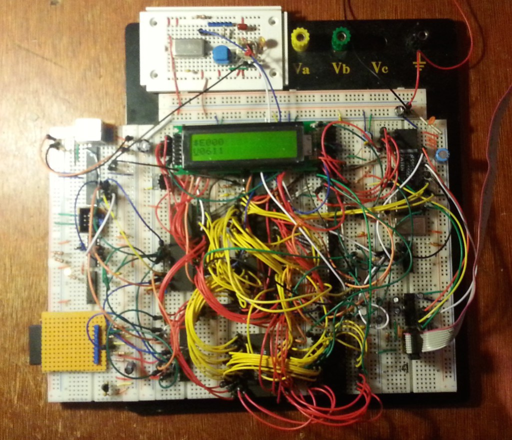
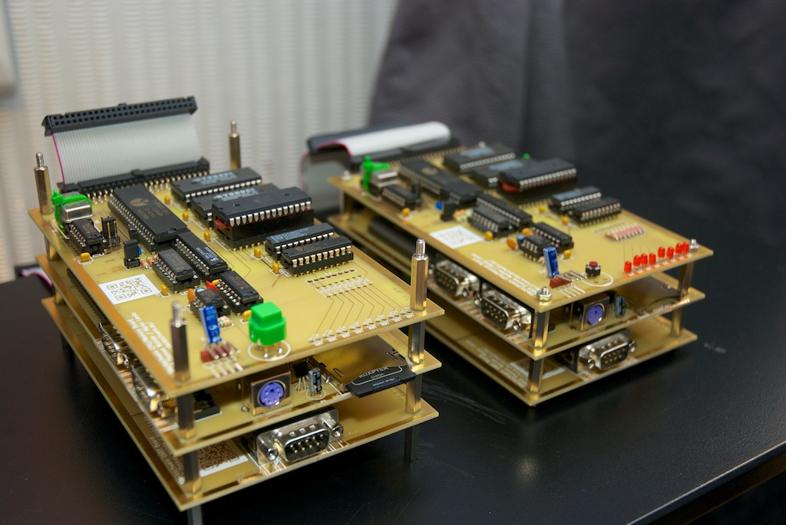

These are times where one just gets bombed with gigahertz, gigabytes. The Steckschwein is an 8bit computer that wants to show how much know how is already to be found in a rather simple computer.

Our mission is to create a computer that might have existed during the heyday of 8bit home computers. Only with more modern interfaces to the outside world, since nobody wants to fiddle with floppy disks anymore.

The name "Steckschwein" originates to the very early stages of our project, where everything was prototyped on breadboards (german: "Steckbrett"), and we all know that those things can be real pigs.

 Early days

 First PCB based prototypes

We started off with a very small test circuit, having the 65c02 execute only NOPs, by hard wiring the data lines to $EA. Then,  we started to add new components step by step, such as ROM, RAM, IO interface (65c22 VIA), serial interface (UART 16550), until we arrived at the current specifications:

- [65c02-CPU](https://de.wikipedia.org/wiki/MOS_Technology_6502) @ [8MHz](/post/chiptuning/)
- 64k RAM
- 32k bankable ROM
- Video chip [TMS9929](https://en.wikipedia.org/wiki/Texas_Instruments_TMS9918), now upgraded to [V9958](https://en.wikipedia.org/wiki/Yamaha_V9958)
- Sound chip [YM3812](https://de.wikipedia.org/wiki/Yamaha_YM3812) (OPL2)
- rs232 via [UART 16550](https://en.wikipedia.org/wiki/16550_UART)
- SPI used as main peripheral bus for:
    - sd-card based mass storage
    - PS/2-peripheral controller (keyboard, mouse) (ATmega8)
    - RTC ([Maxim DS1306](http://www.maximintegrated.com/en/products/digital/real-time-clocks/DS1306.html))

Further reading and more details on [Steckschwein Hardware](/hardware/).
