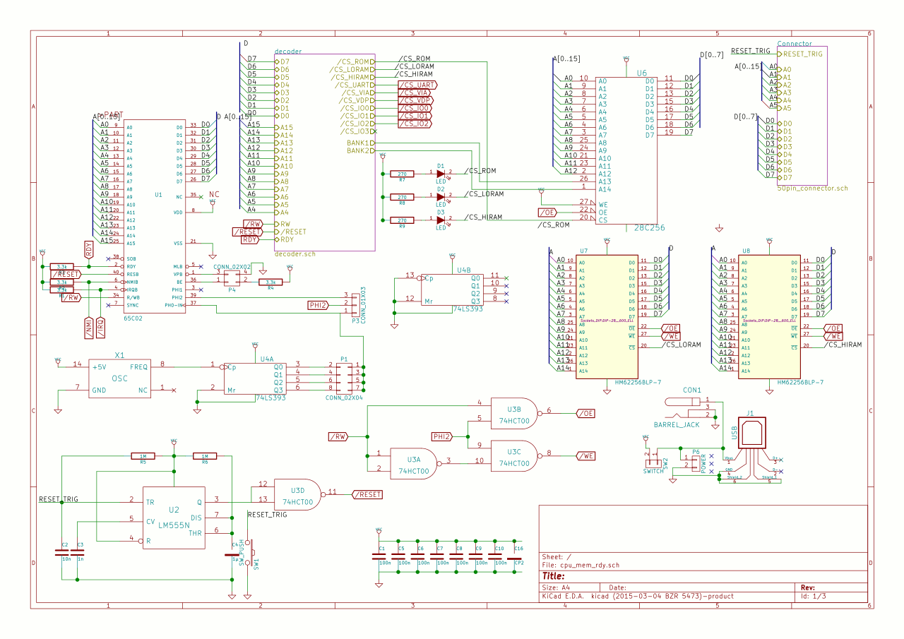
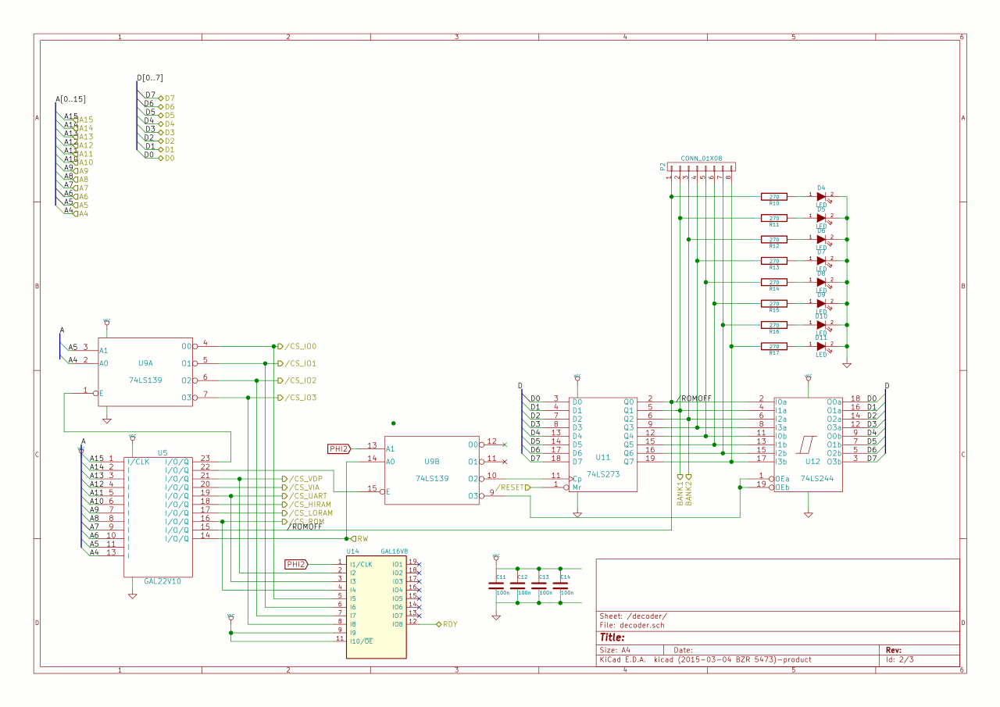
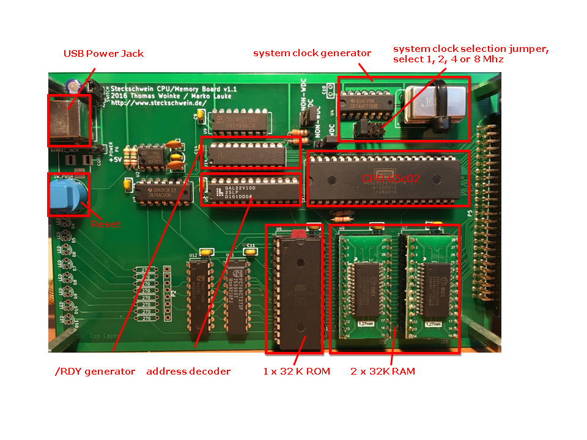

The CPU boards carries the main CPU 65c02, 64k RAM organized in two 32k * 8 SRAM chips (62256). We decided to use SRAM just because it's much simpler to use than DRAM as we do not need a DRAM conroller. Also, small SRAM chips are cheap and easy to obtain. The ROM is a 28c256 EEPROM, which is banked in at $e000 in 8k steps. \
Clock generation and reset circuit reside on the CPU board, too. We decided to replicate the NE555 based reset circuit used by commodore in the PET series as a little hommage. Clock is generated using a 16MHz can oscillator and a 74HCT393 4bit counter to divide the 16 MHz into 4 jumper-selectable clocks: 8 MHz, 4 MHz, 2 Mhz and 1 MHz

 CPU/memory board

 address decoder and /RDY generator

 

## Address decoding

The address decoder logic is the glue that holds everything together. It takes care of mapping all components into their respective areas within the 65c02's address space by decoding the upper 12bit of the adress bus. The decoding logic itself is accommodated in a GAL22V10.

```
GAL22V10

    -------\___/-------
A15 |  1           24 | VCC
    |                 |
A14 |  2           23 | CSIO	- /ENABLE for a 74HCT139 providing additional 4 io-enable pins at $0240-$0270
    |                 |
A13 |  3           22 | MEMCTL	- /CS "Memory Mapping Control-Latch" at $0230
    |                 |
A12 |  4           21 | CSVDP	- /CS VDP V9958  at $0220
    |                 |
A11 |  5           20 | CSVIA	- /CS VIA 65c22  at $0210
    |                 |
A10 |  6           19 | CSUART	- /CS UART 16550 at $0200
    |                 |
A9  |  7           18 | CSHIRAM	- /CS upper SRAM 62256 at $8000-$DFFF($FFFF)
    |                 |
A8  |  8           17 | CSLORAM	- /CS lower SRAM 62256 at $0000-$7FFF
    |                 |
A7  |  9           16 | CSROM	- /CS ROM at $E000-$FFFF
    |                 |
A6  | 10           15 | ROMOFF	- If H, ROM at $E000-$FFFF is banked out to make the underlying RAM accessible
    |                 |		  Is controlled via bit 0 of the "Memory Mapping Control-Latch"
A5  | 11           14 | RW
    |                 |
GND | 12           13 | A4
    -------------------

```

This way, we can assign memory areas as small as 16 byte, which comes in handy for IO devices. Additionally, the r/W pin and a custom pin "ROMOFF" are being decoded to provide some runtime controll over the memory mapping. Write accesses to the ROM-area $E000-$FFFF will always go to the underlying RAM. Is ROMOFF high, the ROM will be banked out, and the underlying RAM will be readable. ROMOFF is connected to bit 0 of the "Memory Mapping Control Latch", so writing a 1 into $0230 will bank out the ROM, writing a 0 will bank it back in.

The memory mapping looks like this:

| Address | Description |  
| --- | --- | 
| $0000-$00ff | Zeropage | 
| $0100-$01ff | Stack |
| $0200-$02ff | IO-Area | 
| $0300-$dfff | RAM |
| $e000-$ffff | ROM/RAM |

The 28C256 EEPROM is 32k * 8, and we only bank in 8k. To make the whole EEPROM accessible, A13 and A14 of the EEPROM are connected to bits 1 and 2 of the latch. This way, the 32k ROM is divided into 4 banks of 8k each, which are selectable during runtime.

## Waitstate generation

The Steckschwein is clocked at at 8MHz, and probably more in the future. The WDC 65c02 is actually rated for 14MHz, and is known to be overclock-friendly. Not all components are capable of that bus speed though, so we need to take care about them. The 65c02 has us covered by providing a pin called "RDY", which can be used to stop and freeze the CPU at whatever it is doing right now. While accessing slower devices such as the video chip, sound chip and ROM, the Steckschwein halts the CPU for 1 cycle, giving those devices the time they need.

 printed board with parts description

[PDF](/steckschwein.pdf)