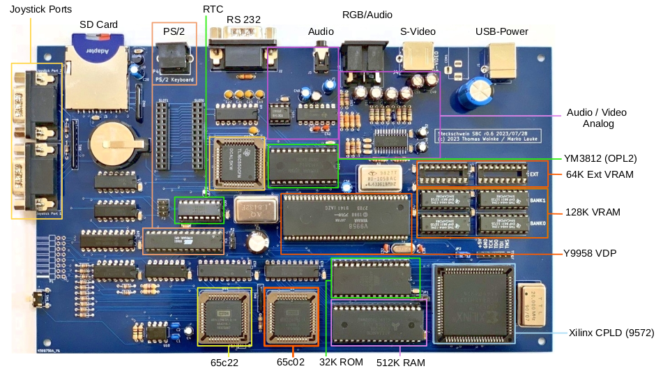
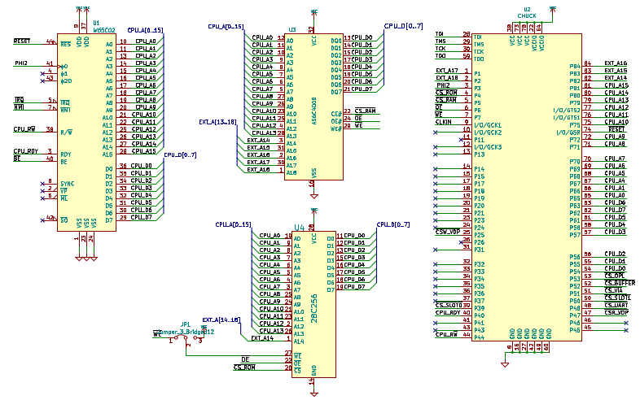
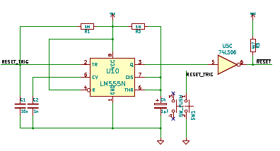
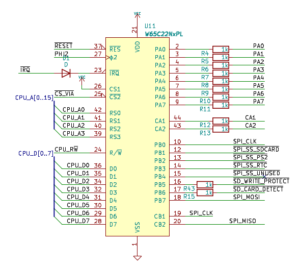
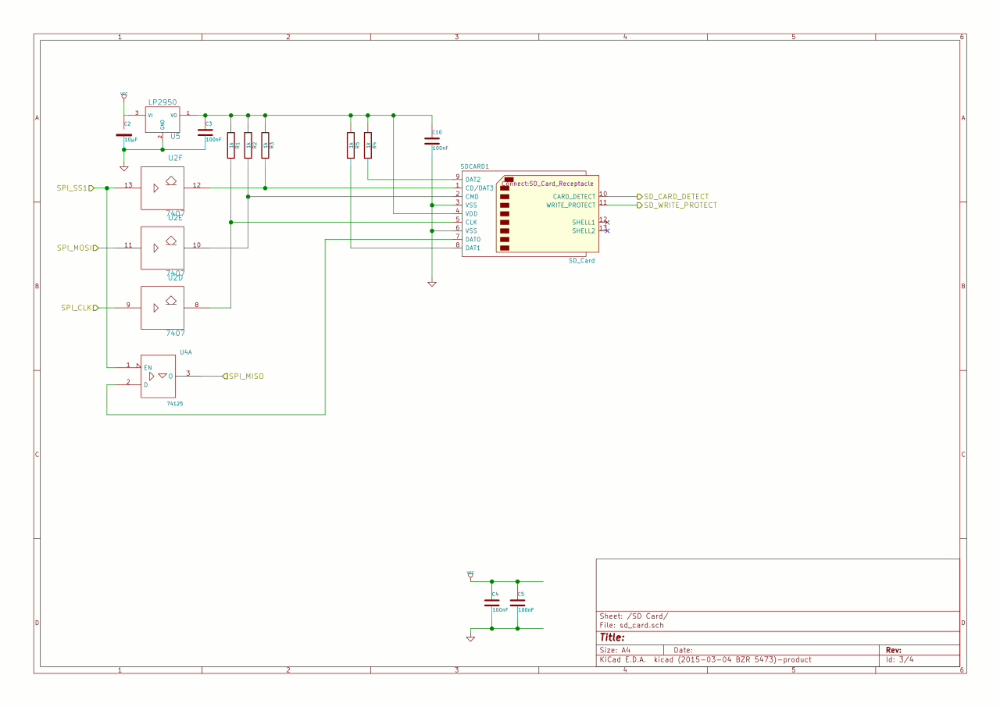
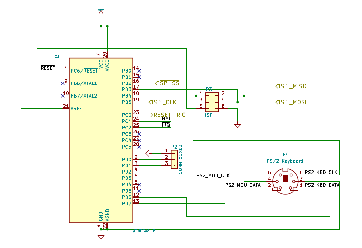
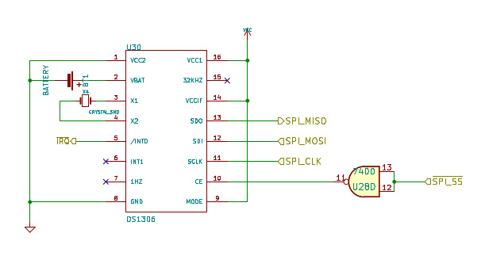
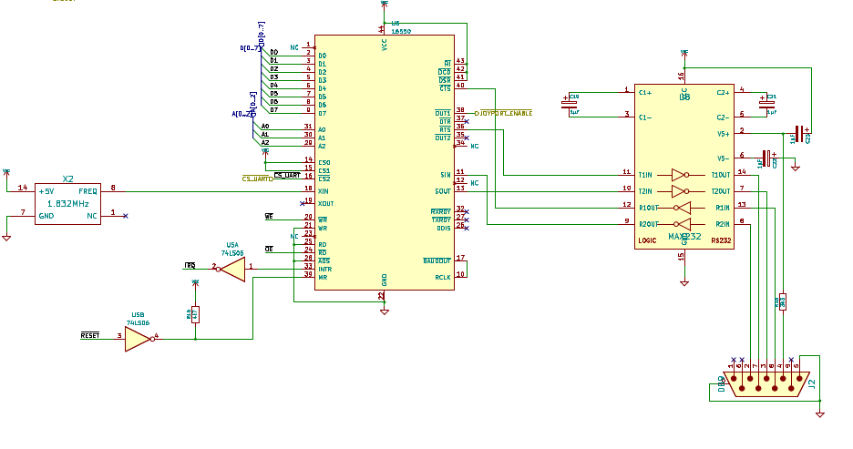
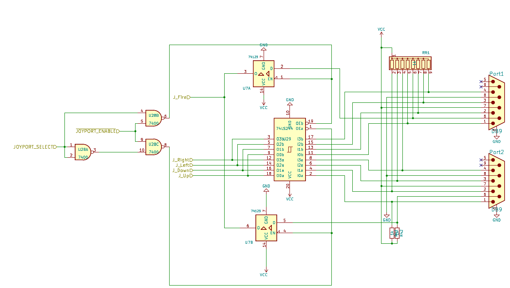

# CPU/Memory

The actual computer core is composed of the actual CPU, a 512k x 8 SRAM, a 32k EEPROM and a Xilinx XC9572 CPLD. The CPLD now provides all glue logic, such as address decoding, memory mapping, wait state and clock generation. In previous revisions, this part was made up of GALs and a couple of TTL ICs.
In order to address 512k, the CPLD provides additional address lines. The banking scheme to address all memory is based on dividing the 64k address space of the 65c02 CPU into 4 "slots" sized 16k each:

|Slot|Start|End|
|:--:|:---:|:-:|
|0|$0000|$3fff|
|1|$4000|$7fff|
|2|$8000|$bfff|
|3|$c000|$ffff|

Four registers within the CPLD (one register per slot) are used to assign one of 32 RAM pages (512k / 16k) or one of 2 ROM pages (32k / 16k) to each slot. For a detailed description of the banking scheme, see [here](/post/512k-ought-to-be-enough-for-anybody/).

## Waitstate generation

The Steckschwein is clocked at at 10MHz, and probably more in the future. The WDC 65c02 is actually rated for 14MHz, and is known to be "overclock-friendly". Not all components are capable of that bus speed though, so we need to take care about them. The 65c02 has us covered by providing a pin called “RDY”, which can be used to stop and freeze the CPU at whatever it is doing right now. While accessing slower devices such as the video chip, sound chip and ROM, the Steckschwein halts the CPU for a given number of cycles, giving those devices the time they need.

The reset circuit is based on an NE555 and is the same as in the Commodore PET and VC20. 

# I/O 

The most common io device for the 6502 processor is the 6522 VIA (Versatile Interface Adapter). In our case, we are using it among a few other things as as the SPI master. VIA port B is solely dedicated to be used with SPI devices. The direction MISO (Master In, Slave Out) is covered by the internal shift register of the VIA. 

One of the fundamental design decisions when creating the Steckschwein was to use SPI as the main peripheral bus. This way, various different devices can be utilized using a single interface protocol. The main killer feature for using SPI was to be able to use an SD card as mass storage. This gives us mass storage with almost no extra hardware effort, only level conversion is needed between the system (5V) and the card (3.3V).

The VIA pins are used as follows:

|VIA pin |SPI / SD card pin|
|---|---|
|PB0|SPICLK|
|PB1|SS1 SD-card|
|PB2|SS2 PS/2 keyboard controller (ATmega8)|
|PB3|SS3 RTC (DS1306)|
|PB4|SS4 (unused)|
|PB5|sd card write protect|
|PB6|sd card detect|
|PB7|MOSI|
|CB1|SPICLK (connected to PB0)|
|CB2|MISO|

Basically, the process of reading data via SPI only consists of setting the appropriate slave select pin to low and then "wiggling" the PB0 pin as fast as possible, which is determined by how fast the CPU is able to write to the port. This also means that the shift register is used in "Shift In - External CB1 Clock Control (011)"-mode, which is the very mode affected by the infamous [VIA-Bug](http://forum.6502.org/viewtopic.php?t=342#p2310). We did not do anything circuit wise to implement a workaround. We rather rely on the fact, that we create the SPI clock using the processor and hereby have the SPI clock locked to the system clock, so the signal slopes have a fixed delay. This should take care of the bug not to occur. Hopefully.

### SPI devices

#### SD-Card as really cheap and lazy mass storage

The SD card is the "killer application", that sold the idea to us to use SPI as the main peripheral bus. The only additional hardware effort was to level shift the signals from and to the sd-card, as it runs on 3.3V while the Steckschwein uses 5V. To accomplish this, the SPI clock, SPI slave select and MOSI are converted using a 74LS07, with it's open collector outputs pulled up to 3.3V. The other direction, MISO, is routed to one of the units of a 74HCT125, whose inputs can deal with 3.3V logic and whose outputs are TTL compliant, hence HCT.

This gives us access to gigabytes of mass storage with minimal effort. No need to fiddle with floppy disc controllers or IDE drives.

#### PS/2 keyboard controller

An ATmega8 is used as PS/2 keyboard and maybe (later) mouse controller. The code running on the ATmega is based on [AVR Application Note 313](http://www.atmel.com/Images/doc1235.pdf), We added code to act as an SPI slave and implemented german keyboard layout and support for a few modifier keys that was missing in the original code. Also, special keys or key combinations like SysRq and the three-finger-salute are being handled directly by the keyboard controller to pull the respective signals like NMI or trigger a hardware reset.

#### Real time clock

The RTC DS1306 delivers the current time down to second resolution, supports two alarms and also has 96 bytes of battery backed memory. 
This makes it a good place to store system boot parameters.
Main reason to add the RTC, besides from that a real nice machine of course needs an RTC, is to have a real time source to set the proper file creation time and date in our FAT32 implementation.

### Serial interface

The 16550 UART was the first chip to be attached to the CPU bus that does not have a native 65xx bus interface and hence needed a little more effort. The reset and interrupt signals are active high, while the 6502 needs them to be active low. So reset needed to be inverted, and interrupt is driven through a 74LS06 inverter driver with open collector outputs in order to be able to be wire-ORed to the system interrupt line. Furthermore, there is no combined R/W line, so that signal hat to be split up into /WR and /RD.
The 16550 provides a full featured serial interfaces and a FIFO. Also, it provides 2 freely usable I/O lines, which are used to disable/enable joystick ports.

### Joysticks and User Port

Since after using all of VIA Port B for SPI, all we have left is Port A to hook up anything else. One of our design goals is to be able to hook up two Atari/Commodore style joysticks. With only one 8bit IO port left, this is a bit tricky. 
Our next approach included tri state drivers behind every joystick port. That way, in order to read the state of a particular joystick, the respective driver has to be enabled first. It is also possible to disable the drivers altogether, freeing port A up completely, which made it possible to add a freely programmable user port.

1. [CPU/Memory](/cpuramdecoder/)
2. [IO (VIA 65c22), now also including UART](/via-65c22-as-spi-master/)
    1. [SPI-Devices](/spi-devices/)
    2. [UART 16550](/uart-16550/)
    3. [Joysticks and user port](/joysticks-and-user-port/)
3. [Video / audio board with V9958 VDP and YM3812 (OPL2) sound chip](/v9958-video-board/)

The 62c22 VIA is mainly utilized as SPI master to implement SPI as the main peripheral bus, connecting SD-card, RTC and the ATmega8 (used as PS/2 controller) to the system. The block diagram shows how things are working together.

[Download full schematics](/pdf/sbc_schematic_0.6.pdf)
[Github repository](https://github.com/Steckschwein/hardware).
