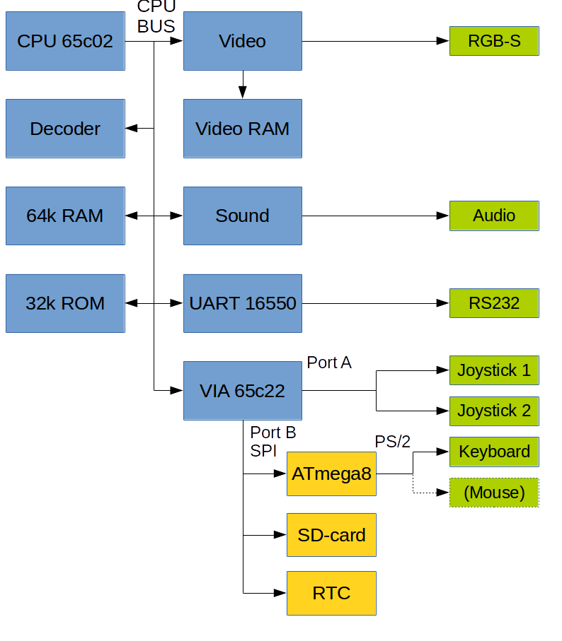

In it's current incarnation, the Steckschwein consists of 3 main units:

1. [CPU/Memory](/cpuramdecoder/)
2. [IO (VIA 65c22), now also including UART](/via-65c22-as-spi-master/)
    1. [SPI-Devices](/spi-devices/)
    2. [UART 16550](/uart-16550/)
    3. [Joysticks and user port](/joysticks-and-user-port/)
3. [Video / audio board with V9958 VDP and YM3812 (OPL2) sound chip](/v9958-video-board/)

The 62c22 VIA is mainly utilized as SPI master to implement SPI as the main peripheral bus, connecting SD-card, RTC and the ATmega8 (used as PS/2 controller) to the system. The block diagram shows how things are working together.

**Schematics, pcb layouts and firmware** can be found at our [Github repository](https://github.com/Steckschwein/hardware).

[Block diagram as PDF](/blockschaltbild.pdf)
