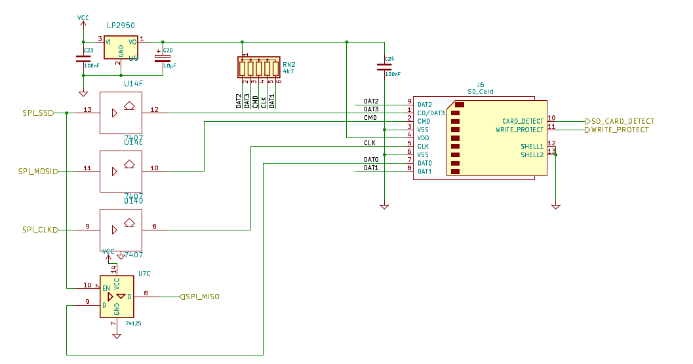

# CPU/Memory

The actual computer core is composed of the actual CPU, a 512k x 8 SRAM, a 32k EEPROM and a Xilinx XC9572 CPLD. The CPLD now provides all glue logic, such as address decoding, memory mapping, wait state and clock generation. In previous revisions, this part was made up of GALs and a couple of TTL ICs.
In order to address 512k, the CPLD provides additional address lines. 


## What is the CPLDs job?

### Address decoding

The CPLD decodes the address bus and decides if ROM or RAM is enabled at that address, or, if the address lies within the IO area, if the VIA, the UART, the VDP or the OPL2 chip is being talked to by the CPU.

The IO area is a group of memory locations located at $0200 to $027f that is divided into 8 sections sized 16 bytes each, which is enough to accommodate all memory locations of all of the chips we use.

|Location|Device|
|:---|:----|
|$0200|UART|
|$0210|VIA|
|$0220|VDP|
|$0230|Internal memory mapping registers|
|$0240|OPL2|
|$0250|Expansion slot 0|
|$0260|Expansion slot 1|
|$0270|reserved for future use|

### Memory paging

In order to make 512k adressable by the 65c02's 16bit address bus, some extra logic is required.
We divide the 64k address space of the 65c02 CPU into 4 "slots" sized 16k each:

|Slot|Start|End|
|:---|:----|:--|
|0|$0000|$3fff|
|1|$4000|$7fff|
|2|$8000|$bfff|
|3|$c000|$ffff|

The "internal memory mapping registers" mentioned above  are used to assign one of 32 RAM pages (512k / 16k) or one of 2 ROM pages (32k / 16k) to each slot. 


```
R0: 00000000
R1: 00000001
R2: 00000100
R3: 10000000
    |  |   | 
    |  + Bits 0-4: Page Number (0-31 for RAM, 0-1 for ROM)
    |
    +--- Bit 7: 0 if RAM, 1 if ROM

```

Each register has bits 0-4 to contain the page number (actual 16k block within the 512k memory space), and bit 7 to select ROM or RAM. Bits 5 and 6 are reserved for future use.
Example: 
A register value of $81 (10000001) in register 3 will cause ROM bank 1 to be visible in Slot 3 ($c000-$ffff).

The IO-area ($0200-$02f) will always be present at this location, no matter the value of register 0.

For a more detailed description of the banking scheme, see [here](/post/512k-ought-to-be-enough-for-anybody/).

### Clock generation

The master clock is also routed through the CPLD in order to be able to get some flexibility to shape the clock signal. At the moment, the master oscillator's clock is just divided by two. 

### Waitstate generation

The Steckschwein is clocked at at 10MHz, and probably more in the future. The WDC 65c02 is actually rated for 14MHz, and is known to be "overclock-friendly". Not all components are capable of that bus speed though, so we need to take care about them. The 65c02 has us covered by providing a pin called “RDY”, which can be used to stop and freeze the CPU at whatever it is doing right now. While accessing slower devices such as the video chip, sound chip and ROM, the Steckschwein halts the CPU for a given number of cycles, giving those devices the time they need.

## Reset

The reset circuit is based on an NE555 and is the same as in the Commodore PET and VC20. 


## Buffers

The "computer core", CPU, ROM, RAM and CPLD plus the VIA 65c22 and the "non-65xx-bus" native rest of the system, such as the UART 16550, V9958 and OPL2 are separated through two 74HCT245 buffers, to keep the bus lines as short as possible.


# I/O 

The most common io device for the 6502 processor is the 6522 VIA (Versatile Interface Adapter). In our case, we are using it among a few other things as as the SPI master. VIA port B is solely dedicated to be used with SPI devices. The direction MISO (Master In, Slave Out) is covered by the internal shift register of the VIA. 

One of the fundamental design decisions when creating the Steckschwein was to use SPI as the main peripheral bus. This way, various different devices can be utilized using a single interface protocol. The main killer feature for using SPI was to be able to use an SD card as mass storage. This gives us mass storage with almost no extra hardware effort, only level conversion is needed between the system (5V) and the card (3.3V).

The VIA pins are used as follows:

|VIA pin |SPI / SD card pin|
|---|---|
|PB0|SPICLK|
|PB1|SS1 SD-card|
|PB2|SS2 PS/2 keyboard controller (ATmega8)|
|PB3|SS3 RTC (DS1306)|
|PB4|SS4 (unused)|
|PB5|sd card write protect|
|PB6|sd card detect|
|PB7|MOSI|
|CB1|SPICLK (connected to PB0)|
|CB2|MISO|

D1 only needs to be populated when using a VIA variant with a totem pole IRQ pin instead of open drain, such as the W65c22S. If an NMOS compatible variant is used, a wire has to be popupated for D1.


Basically, the process of reading data via SPI only consists of setting the appropriate slave select pin to low and then "wiggling" the PB0 pin as fast as possible, which is determined by how fast the CPU is able to write to the port. This also means that the shift register is used in "Shift In - External CB1 Clock Control (011)"-mode, which is the very mode affected by the infamous [VIA-Bug](http://forum.6502.org/viewtopic.php?t=342#p2310). We did not do anything circuit wise to implement a workaround. We rather rely on the fact, that we create the SPI clock using the processor and hereby have the SPI clock locked to the system clock, so the signal slopes have a fixed delay. This should take care of the bug not to occur. Hopefully.


### SPI devices


#### SD-Card as really cheap and lazy mass storage

The SD card is the "killer application", that sold the idea to us to use SPI as the main peripheral bus. The only additional hardware effort was to level shift the signals from and to the sd-card, as it runs on 3.3V while the Steckschwein uses 5V. To accomplish this, the SPI clock, SPI slave select and MOSI are converted using a 74LS07, with it's open collector outputs pulled up to 3.3V. The other direction, MISO, is routed to one of the units of a 74HCT125, whose inputs can deal with 3.3V logic and whose outputs are TTL compliant, hence HCT.

This gives us access to gigabytes of mass storage with minimal effort. No need to fiddle with floppy disc controllers or IDE drives.





#### PS/2 keyboard controller

An ATmega8 is used as PS/2 keyboard and maybe (later) mouse controller. The code running on the ATmega is based on [AVR Application Note 313](http://www.atmel.com/Images/doc1235.pdf), We added code to act as an SPI slave and implemented german keyboard layout and support for a few modifier keys that was missing in the original code. Also, special keys or key combinations like SysRq and the three-finger-salute are being handled directly by the keyboard controller to pull the respective signals like NMI or trigger a hardware reset.
The pin header P2 can be used to access the rx and tx pin of the ATmega8's UART to be able to get some debug output. P3 is a standard ISP connector used to reflash the ATmega8's firmware.


#### Real time clock

The RTC DS1306 delivers the current time down to second resolution, supports two alarms and also has 96 bytes of battery backed memory. 
This makes it a good place to store system boot parameters.
Main reason to add the RTC, besides from that a real nice machine of course needs an RTC, is to have a real time source to set the proper file creation time and date in our FAT32 implementation.


### Serial interface

The 16550 UART was the first chip to be attached to the CPU bus that does not have a native 65xx bus interface and hence needed a little more effort. The reset and interrupt signals are active high, while the 6502 needs them to be active low. So reset needed to be inverted, and interrupt is driven through a 74LS06 inverter driver with open collector outputs in order to be able to be wire-ORed to the system interrupt line. Furthermore, there is no combined R/W line, so that signal hat to be split up into /WR and /RD.
The 16550 provides a full featured serial interfaces and a FIFO. Also, it provides 2 freely usable I/O lines, which are used to disable/enable joystick ports.


### Joysticks

Since after using all of VIA Port B for SPI, all we have left is Port A to hook up anything else. One of our design goals is to be able to hook up two Atari/Commodore style joysticks. With only one 8bit IO port left, this is a bit tricky. 
Our next approach included tri state drivers behind every joystick port. That way, in order to read the state of a particular joystick, the respective driver has to be enabled first. It is also possible to disable the drivers altogether, freeing port A up completely, which made it possible to add a freely programmable user port.


### User Port
By using the UART IO lines, the Joysticks can be completely disconnected from the VIA, freeing up it's entire port A for the user port and any custom extension one might want to connect there. IRQ and NMI lines are also accessible from the user port. An example for an user port extension could be an [adapter for SNES controllers](/post/connecting-snes-controller-to-the-steckschwein/).


### Video

The core of the Steckschwein video section is the [Yamaha V9958](https://www.msx.org/wiki/Yamaha_V9958). The V9958 is the successor of the V9938, which in turn is the successor to our TMS9929/9918, which has served our project for quite some time. But it is hard to ignore what the V9958 has to offer (80 column text mode to begin with), so we decided to use it as the first major upgrade to the Steckschwein Hardware specs in a couple of years.

#### Digital Section

The V9958 supports up to 192k of video RAM - 128k in two banks, plus additional 64k "extended" RAM.  The video chip having his own RAM also means that every access to the video RAM has to happen through the means of the V9958. There is no way for the CPU to access the video RAM directly.
The VDP has it's own /WAIT line, which it can use to signal that it is still busy doing VRAM access. This line can be connected to the 65c02's RDY line to halt the CPU until the VDP is ready again.


#### Analog Section

A Sony CXA2075 is used as the video signal output stage and to additionally generate s-video and composite video from the VDPs RGB signal.
The shown configuration is for generating PAL video. For NTSC, has to be changed from 2.61k/1% Ohms to 3.32k/1%, and the oscillator X2 needs to be 3.28 MHz instead of 4.43MHz. Also, the VDP needs to be initialized accordingly.
The 8pin DIN jack for the RGB signal and the pinout is the same the NeoGeo console uses. We wanted an RGB jack that is not D-SUB23 or SCART, and we did not want to come up with out own. The NeoGeo pinout is exactly what we need, and there are also ready made cables available to buy. S-Video just uses the standard miniDIN connector.


### Sound

A real 8bit computer also needs a real soundchip, not some D/A converter that plays samples, but a real synthesizer on a chip, just like in the old days.

And by thinking sound chip and 8bit, the first thing comes to mind is of course the MOS 6581 SID chip, prominently used in the C64 and hands down the best sound chip from the 8bit era. But the SID has a few drawbacks that would make it difficult to use for the Steckschwein:

1. It’s maximum clock rating is 2MHz. We’re already running at 8MHz, so that’s going to be a problem.
2. While not hard to come by, SID chips aren’t cheap. Prices of about 40 Euros or more per unit are common. And those chips are not NOS, they are most likely pulled from a C64. We do not want to build the Steckschwein out of scavenged parts.

The other optimal choice would probably have been the Ensonic DOC5503 Chip, as used in the Apple IIgs, and also in the early Ensoniq Synthesizers as the ESQ-1 and the SQ-80, but these are hard to come by and documentation is scarce.

So we decided to use the Yamaha [YM3812](https://en.wikipedia.org/wiki/Yamaha_YM3812) chip, which might be better known as OPL2. That’s right, the very chip that was used on early PC sound cards such as AdLib or the first Sound Blaster cards. OPL2 chips are easy to come by, and they are rather cheap.

#### Digital Section

The YM3812 is attached to the CPU data bus, CS and RD/WR signals are generated by the glue logic in the CPLD. The YM3812 does not output an analog audio signal directly, but a digital stream of encoded floating point numbers. To convert this into analog audio, it's companion chip, the Y3014B is used.


#### Analog Section

As mentioned above, the actial analog audio signal is generated by the Y3014B 16bit DAC. All thats needed to get an line level audio signal is an amplification stage using the very common operational amplifier LM324. Actually, the whole analog section is the same as the one in the [Commodore Sound Expander](https://www.c64-wiki.com/wiki/Commodore_Sound_Expander#Technical_Details) cartridge.


### Expansion Slots

The Steckschwein SBC has two expansion slots featuring the most relevant signals to build extension modules and/or prototype new hardware features.


### Schematics and Repository.

The full schematics are available as PDF [here](/pdf/sbc_schematic_0.6.pdf).

Our [Github hardware repository](https://github.com/Steckschwein/hardware) does not only contain all KiCad files including schematics and pcb layouts, but also the firmware for the CPLD and the PS/2 controller.
