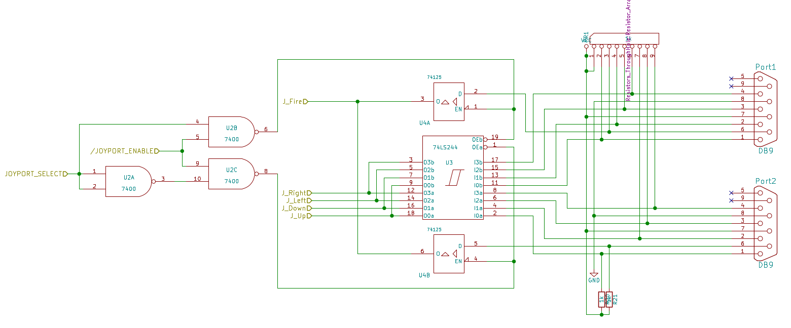

Since after using all of VIA Port B for SPI, all we have left is Port A to hook up anything else. One of our design goals is to be able to hook up two Atari/Commodore style joysticks. With only one 8bit IO port left, this is a bit tricky. Our first approach was to wire up the joysticks in a matrix like arrangement, but this suffered from the infamous [matrix ghosting problem](https://www.dribin.org/dave/keyboard/one_html/). Also, port A was completely blocked and could not be used for anything else that way.

Our next approach included tri state drivers behind every joystick port. That way, in order to read the state of a particular joystick, the respective driver has to be enabled first. It is also possible to disable the drivers altogether, freeing port A up completely, which made it possible to add a freely programmable user port.

