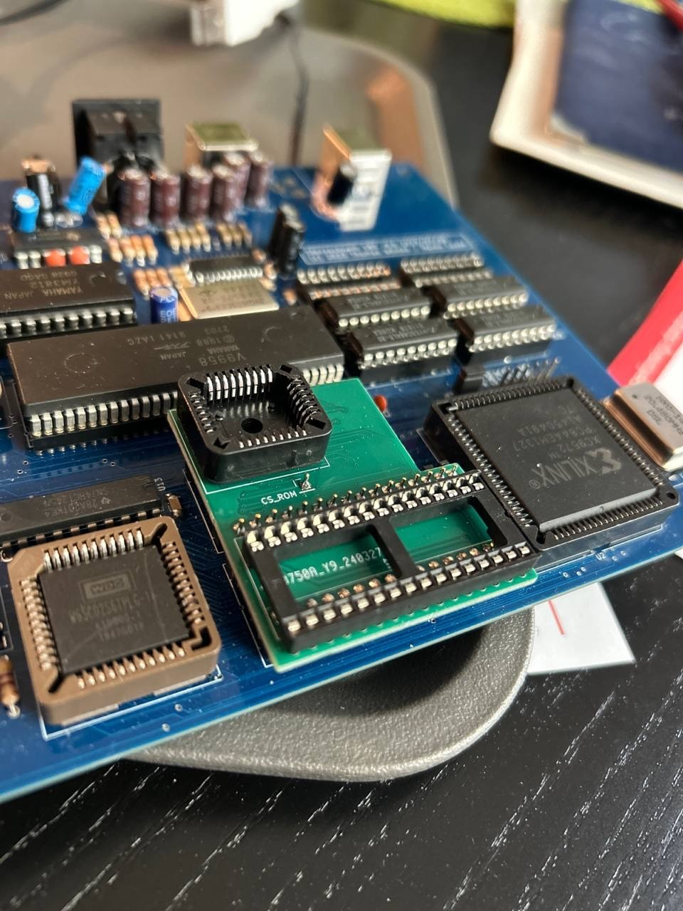

The **28C256 EEPROM**, which holds the BIOS, has been our go-to choice since the early breadboard days. Before that, we relied on **EPROMs**, which required UV erasure before every upgrade—a time-consuming and inconvenient process. Switching to an EEPROM significantly improved our workflow, reducing turnaround time.

However, the **28C256** has a couple of drawbacks:

- **It cannot be written in-circuit** since it requires a 12V programming voltage, which the Steckschwein does not provide.
- **It is slow**, with an access time of **150ns**, forcing us to introduce wait states to slow down the CPU when accessing the BIOS.

Because of these limitations, using ROM routines isn't ideal from a performance standpoint. As a result, the BIOS's sole function is to load the steckOS bootloader from an SD card into **RAM** and start it.

To overcome these issues, we designed an **adapter board** that replaces the **28C256 EEPROM** with a **Flash EEPROM**, such as the **39F040**, which features a much faster **55ns access time**.

With this upgrade, the Steckschwein SBC now has **1MB of total memory**—**512K RAM** and **512K Flash EEPROM**—running at full speed. This unlocks several new possibilities:

- Eliminating the BIOS and running **steckOS** directly from ROM.
- Upgrading steckOS in-circuit and from within itself using a flash write tool.
- Adding a ROM-based machine language monitor.
- ROM BASIC/FORTH
- Implementing **demos** and **diagnostic tools.**

