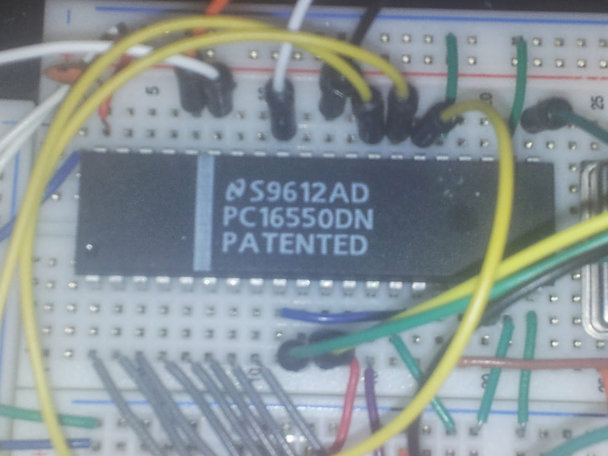

Die 65x51 ACIA erschien uns als die am tiefsten hängende Frucht, um eine RS232 Schnittstelle zu implementieren, nachdem wir Bit Banging nach C64 Vorbild ziemlich schnell verworfen hatten.  
Auch programmiertechnisch mach die ACIA einen simplen Eindruck, ganze drei Register wollen beherrscht werden.  
Die rs232-Schnittstelle ermöglicht uns, Code auf den Steckbrettrechner zu laden, ohne jedesmal das EEPROM neu brennen zu müssen. Eine gewaltige Erleichterung.  
  
Aber - wir haben es bereits erwähnt - die ACIA hat keine Zukunft bei uns. Die uns vorliegenden Chips können mit bis zu 2 MHz getaktet werden. Wir aber wollen hoch hinaus. Mit den aktuellen 65cXX-Chips von WDC sind schließlich bis zu 14MHz möglich.  
Darüberhinaus sind mit der ACIA ohne Hacks nur 19200 baud möglich, und selbst hochgezüchtet sind mehr als 38400 baud nicht drin. Dazu kommt, dass es keinen Puffer gibt und für jedes empfangene Byte ein Interrupt ausgelöst werden müßte.  
  
Die Entscheidung ist gefallen. Die ACIA hat uns viel Spass gemacht, aber noch mehr Spass macht ein modernerer Schnittstellenchip: der 16550 UART, bekannt aus der Welt der IBM-kompatiblen.  

<table align="center" cellpadding="0" cellspacing="0" style="margin-left:auto;margin-right:auto;text-align:center;"><tbody><tr><td style="text-align:center;"></td></tr><tr><td style="text-align:center;">Der 16550 UART</td></tr></tbody></table>

  
Der 16550 kann zunächst einmal seine niedere Herkunft als PC-Chip nicht verbergen. Reset und Interrupt-Signal sind active high, sodass hier schonmal ein wenig Glue Logic vonnöten ist. Das Reset-Signal wird durch einen freien Inverter des 74ls04 geschickt. Um die IRQ-Leitung bei einem Interrupt auf L ziehen zu können, benötigen wir hier einen Inverter mit Open Collector-Ausgang. Dazu kommt ein 74ls06 zu Einsatz, der auch bis jetzt nichts anderes macht als das IRQ-Signal des UART zu verarbeiten.  
Das Businterface erfordert weitere Anpassungen. Der 16550 hat ein jeweils separates Signal für RD (read) und WR (write), und zwar wahlweise eins als active high und eins als active low. Irgendwie muss man 40 Pins ja voll kriegen. Das jeweils nicht benötigte Signal wird entsprechend auf Potential gelegt. Also legen wir RD und WR auf Masse und kümmern uns nur noch um /RD und /WR.  
Einen dedizierten Takteingang, wie wir es von den Chips der 65xx-Serie gewohnt sind, gibt es auch nicht.  
Wir lassen uns von [Andre Fachats Umbau eines C64 auf 16550](http://www.6502.org/users/andre/icaphw/c64ser.html) inspirieren und legen CS0 auf High, CS2 auf Low und geben den Systemtakt PHI2 auf CS1. Somit ist der Chip immer nur selektiert, wenn PHI2 H ist. Die Adressdekodierung übernimmt hier wieder der GAL. Das CS-Signal von dort dient als Enable-Signal für einen 74ls138, der aus /RW und PHI2 separate /RD und /RW Signale dient. Der 74ls138 hat sogar noch einen Eingang und zwei Ausgänge frei, sodass sich unter Dazunahme einer weiteren Adressleitung sehr einfach ein zweiter UART unterbringen ließe. Auch hier dient die Arbeit von Andre Fachat als Vorbild.  
  
Richtig spassig wird der 16550 aber, wenn es an die Programmierung geht. Er verfügt über 12 Register, die an 8 Adressen ansprechbar sind. Auch Nicht-Mathematiker erkennen hier sofort, dass hier Registeradressen doppelt belegt sind. Registeradresse A beherbergt, wenn gelesen, also Register X, wenn geschrieben wird, ist es aber Register Y. Wahnsinn.  
Quasi als kleiner Trost und Bonbon verfügt der 16550 dafür aber über das "Scratchpad"-Register. Dort kann man ein Byte ablegen und auch wieder lesen. Ansonsten beeinflusst es das Verhalten des Chips in keiner Weise. Die Bezeichnung "Scratchpad" legt nahe, dass dort Registerinhalte "entworfen" werden könnten, um sie dann von dort in das entsprechde Register zu übertragen. Nur verfügt der 16550 über keinerlei Möglichkeit, den Inhalt eines seiner Register ins Scratchpad zu legen oder von dort zu holen, sodass es jede andere Specherstelle genauso tut. Was bleibt ist, dass man quasi mit jedem verbauten 16550 ein Byte RAM gratis erhält. Sogesehen kann man gar nicht genug UARTs haben.
