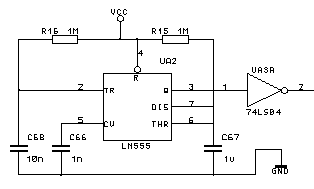

Wenn man 20 Jahre lang den Jugendtraum mit sich rumträgt, einen 8bit-Rechner selber zu bauen, dann hat man 20 Jahre Zeit, einzurosten. Langsames Rantasten an das große Ziel ist angesagt.

In diesem Fall soll unser 65c02 erstmal nur NOPs ausführen und wir wollen zuschauen, was auf dem Adressbus passiert. Der Datenbus ist hart verdrahtet auf NOP ($EA, 11101010) . Als Reset-Schaltung kommt eine auf Basis des allseits beliebten NE555 zum Einsatz. Die gleiche Schaltung verrichtet auch im legendären Commodore PET ihren Dienst, also eine Chance, eine kleine Hommage mit einzubauen:

Als Taktgenerator missbrauchen wir den Kalibrierausgang des Oszilloskops, der unsere Computer-Keimzelle mit 1 kHz taktet.

Am Adressbus sind nun, über 74ls245-Treiber, 16 LEDs angeschlossen, an denen wir erkennen können, welche Adresse anliegt:

 


Was wir also spannendes hier sehen ist folgendes:

Nach dem Reset sprint der 65c02 an seinen Reset-Vektor, nämlich $fffc, liest dort die Adresse $EAEA (der Datenbus ist ja auf $EA hart verdrahtet), springt nach $EAEA, liest die erste Instruktion ein, nämlich ein NOP ($EA) und so weiter. Könnte man sich stundenlang ansehen.
