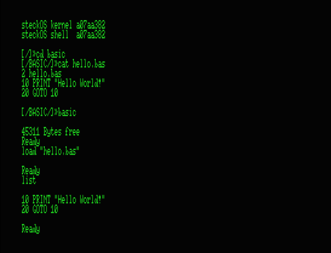

Since our implementation of FAT32 now supports reading a file byte for byte, a little rework of the file handling in our version of EhBasic is in order.

In the past, we only could read or write a file as a whole, relative to the location in memory where the according pointer pointed to. We used this in EhBasic to save and load BASIC programs by dumping and reloading it’s binary representation from memory. While this works well, this approach has the major disadvantage that the saved program will be incompatible with other versions of EhBasic or even with our own when the token list is changed, which happens when adding new commands.

So clearly, the better approach is to read the BASIC program as source in it’s ASCII representation. This is the way EhBasic’s late creator, Lee Davison, preferred, and suggested how to implement this:

    To load an ASCII program redirect the character input vector to read 
    from your filesystem and return to the main interpreter loop. 
    The input vector should be restored and the file closed when the 
    file end is reached or an error is encountered.

Basically the interpreter would read characters and interpret them, just like them being typed in, but instead they will be read from the file. So, our LOAD command is implemented like this:
```
LAB_LOAD: 
    lda #O_RDONLY 
    jsr openfile

    lda #<fread_wrapper 
    sta VEC_IN 
    lda #>fread_wrapper 
    sta VEC_IN+1

    lda #<outvec_dummy 
    sta VEC_OUT 
    lda #>outvec_dummy 
    sta VEC_OUT+1 

    JMP LAB_1319 ; reset and return

```
All it does is changing the in and output vectors and then returning back to the interpreter, which then begins to read characters from VEC_IN until the file is read. But then what? The input vector still points to fread_wrapper, how do we get control back?
That’s the reason we did not point the vector directly to fat_fread_byte. Instead, we implemented a wrapper, which will read a byte from the file and pass it to EhBasic, and restore the vectors when EOF is reached:

```
fread_wrapper: 
    phx 
    phy 
    ldx _fd 
    jsr krn_fread_byte 
    bcs @eof 
    cmp #KEY_LF ; replace with "basic end of line" 
    bne :+ 
    lda #KEY_CR
:   ply   
    plx 
    cmp #0 
    rts
@eof: 
    jsr krn_close
    jsr init_iovectors
    SMB7 OPXMDM ; set upper bit in flag (print Ready msg) 
    jmp LAB_1319 ; cleanup and Return to BASIC

init_iovectors: 
    lda #<krn_chrout 
    sta VEC_OUT 
    lda #>krn_chrout 
    sta VEC_OUT+1
    lda #<krn_getkey 
    sta VEC_IN 
    lda #>krn_getkey 
    sta VEC_IN+1 
    rts
```

Also, outvec dummy ist just an empty subroutine which we set the output vector VEC_OUT to, in order to suppress output while loading. Otherwise, the input would be echoed by the interpreter loop, resulting in the program being listed during load.

```
outvec_dummy: 
    rts
```

Now we’re ready to feed almost any BASIC source to EhBasic, which will make porting existing BASIC software pretty easy.




The next step will be to save BASIC programs in ASCII format by setting VEC_OUT accordingly and triggering a LIST command.