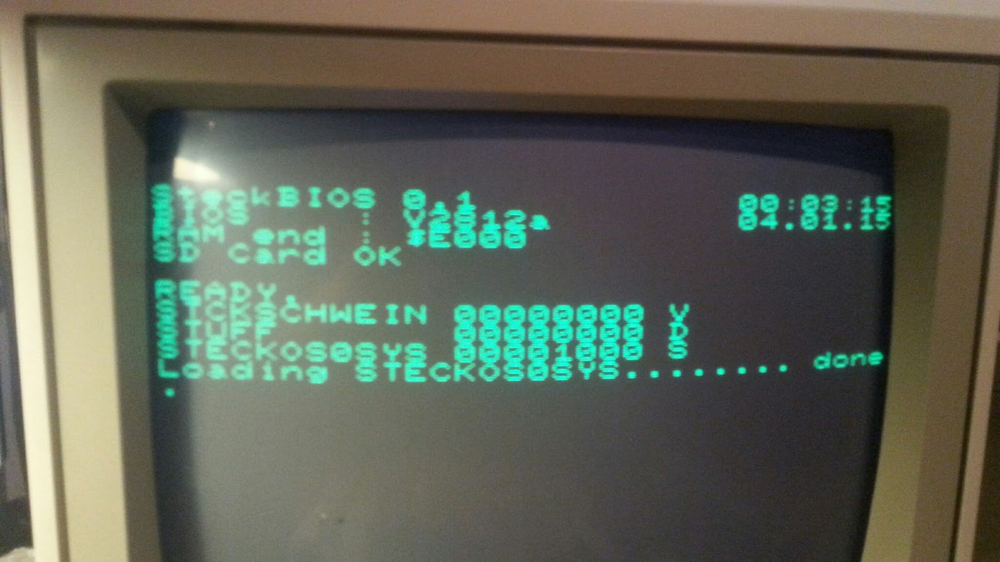

Die Aufgabe, die wir dem (Steck)BIOS zugedacht haben, beschränkt sich darauf, die vorhandene Hardware zu initialisieren, auf eine eingelegte SD-Karte zu prüfen, und dann von dort das eigentliche "Betriebssystem" zu laden. Fast ein bisschen PC-like.

Hier ist die Überlegung, im Stammverzeichnis eine bestimmte Datei zu finden und an eine bestimmte Adresse in den Speicher zu laden.

Sollte dies fehlschlagen, kann man immer noch in einen Monitor oder unsere bekannte rs232-Uploadroutine springen.

<table style="margin-left:auto;margin-right:auto;text-align:center;" cellspacing="0" cellpadding="0" align="center"><tbody><tr><td style="text-align:center;"></td></tr><tr><td style="text-align:center;">Aktuell lesen wir das Stammverzeichnis, bis wir eine Datei mit "System"-Attribut finden, lesen diese ein und führen den Code aus.</td></tr></tbody></table>

Um nun also eine Datei auf der SD-Karte zu finden, müssen wir erstmal rudimentäre Unterstützung für das FAT-Dateisystem bauen. FAT stammt aus den 70er Jahren und hat als Dateisystem für MS-DOS-basierte Betriebssysteme Verbreitung gefunden. Ursprünglich war es für Disketten gedacht (FAT12), und wurde immer wieder erweitert, um auch wesentlich größere Datenträgerkapazitäten wie z.B. von Festplatten zunächst bis 2GB (FAT16), dann aber auch über diese Begrenzung heraus (FAT32) zu unterstützen.

Da so ziemlich jede SD-Karte, die man heute kaufen kann, mindestens 2GB Kapazität hat, lassen wir FAT12 und FAT16 außen vor, und konzentrieren uns nur auf FAT32. Hierzu ist sicherlich die [offizielle Dokumentation von Microsoft](http://msdn.microsoft.com/en-us/windows/hardware/gg463080.aspx) eine sinnvolle Lektüre, als wesentlich hilfreicher hat sich aber das auf FAT32 konzentrierte [Understanding FAT32 Filesystems von Paul Stoffregen](https://www.pjrc.com/tech/8051/ide/fat32.html) erwiesen, indem es einen gezielt durch die Strukturen führt, die man für FAT32 tatsächlich braucht.

Unsere Implementation beschränkt sich darauf, das Stammverzeichnis der ersten Partition zu lesen, bis eine Datei gefunden wird, die das "System"-Attribut hat. Diese wird eingelesen.

Hierbei ist das Verfolgen der Clusterketten, also das eigentliche Auswerten der FAT, nicht implementiert, sodass die max. Dateigröße der Größe eines Clusters entspricht. Zum finden und laden dessen, was später mal unser "Betriebsystem" werden soll, reicht es aber.

Der rudimentäre Code findet sich in unserem [Repository auf Sourceforge](https://sourceforge.net/p/steckschwein/code/ci/default/tree/fat/).
