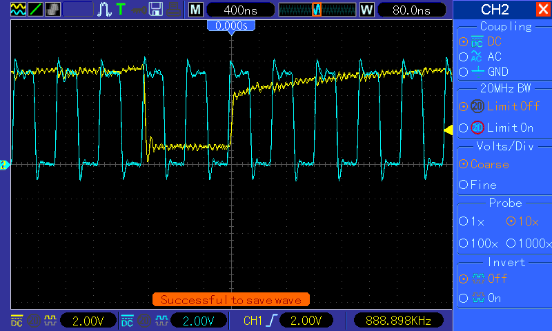
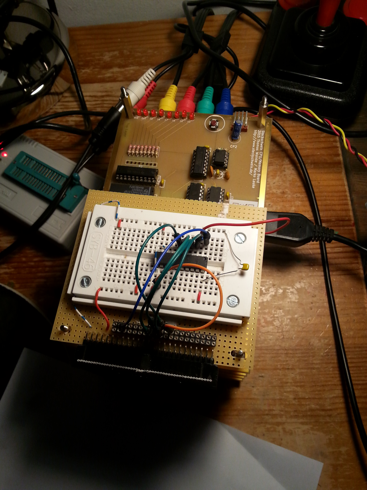

An den Heimcomputern von "damals" gemessen ist das Steckschwein mit 4 MHz durchaus einer der schnelleren 6502-Rechner. Damals waren zumeist Taktraten von 1 MHz üblich. Einige wenige hatten deutlich mehr, wie z.B. der Apple IIgs (65816) mit 2.8 MHz. Einen 4 MHz-65(C)02-Heimcomputer hat es damals nach unserem Informationsstand nicht gegeben.

Nun ist es aber so, dass aktuell erhältliche 65c02-CPUs von WDC offiziell mit bis zu 14MHz getaktet werden können, inoffiziell wurden schon problemlos Taktraten von 20 MHz erreicht. Da ist also noch Raum für eine Prise Größenwahn. Den Takt des Steckschweins pauschal zu erhöhen funktioniert nicht. Zu viele Bausteine kommen dann nicht mehr mit. Das verwendete Atmel 28c256 EEPROM hat eine Zugriffszeit von 150ns. Im WDC-Datenblatt ist tACC des Prozessors bei 4MHz mit 145ns angegeben. Also ist das stand jetzt schon etwas eng. Schneller takten geht also schon allein deswegen auf keinen Fall. Für den Videochip TMS9929 und den Soundchip gilt ähnliches. Das SRAM hingegen läßt sich problemlos gegen Bausteine von Alliance Memory mit 55ns Zugriffzeit austauschen. Damit sollten Taktraten von um die 10 MHz möglich sein.

Was wir also brauchen ist eine Möglichkeit, auf RAM und VIA (sofern auch WDC und damit gleich schnell)  mit voller Geschwindigkeit zuzugreifen, währen wir den Prozessor bei Zugriffen auf ROM, Video- und Soundchip für 1-2 Zyklen stoppen. Schließlich ist man geschätzt zu 99% im RAM unterwegs.

Erste Überlegungen gingen in die Richtung, die Taktfrequenz umschaltbar zu machen, je nachdem, welcher Baustein auf dem Bus von der CPU angesprochen wird. Dieses Prinzip birgt zwei entscheidende Nachteile:

1. Man darf den Takt nicht einfach so umschalten. Erwischt man einen ungünstigen Moment, kann dies die CPU zum Absturz bringen. Näheres kann in einem [entsprechenden Artikel auf 6502.org](http://www.6502.org/mini-projects/clock-switching/clock-switching.html) nachgelesen werden.
2. Die VIA-Timer sind direkt abhängig von der Taktfrequenz. Software, die diese benutzt, könnte sich nicht mehr auf diese verlassen, wenn sich die Taktfrequenz ständig ändert.

Zum Glück bietet der 6502 auch hier genau das, was wir brauchen: Den RDY-Pin. Wird dieser auf LOW gezogen, "friert" der 6502 ein. Kehrt RDY wieder auf HIGH zurück, macht die CPU dort weiter, wo sie unterbrochen wurde. Durch geschicktes Ansteuern dieser Leitung können wir den Prozessor also veranlassen, auf langsamere Bausteine zu warten. Dieses Konzept nennt sich Wait States (eben Wartezyklen) und ist bei aktuellen Computern gang und gäbe.

Im Grunde genommen brauchen wir also einen Zähler, der die Taktfrequenz des Systems herunterteilt, und eine Selektionslogik, über die sich wählen läßt, welcher Ausgang des Zählers die Grundlage für das RDY-Signal bilden soll, und damit die Anzahl der Wait States bestimmt. Dieses Signal bildet invertiert das RDY-Signal.

\[caption id="attachment\_388" align="alignnone" width="800"\] Gelb: RDY, Blau: PHI2 (Systemtakt) - 2 Wait States für den Videochip\[/caption\]

Zur folgender Logik haben wir uns vom [Waitstate-Generator von Daryl Rictor](http://sbc.rictor.org/parts/wsgen.html)  stark inspirieren lassen. Im Wesentlichen haben wir die Adressdekoderlogik zugunsten der bereits ausdekodierten /CS\_... Leitungen entfernt, sowie die Syntax von CUPL nach GALasm überführt.

\[caption id="attachment\_585" align="alignnone" width="2448"\] Waitstate-Generator-Prototyp auf dem Steckbrett\[/caption\]

Folgende Schaltung erzeugt entsprechend 1 oder 2 Waitstates, und versetzt den Ausgangspin in den Tri-State-Zustand, damit auch andere Bausteine Wait-States anfordern können. Sollten einmal mehr Waitstates nötig werden, lassen sich noch 1 oder 2 Zählerstufen hinzufügen, um 4 oder 8 Waitstates zu erzeugen.

GAL16V8
RDYGEN

Clock ROM VIA UART VDP SND NC NC Clear GND
/OE RDY W1 W2 NC NC NC Q1 Q0 VCC

W2 = ROM \* VIA \* UART \* SND \* /VDP
 + ROM \* VIA \* UART \* /SND \* VDP
W1 = W2
 + /ROM \* VIA \* UART \* VDP

Q0.R = W1 \* /Q0 \* /Q1 \* Clear
 + W2 \* /Q0 \* /Q1 \* Clear

Q1.R = W2 \* /Q1 \* Q0 \* Clear

RDY.T = /Q0 \* /Q1
RDY.E = W1

DESCRIPTION:
Generation of /RDY line modeled after http://sbc.rictor.org/parts/wsgen.html
and adapted to galasm syntax

Wir freuen uns jetzt über ein 8MHz-Steckschwein. Das Tolle ist, dass die VIA ebenfalls mit 8 MHz und ohne Waitstates betrieben werden kann, sodass sich die erhöhte Geschwindigkeit 1:1 auf den SPI-Bus auswirkt. Zugriffe auf die SD-Karte sind damit gleich doppelt so schnell.
