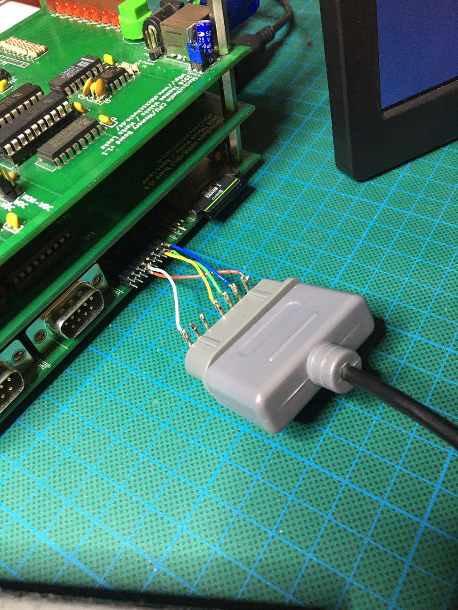
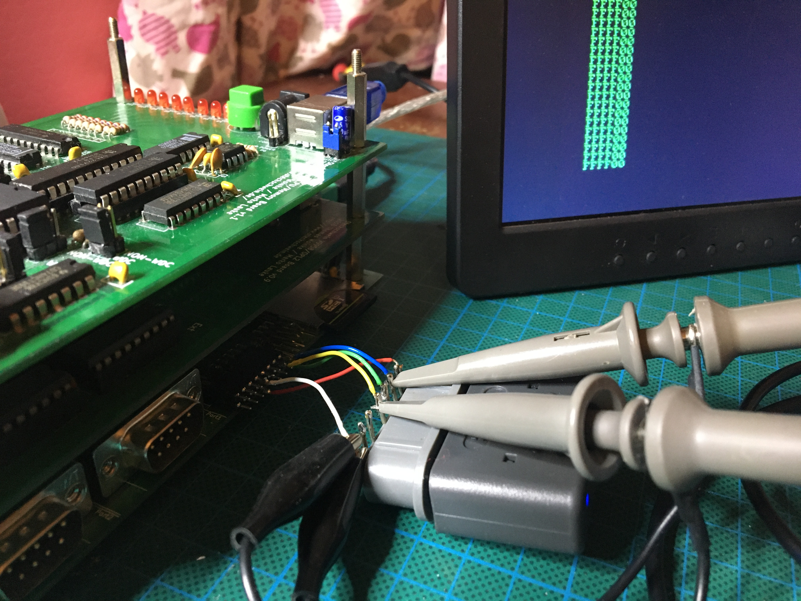

Recently, Michael Steil published a [blog post about connecting NES and SNES Controller to a 6502-based system](https://www.pagetable.com/?p=1365) showing how to use NES and SNES controllers on a C64 without the need for any special hardware, by just connecting them to the C64's user port.

Why not use his approach and adapt it to the Steckschwein? The Steckschwein has a User Port, too, albeit a very different one as the C64. Basically, the Steckschwein-User-Port consists of the complete Port A of the VIA, plus the /RESET and /IRQ lines. Also of course, VCC and GND.

User Port:
      |---------GND
      | |-------PA6  
      | | |-----PA4
      | | | |---PA2 (DATA1)
      | | | | |-PA0 (CLK)
o o X o o o o o
o o X o o o o o
      | | | | |-PA1 (LATCH)
      | | | |---PA3 (DATA2)
      | | |-----PA5
      | | |-----PA7
      |---------VCC

SNES Controller:
 /---------------------
| 7  6  5 | 4  3  2  1 |
 \\---------------------

Pin Description
1   +5V
2  CLK
3  LATCH
4  DATA
5  –
6  –
7  GND

\[caption id="attachment\_1289" align="alignnone" width="960"\] Simple adapter to connect one SNES controller\[/caption\]

As for the code, we use Michael's code with only a few modifications respective to the different pinout, and with a handful of optimizations. Having a 65c02 instead of the 6510 in the C64 gives us the STZ instruction, also using PA0 as clock pin takes just an INC instruction followed by STZ to pulse the clock line.

nes\_data = via1porta
nes\_ddr = via1ddra
; zero page
controller1 = $00 ; 3 bytes
controller2 = $03 ; 3 bytes

bit\_clk   = %00000001 ; PA0 : CLK (both controllers)
bit\_latch = %00000010 ; PA1 : LATCH (both controllers)
bit\_data1 = %00000100 ; PA2 : DATA (controller #1)
bit\_data2 = %00001000 ; PA3 : DATA (controller #2)

query\_controllers:
    lda #$ff-bit\_data1-bit\_data2
    sta nes\_ddr
    lda #$00
    sta nes\_data

    ; pulse latch
    lda #bit\_latch
    sta nes\_data
    ;lda #0
    ;sta nes\_data
    stz nes\_data

    ; read 3x 8 bits
    ldx #0
l2: ldy #8
l1: lda nes\_data
    cmp #bit\_data2
    rol controller2,x
    and #bit\_data1
    cmp #bit\_data1
    rol controller1,x
    ;lda #bit\_clk
    ;sta nes\_data
    inc nes\_data
    ;lda #0
    ;sta nes\_data
    stz nes\_data

    dey
    bne l1
    inx
    cpx #3
    bne l2
    rts

Small test program to output a different character for each button:

\[wpvideo 5Kk7bE3z\]

 

Also, instead of the original Nintendo SNES controller, I use an [8bitdo SN30](https://www.8bitdo.com/) Bluetooth controller with the SNES receiver. One could say this is the first time a Bluetooth device has been connected to the Steckschwein.

\[caption id="attachment\_1296" align="alignnone" width="4032"\] Bluetooth SNES receiver from 8bitdo\[/caption\]

Up next: Patching our games!
