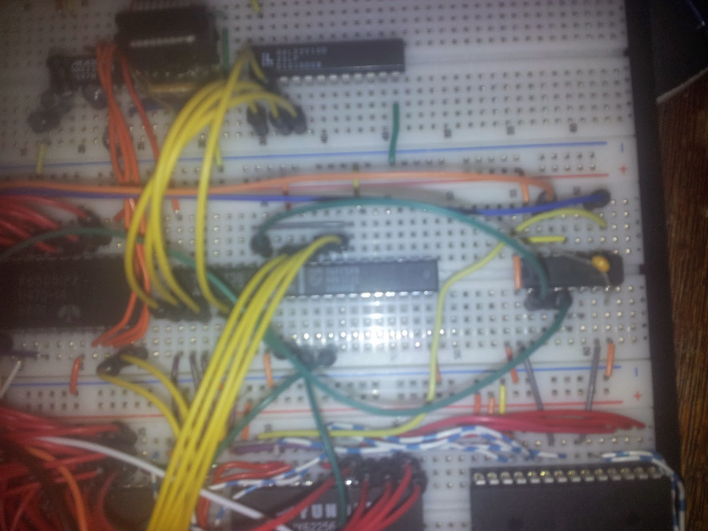

Sinn der Sache ist ja nicht, etwas 1:1 nachzubauen, sondern ein möglichst eigenes Design. Nachdem wir mit Chris' Design - bzw. dessen, was wir davon übernommen haben (Adressdekodierung, ACIA, VIA) - genug herumgespielt hatten, galt es, "unser" Ding draus zu machen. Der erste Schritt war ein Sprung ins kalte Wasser in die uns bislang noch unbekannte Welt der Programmierbaren Logik. Dazu haben wir zunächst die Adressdekodierung bestehend aus 74ls138/74ls154 sowie etwas glue Logic in VHDL implementiert und auf ein GAL22V10D gebrannt. Somit haben wir 3 TTL-ICs durch einen GAL ersetzt und wieder Platz auf dem Steckbrett geschaffen. Und das Beste: Änderungen an der Dekodierungslogik laufen ab sofort minimalinvasiv.

<table style="margin-left:auto;margin-right:auto;text-align:center;" cellspacing="0" cellpadding="0" align="center"><tbody><tr><td style="text-align:center;"></td></tr><tr><td style="text-align:center;">Der erste Test: Der 74ls138 wird durch den entsprechend programmierten GAL ersetzt. Später beherbergt dieser die gesamte Dekoder-Logik</td></tr></tbody></table>

Die erste Erweiterung ist ein /CS-Signal für den 2. 62256-Chip, der sich seinen Adressbereich mit 4k IO-Bereich und 8K ROM teilen darf und uns immerhin noch 20k nutzbares RAM beschert. Anfängliche Pläne, das unter dem ROM und IO liegende RAM nach Vorbild des C64 nutzbar zu machen stellen wir erstmal zurück. Zu viel Aufwand für lumpige 12k.

Inzwischen gibt es auch eine rs232-Schnittstelle auf Basis einer 65x51 ACIA. Der vorliegende Chip kann mit max. 2MHz getaktet werden, daher ist der diskret aufgebaute 3MHz-Oszillator wieder arbeitslos. An seiner Stelle betaktet ein 2MHz-TTL-Oszillator unseren Rechner.

Diese Begrenzung auf 2MHz gefällt uns nicht, eigentlich wollten wir den Rechner später so hoch wie möglich takten, auf jeden Fall mit 4MHz. Modernere CPUs sowie VIAs von WDC, die bis zu 14MHz Taktfrequenz vertragen, sind so gut wie geordert. Einzig die ACIA soll komplett durch einen moderneren Chip ersetzt werden, da sie uns nicht nur auf 2MHz, sondern auch auf 19200 baud begrenzt. Ein bisschen zu vintage, darum soll als nächtes die ACIA einem zeitgemäßeren Chip weichen.
