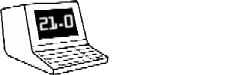

Am Wochenende vom 30. April und 1. Mai 2016 findet zum 17. Mal das [Vintage Computer Festival Europe (VCFe)](http://www.vcfe.org/D/) in München statt.

Das Steckschwein ist natürlich wieder dabei. Unter anderem wird es unsere neue CPU-Platine mit integriertem Waitstate-Generator und dadurch möglichen 8MHz Takt gezeigt.

Ausserdem wird es getreu des diesjährigen VCFe-Mottos "Irgendwas mit Medien" einen Vortrag zum Speichermedium des Steckschweins geben, speziell über dessen FAT32-Unterstützung.
