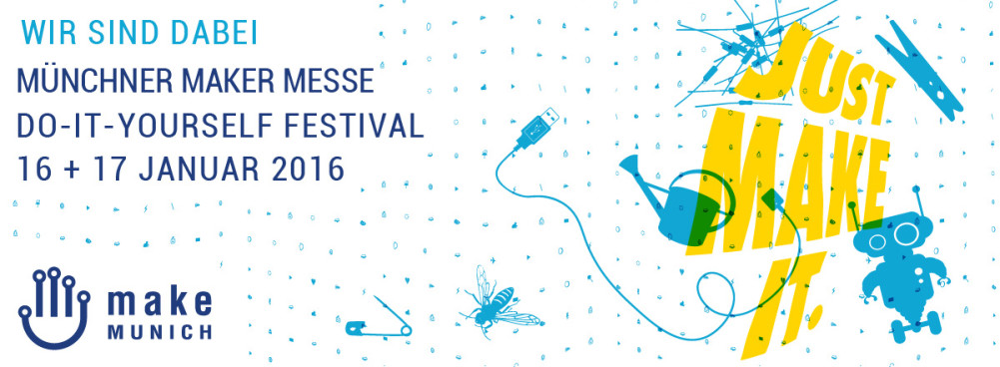

 Wir sind dabei!

Wir dürfen unser kleines Projekt auf der [Make Munich 2016](http://make-munich.de/) vorstellen! Ehrlich gesagt haben damit nicht wirklich gerechnet, denn die Maker-Szene ist ja eher visionär unterwegs, während wir etwas bauen, was vor 20 Jahren schon alt war. Umso mehr freut es uns, dass wir dabei sein dürfen. Wir denken uns auch etwas Schönes aus, um die Brücke zur Gegenwart zu schlagen.

Also, notieren: Steckschwein kucken auf der [Make Munich 2016](http://make-munich.de/), 16. und 17. Januar 2016
