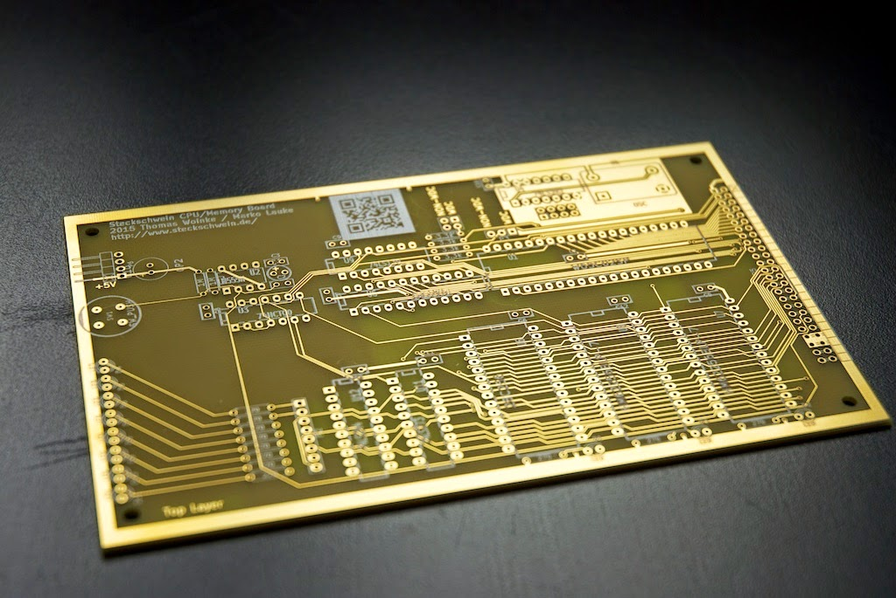
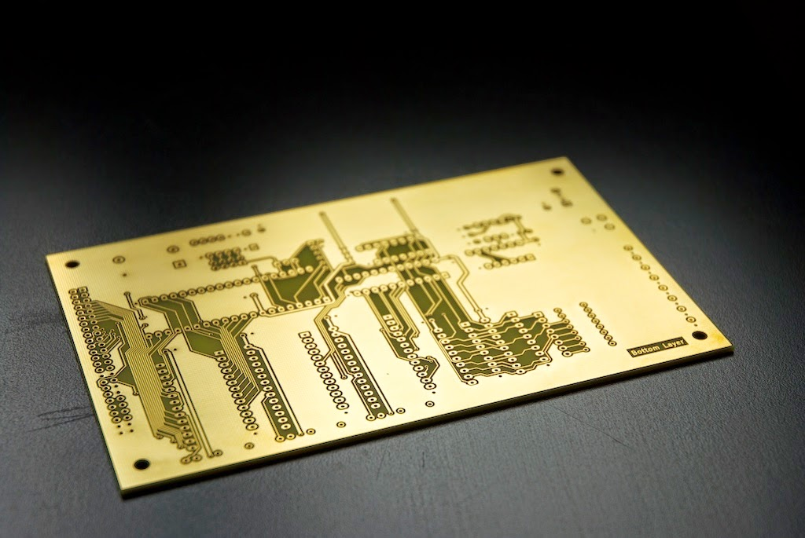
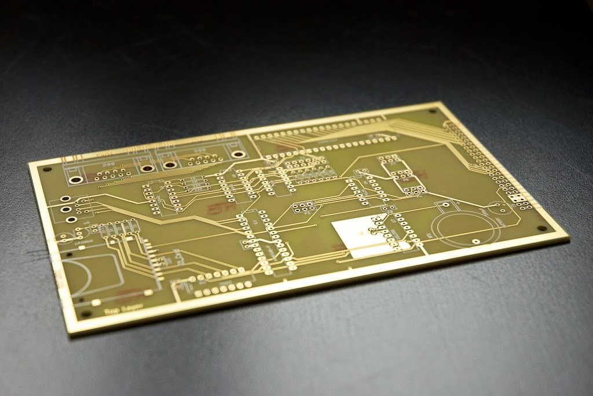
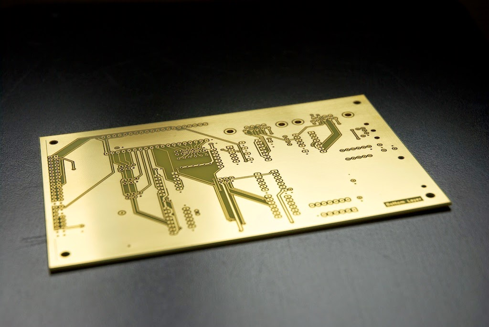
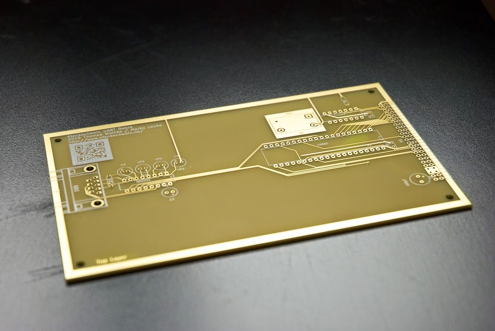
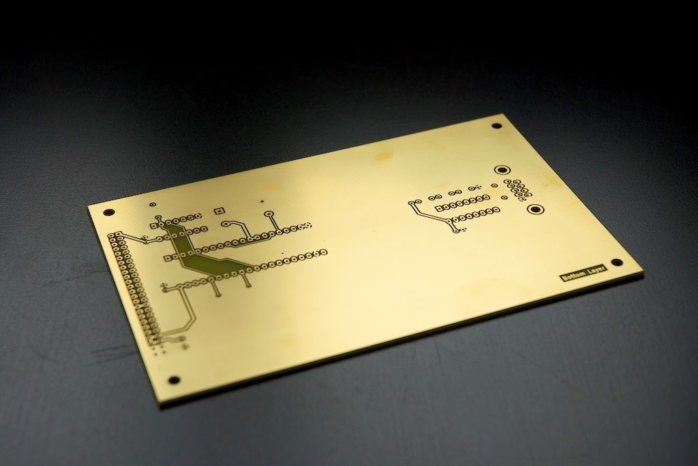

Die Platinen für CPU/Mem, UART und IO sind fertig! Dank Überlieferung sogar jede 2mal, sodass wir gleich 2 Steck^H^H^H^H^HPlatinenschweine aufbauen können.

<table style="margin-left:auto;margin-right:auto;text-align:center;" cellspacing="0" cellpadding="0" align="center"><tbody><tr><td style="text-align:center;"></td></tr><tr><td style="text-align:center;">CPU/Mem front</td></tr></tbody></table>

<table style="margin-left:auto;margin-right:auto;text-align:center;" cellspacing="0" cellpadding="0" align="center"><tbody><tr><td style="text-align:center;"></td></tr><tr><td style="text-align:center;">CPU/Mem back</td></tr></tbody></table>

<table style="margin-left:auto;margin-right:auto;text-align:center;" cellspacing="0" cellpadding="0" align="center"><tbody><tr><td style="text-align:center;"></td></tr><tr><td style="text-align:center;">IO/SPI front</td></tr></tbody></table>

<table style="margin-left:auto;margin-right:auto;text-align:center;" cellspacing="0" cellpadding="0" align="center"><tbody><tr><td style="text-align:center;"></td></tr><tr><td style="text-align:center;">IO/SPI back</td></tr></tbody></table>

<table style="margin-left:auto;margin-right:auto;text-align:center;" cellspacing="0" cellpadding="0" align="center"><tbody><tr><td style="text-align:center;"></td></tr><tr><td style="text-align:center;">UART front</td></tr></tbody></table>

<table style="margin-left:auto;margin-right:auto;text-align:center;" cellspacing="0" cellpadding="0" align="center"><tbody><tr><td style="text-align:center;"></td></tr><tr><td style="text-align:center;">UART back</td></tr></tbody></table>
