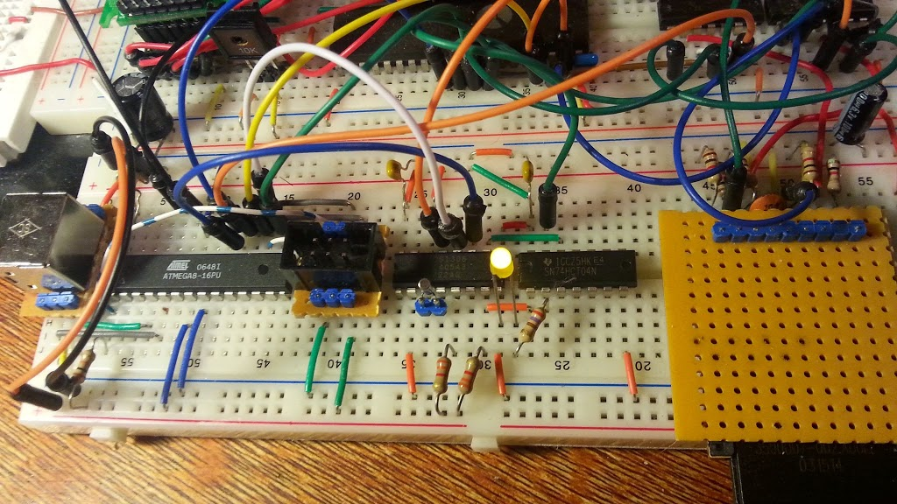
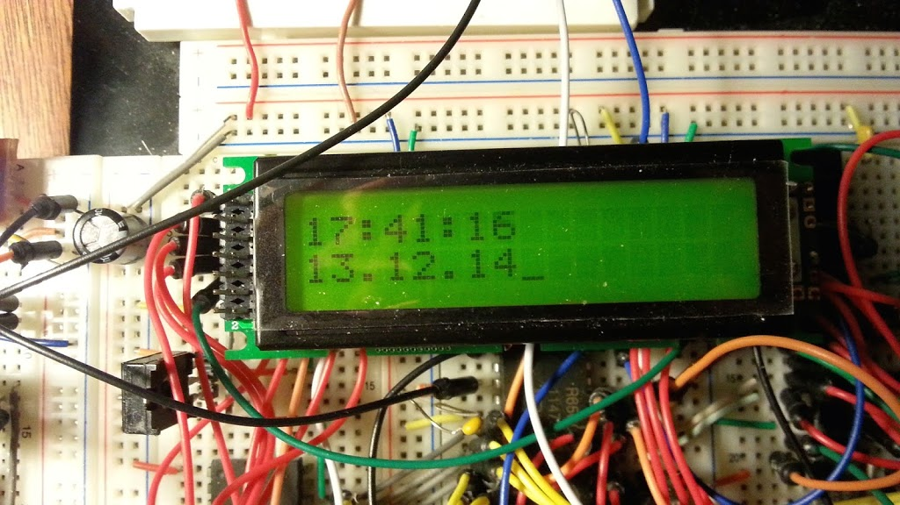

Eine batteriegepufferte Echtzeituhr gehört ja heutzutage schon zur Serienausstattung, auch bei Retro-Rechnern. Das Steckschwein soll also auch eine bekommen. [Chris Ward's Design](http://www.chrisward.org.uk/6502/schematics/ds1687.gif), welches uns zu Anfang als Grundlage gedient hat (mittlerweile ist davon nicht mehr viel übrig geblieben) verwendet eine DS1687, deren Intel-mäßiges Businterface über ein wenig Glue-Logik direkt an den Datenbus des 6502 angelegt ist und damit auch Platz im IO-Bereich benötigt.

Wir wollen das mit dem Steckschwein anders angehen. Unsere Echtzeituhr soll via SPI angebunden werden. Und auch ansonsten sind unsere Anforderungen eher bescheiden: - Einen Interrupt-Pin soll sie haben - Ein paar Bytes batteriegepuffertes RAM wären toll. - DIL-Gehäuse, sonst passts nicht aufs Steckbrett :-)

Schlussendlich haben wir uns aus dem breiten Angebot von RTC-Chips mit SPI-Interface die DS1306 von Dallas/Maxim herausgepickt. Lediglich ein externes Uhrenquarz mit 32,768 kHz und 6pF Lastkapazität wird noch gebraucht, was gar nicht so leicht zu beschaffen ist, will man kein SMD. Letztendlich wurde es dann doch ein SMD-Quarz, aber mit Drähten dran, sodass es leicht war, es steckschweinkompatibel zu machen.

<table style="margin-left:auto;margin-right:auto;text-align:center;" cellspacing="0" cellpadding="0" align="center"><tbody><tr><td style="text-align:center;"></td></tr><tr><td style="text-align:center;">Quarz mit Gehhilfe</td></tr></tbody></table>

<table style="margin-left:auto;margin-right:auto;text-align:center;" cellspacing="0" cellpadding="0" align="center"><tbody><tr><td style="text-align:center;"></td></tr><tr><td style="text-align:center;">Die DS1306 (Mitte). Davor der auf eine kleine Pinleiste gelötete SMD-Quarz. Die LED hängt am 1Hz-Ausgang und dient als "Heartbeat".</td></tr></tbody></table>

Ansonsten ist die DS1306 sehr simpel zu handhaben. Sie bietet 2 Alarme mit jeweils eigenem Interrupt-Pin  (einer active low, einer active high), 2 Taktausgänge (1Hz, 32,768kHz), Möglichkeiten zur Batterie- bzw. Akkupufferung, satte 96 Bytes gepuffertes RAM und ein pipileicht zu handhabendes SPI-Interface.

So war es dann auch ein Leichtes, ein kleines Programm zu schreiben, welches per Interrupt getriggert die Uhrzeit aus der RTC liest und auf dem LCD ausgibt. Der Interrupt, der dies auslöst wird ebenfalls im Sekundentakt von der RTC getriggert. Schneller kann die DS1306 nämlich nicht, eine höhere Auflösung als Sekunden ist nicht möglich. Auch die Tatsache, dass der Chip-Enable-Pin active high ist, ist etwas umständlich. Aber soweit wir das sehen konnten, ist das bei vielen RTC-Chips so. So müssen wir dies entweder Softwaremäßig berücksichtigen, oder das SPI\_Select-Signal vorher durch einen Inverter leiten.
