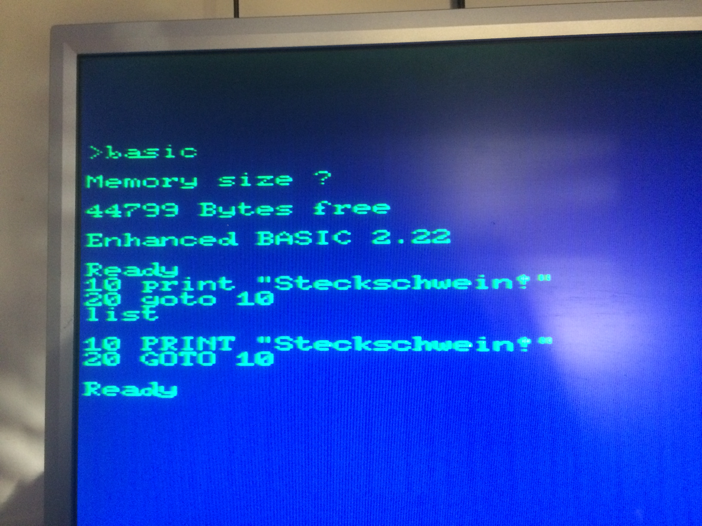

Vor geraumer Zeit hatten wir ja bereits EhBASIC auf dem Steckschwein zum Laufen gebracht. Diese Version war im Wesentlichen eine Machbarkeitsstudie. Diese setzte auch noch nicht auf unseren SteckOS-Kernel auf, sondern auf BIOS-Routinen. Hier lag also noch ein wenig Arbeit vor uns.

Die EhBASIC-Dokumentation setzt bei einem potentiellen Portierungsziel nicht sehr viel voraus, und dies sind schon die "Preferred requirements":

1. 6502 or better processor (65c02, CCU3000, M38xx).
2. 10k ROM or RAM for the interpreter code.
3. RAM from $0000 to $BFFF (more with changes).
4. Any character based I/O (e.g. RS232, LCD/keyboard etc).

Punkte 1 und 2 sind schnell abgehakt. Einen 65c02 hat das Steckschwein ja. 10k ROM haben wir nicht am Stück, jedoch wollen wir das Basic ja als Programm im RAM ausführen, und davon haben wir 64k. Alles klar.

Die Punkte 3 und 4 erfordern jedoch ein paar kleine Anpassungen. RAM von $0000 bis $BFFF gibt es im Steckschwein nicht durchgehend, denn von $0200 bis $027F liegt ja der IO-Bereich. Hier gilt es also zunächst zu prüfen, ob EhBASIC zufällig in diesem Bereich irgendetwas tut. Im EhBASIC-eigenen Monitor min\_mon wird zwar ein IO-Bereich angegeben, dieser wird jedoch in unserer Version nicht angesprochen, da wir zur Ein- und Ausgabe unserer SteckOS-Kernel-Routinen verwenden wollen.

Jetzt müssen wir sicherstellen, dass sich der Basic-Start, also die Adresse, an der die eigentlichen Basic-Programme im Speicher liegen, mit nichts überschneidet. EhBASIC wird ja offenbar eher ROM-basiert  verwendet und liegt damit meist im oberen Adressbereich. Im Quellcode gibt es die Konstanten Ram\_base und Ram\_top. Hier gab es schon das erste Problem, dass Ram\_top nicht größer sein konnte als die Startadresse des eigentlichen EhBASIC-Codes. Mit Hilfe der äußerst hilfreichen Community im Forum auf 6502.org konnten wir "unser" Basic aber patchen: [http://forum.6502.org/viewtopic.php?p=48368#p48368](http://forum.6502.org/viewtopic.php?p=48368#p48368)

EhBASIC benötigt außerdem eine Routine zur Zeicheneingabe. Laut Dokumentation:

> This is a non halting scan of the input device. If a character is ready it should be placed in A and the carry flag set, if there is no character then A, and the carry flag, should be cleared.

Einen non-halting Scan der Tastatur haben wir schon, die Routine "krn\_getkey". Die geforderte Mimik mit dem Carry Flag haben wir dort noch eingebaut und nutzen diese auch selbst in krn\_keyin. So kann krn\_getkey direkt in EhBasic verwendet werden.

Auch unsere krn\_chrout-Routine können wir direkt in EhBasic nutzen.

Damit haben wir endlich ein lauffähiges Basic auf unserem Steckschwein!

Relativ schnell fiel allerdings etwas störend ins Gewicht, dass der Tokenizer von EhBasic die Eingabe von BASIC-Schlüsselwörtern in Großbuchstaben erwartet, was auf Dauer etwas anstrengend ist. Das Steckschwein, unterstützt bekanntlich Groß- und Kleinschreibung mit Kleinschreibung als Default.

Es wäre doch nett, wenn der Tokenizer beides akzeptieren würde. Dies würde ja nichtmal die Ausführungsgeschwindigkeit negativ beeinträchtigen, da nur für das Parsen ein weiterer Schritt nötig wäre.

Ganz so trivial wie angenommen war der Patch dann doch nicht. Der EhBASIC tokenizer sucht zunächst nach dem ersten Zeichen des Dictionary-Eintrags. Das zu suchende Zeichen liegt hierbei im Akku. Das Dictionary liegt schon in Großschreibung vor, sodass es an dieser Stelle reicht, den Akkuinhalt zu prüfen, ob es sich um einen Buchstaben handelt, und diesen dann in den entsprechenden Großbuchstaben zu verwandeln. Unser toupper-Makro tut genau das!

Jetzt funktioniert der Tokenizer zumindest schon einmal für das erste Zeichen case-insensitiv. Für den Rest des Schlüsselworts galt es, ein wenig zu knobeln, denn das zu vergleichende Zeichen liegt hier nicht im Akku. Der Hack besteht nun darin, nach einem Nichttreffer den Akkuinhalt in einen Kleinbuchstaben zu verwandeln und einfach nochmal zu vergleichen: [https://bitbucket.org/steckschwein/steckschwein-code/commits/7729b971379f4ec022e9c98a3154ff6b0a20653f](https://bitbucket.org/steckschwein/steckschwein-code/commits/7729b971379f4ec022e9c98a3154ff6b0a20653f)

Das macht den Tokenizer für in Kleinbuchstaben geringfügig langsamer, was aber auf die Ausführungsgeschwindigkeit keinen Einfluss. Als Extra-Bonus können Variablennamen jetzt groß oder klein geschrieben sein, also i ist nicht gleich I.

Zuletzt wurde noch eine weitere Anregung aus dem 6502.org-Forum umgesetzt, denn zwar ist der Tokenizer jetzt case-insensitive, aber Buchstaben, die nicht im Dictionary stehen, werden weiterhin immer als Großbuchstaben dargestellt. Auch hier gibt es einen kleinen Patch: [http://forum.6502.org/viewtopic.php?p=50271#p50271](http://forum.6502.org/viewtopic.php?p=50271#p50271)

Jetzt fehlen nur noch Implementationen für LOAD und SAVE, damit wir unsere BASIC-Kunstwerke auch im Filesystem speichern können und evtl. das ein oder andere BASIC-Spiel vom C64 portieren können.
