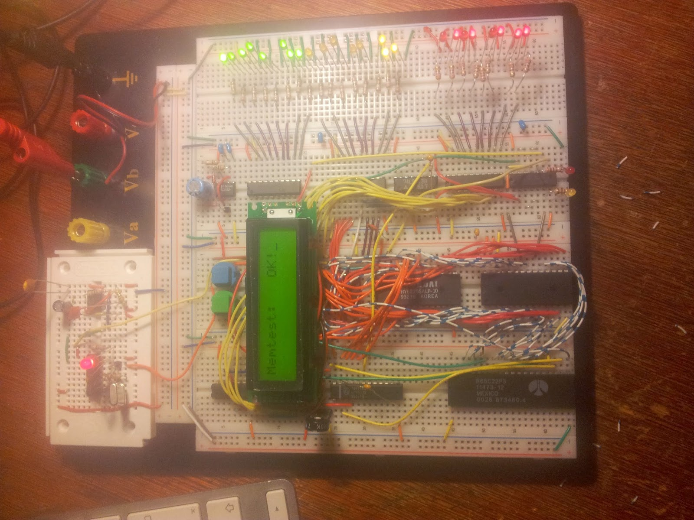

Nachdem die vorangegangenen Spielereien sehr ermutigend verliefen, war der nächste Schritt klar. Wenn wir so weit kommen, kommen wir auch noch weiter. Das Ziel ist jetzt definitiv ein funktionierender 8bit-Rechner mit 64k RAM.

Da der 6502 keinen DRAM-Refresh liefert und wir uns den Aufwand eines diskreten Refresh-Generators ersparen wollen, soll es ein SRAM-basiertes Design werden. Bei ein wenig Recherche beim Elektronik-Versenders unseres Vertrauens stellen wir fest, dass 2x32k\*8 in Form von zwei 2 62256 eine komfortable Lösung sein würden. A15 würde den Chip mit den unteren 62256 selektieren, um alles oberhalb würde sich ein kleines TTL-Grab kümmern, denn irgendwo muss ja noch ein Bereich für verschiedene IO-Bausteine hin.

Etwas mehr Recherche bei 6502.org bringt uns zum Projekt von Chris Ward ([http://www.chrisward.org.uk/6502/spec.shtml](http://www.chrisward.org.uk/6502/spec.shtml)), der eine simple und effektive Adressdekodierung hat, und die selben Ansätze bereits weiter gedacht hat. Zusätzlich zeigt er, wie simpel es ist, ein LCD-Display nach hd44780-Standard an den Datenbus zu klemmen. Also stellen wir uns auf die Schultern dieses Giganten, und beschließen, auf Basis dieses Designs weiterzumachen. Der 500Hz-Taktgeber weicht einem Quarzoszillator mit 3MHz, mehr verkraftet die verwendete VIA nicht. Die CPU könnte auch 4MHz.

<table style="margin-left:auto;margin-right:auto;text-align:center;" cellspacing="0" cellpadding="0" align="center"><tbody><tr><td style="text-align:center;"></td></tr><tr><td style="text-align:center;">Ein richtiger Computer mit 32k RAM, 8kROM, LCD-"Monitor" und einer 65c22 VIA</td></tr></tbody></table>
