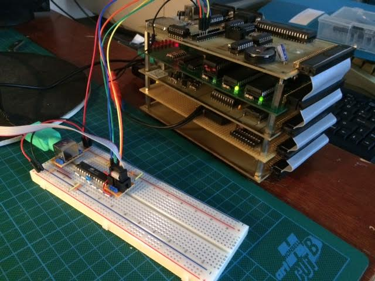

Es ist mal wieder recht still ums Schwein. Und mal wieder ist das kein Indiz dafür, dass nicht gewerkelt wird. In den letzten Wochen wurden BIOS und der SteckOS-Kernel auf Basis des Assemblers ca65 neu gebaut. Dessen nachgelagerter Linker erlaubt eine übersichtlichere Strukturierung der Codebasis.

In den FAT32-Code wird aktuell ebenfalls einiges an Hirnschmalz investiert, um endlich Cluster Chain lookups und Schreib-Support bauen zu können.

Darüberhinaus kam letzte Woche der Geistesblitz, die Kommunikation des Tastaturcontrollers ATmega8 mit der Tastatur über dessen eingebauten USART zu machen, anstatt "Zu Fuß" in Software. Hier wird aktuell also auch geforscht. Wenn das klappt, dann wird dies auf jeden Fall in das Redesign des IO-Boards einfließen.

