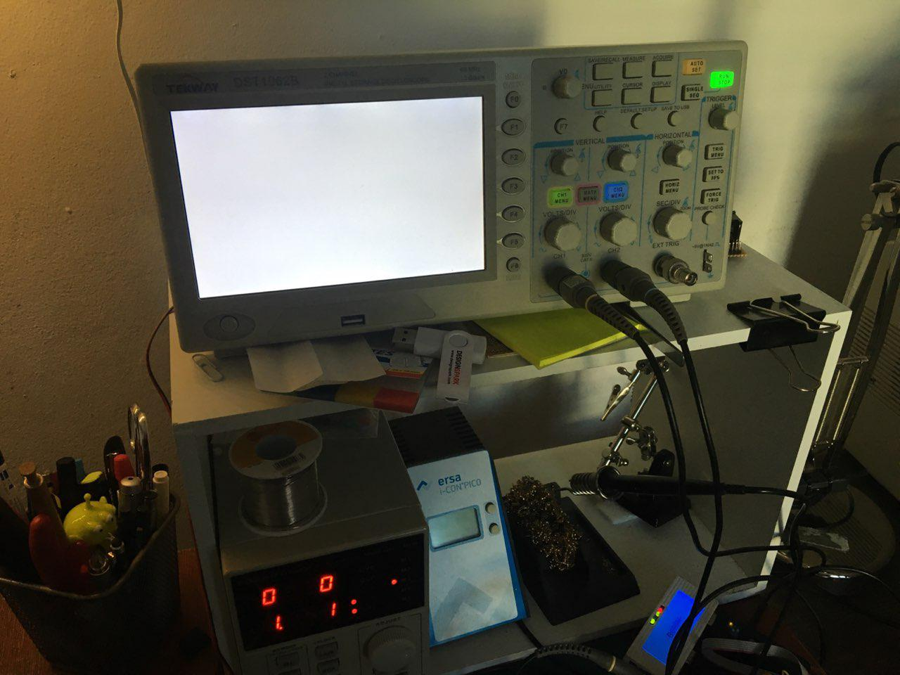
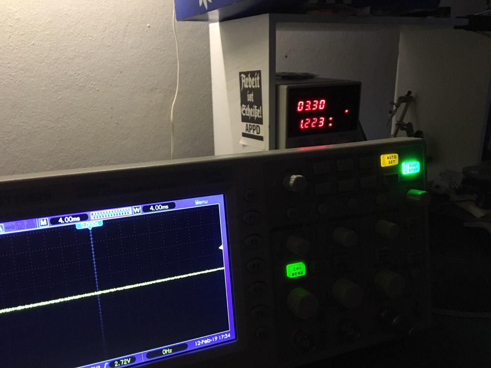
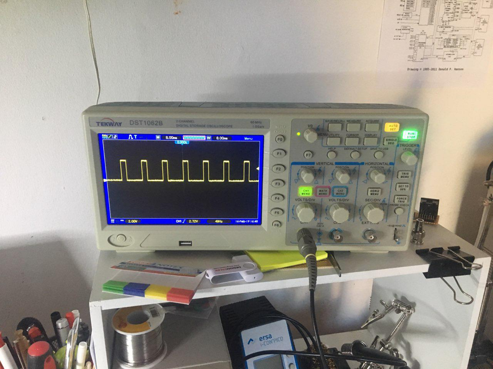

The Tekway DST 1062B (also known unter the Hantek or Voltcraft brand) is an inexpensive 60MHz digital storage oscilloscope, which is very much hackable and has proven to be worth its weight in gold pressed latinum.

More recently, my scope became affected by the infamous white screen problem, which apparently is a problem quite common to this model and its 100MHz or 200MHz siblings.

 The Tekway/Hantek white screen of death

The screen just goes white, but the scope otherwise responds to pressing buttons, etc. so it appears not to be completely dead. Some research revealed bad connections inside the scope as a possible culprit: [https://hackcorrelation.blogspot.com/2014/01/dso5062b-white-screen-repair-and-hack.html](https://hackcorrelation.blogspot.com/2014/01/dso5062b-white-screen-repair-and-hack.html) But in my case, that did not do anything. More research brought me to a couple of messages within the famous Tekway hacking thread on the EEVBlog-Forum: https://www.eevblog.com/forum/testgear/hantek-tekway-dso-hack-get-200mhz-bw-for-free/msg87635/#msg87635

Forum member "bbf" told me during a conversation, that he had replaced the 3.3V regulator, but did not remember exactly, which regulator he used. With this information, I went to examine the power supply. The 3.3V rail is powered by a KA78R33 regulator, which is rated for a maximum current of 1A. I removed it in order to power the 3.3V rail directly from my bench supply.

 That's a lot of load for the stock 3.3V regulator

And there we have it. The KA78R33 is under a constant load of almost 1.3A. Also using the bench supply I could play around with the exact voltage and I found out, that the scope is very sensitive about the voltage being correct. A voltage drop down to 3.2V will make the screen go white again. To make things worse, the KA78R33 is completely potted in plastic, which I don't imagine to be the best idea in terms of heat dissipation. So we obviously need a beefier 3.3V regulator. I decided to go for a LM1085 which is rated for 3A, so we have plenty of safety margin. Also, it is almost pin compatible with the KA78R33, if inserted "the other way around". Also, the LM1085 does not have GND but Vout on it's housing, so one needs to be careful to not have it touch anything it's not supposed to. So with the new regulator, the scope works like a charm again.

Originally, the scope was sold as fanless, which was a big selling point for me back then. Inside, there happens to be a place to mount an 50mm 12V fan, also the power supply has a 12V rail just to power a fan. To be on the safe side from now on, I installed a fan. I just replaced the 12V regulator with a 9V one in order to keep fan noise down.

