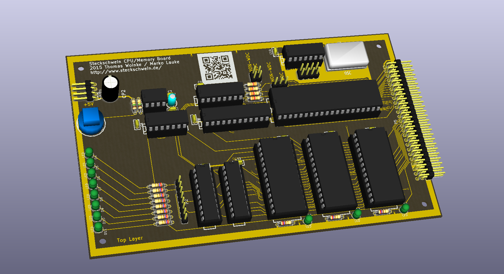
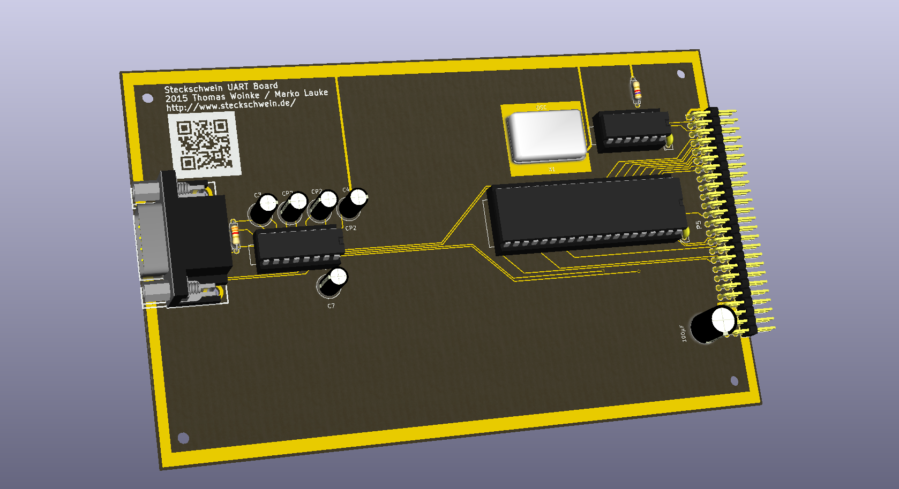
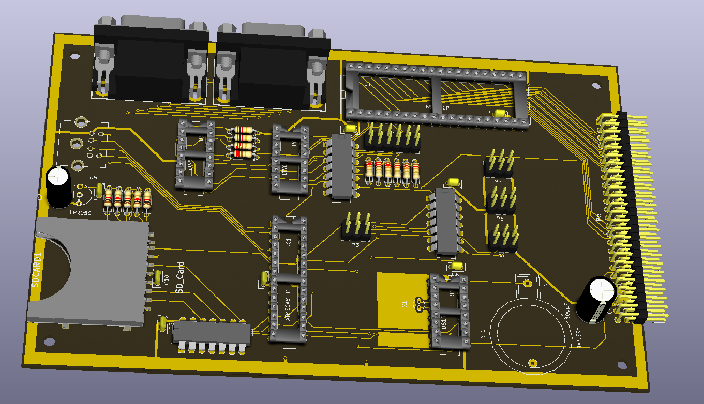

Es ist ruhig geworden ums Steckschwein. Das liegt daran, dass wir genug haben. Genug von dem Gewackel auf dem Steckbrett, genug von instabilem Monitorbild und anderen diversen Störanfälligkeiten. Wir wollen endlich Code schreiben, und die Bugs dort suchen, und nicht auf dem Steckbrett. Dazu müssen wir unsere Hardware in eine stabilere Form zu bringen. Das bedeutet: Platinen. Zwar noch nicht unser Einplatiner, aber es spricht ja nichts dagegen, die einzelnen Baugruppen auf je eine Platine zu bringen, und diese zu verbinden. So haben wir die Möglichkeit, später einzelne Baugruppen auszutauschen oder neue (Sound!) zu ergänzen. Die Layouts sind gemacht, die Platinen in Produktion, sodass uns aktuell nichts weiter bleibt, als abzuwarten.

So solls aussehen:

<table style="margin-left:auto;margin-right:auto;text-align:center;" cellspacing="0" cellpadding="0" align="center"><tbody><tr><td style="text-align:center;"></td></tr><tr><td style="text-align:center;">CPU/Memory-Platine</td></tr></tbody></table>

<table style="margin-left:auto;margin-right:auto;text-align:center;" cellspacing="0" cellpadding="0" align="center"><tbody><tr><td style="text-align:center;"></td></tr><tr><td style="text-align:center;">UART</td></tr></tbody></table>

<table style="margin-left:auto;margin-right:auto;text-align:center;" cellspacing="0" cellpadding="0" align="center"><tbody><tr><td style="text-align:center;"></td></tr><tr><td style="text-align:center;">IO-Platine mit SD-Karten-Slot und RTC</td></tr></tbody></table>
