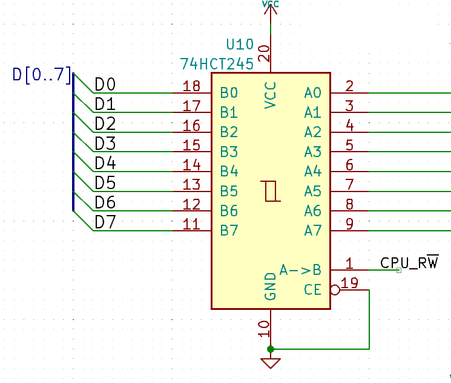
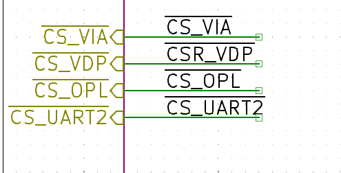
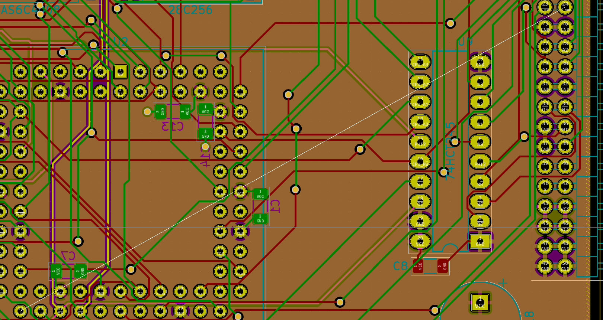

This one really is a tough one to debug. At first, we suspected the VHDL code for the CPLD as the main error source, as VHDL is not our strongest suit. In fact, the decoder/banking logic is the first thing we ever really did in VHDL (apart from a few simple decoder equations the first days we were playing with GALs).

As it turned out, the VHDL was not the main problem. It sure was quite buggy and the RDY-generator had problems, but overall it was not too far off.
Marko even managed to run a memory check over the entire 512k RAM, proving that even the banking logic works. Furthermore, he was able to clock the new board at 16MHz, which is another breakthrough, as a bonus.



But what was the problem, then? In order to hook the logic analyzer to a couple of signals, the newly added 74HCT245 buffers were removed. Right after U10, the buffer between the data bus and the edge connector, has been put back, there was silence again.

Looks like that's what you get when you skip prototyping your designs.

We just hooked the r/W line from the CPU to the data direction pin, and tied CE to GND. So the 245 can not become tri state and is driving the bus when the CPU is reading, creating bus contention. We should have created an appropriate CS signal. Which is what we'll do. We will just bodge-wire one of the unused CPLD pins to the /CS pin of the buffer.

And speaking of bodge wires - the board does not route CS_VDP, the CS signal for the video chip, to the connector. The reason for this - there was a typo in a signal label, stating CSR_VDP instead of CS_VDP, originating from a former attempt to generate both CSW_VDP and CSR_VDP in the CPLD. Bummer.

After fixing that.. voila.. but too late, now we need to add a bodge wire.

