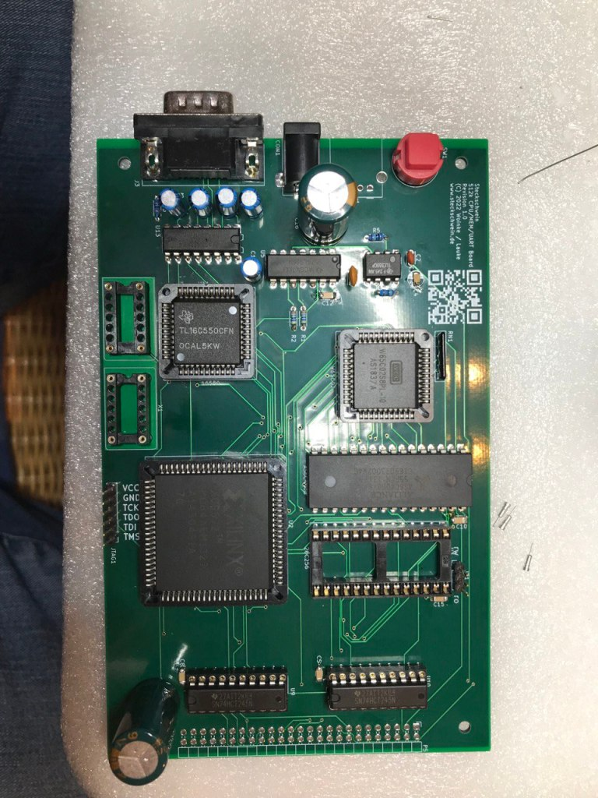
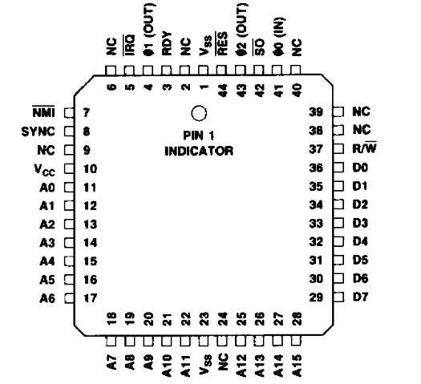
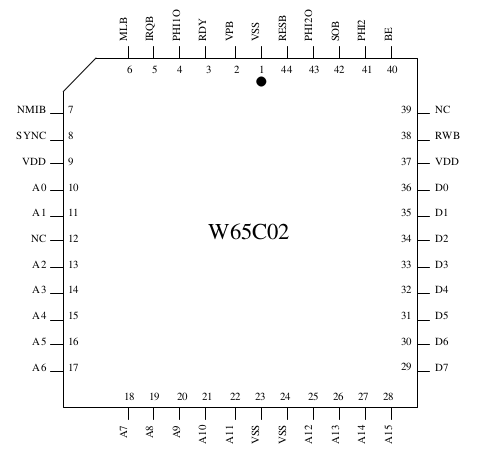

In preparation for the build of our new CPU-Board, we purchased two WDC 65c02 in PLCC44 package from some eBay vendor.
On arrival, the first interesting thing is the way they were packaged. No anti esd packaging, only a plastic bag, which we found sketchy enough to post on Twitter.

Next, WDC reacted to that tweet, stating that these might be not genuine or be at least very old. 


https://twitter.com/steckschwein/status/1532446031127904256

At least they did arrive in time so we finally could assemble the first new CPU board. This board marks a lot of firsts for us:

1. our first 4 layer board
2. first time using PLCC chips
3. first autorouted board
4. first time using a CPLD (Xilinx XC9572 (PLCC84))
5. first time making a board without having breadboarded everything first
6. first time following a lot of people’s advice to put bus transceivers between the CPU board and the rest of the system

With so many degrees of freedom, we could not be sure what to expect at first power up. We modified the BIOS to only inititalize the on board UART (another first, CPU board with UART..) and output some characters on the serial interface.
Ideally, the BIOS would start up and send something.

But living in a non ideal world, nothing visible happened.
To detect any signs of life, we had to proceed using oscilloscope and logic analyzer only to find the bus was completely dead. We spent quite a while troubleshooting, and identified the RDY generator inside the CPLD as the first culprit. After disabling the latter, and continuing with a slower clock speed, we at least had activity on the bus, but still nothing on the serial interface.

Scope and logic analyzer readings still were inconclusive at best. When trying to observe the VPB pin with the scope, we noticed that this pin seemed to be dead. Which is odd, because it shoud have shown some activity at least after the RESET-pulse. Also, when observing the address bus, A0 did seem to be always high.. highly unlikely for an address line, especially for such a low one.

Back to the sketchy CPUs. Are they 65C02s at all?
Measuring Pin 43(PHI2 OUT) and Pin 4 (PHI1 out) showed us a clock signal there. Also, the SYNC Signal (Pin 8) showed some activity. So the chip did seem to be something 6502ish..
We then compared the PLCC44 pinouts from the WDC datasheet to one from Rockwell.

Pin 2 (VPB on WDC) on the Rockwell chip is NC.. which explains why we did not measure anything there. Also, on the Rockwell chip, Pin 10 is Vcc, while the same pin on WDC is A0..
So, our WDC is indeed not genuine, and appears to be a relabeled Rockwell 65C02 (or another non-WDC manufacturer, we only had the Rockwell datasheet to compare with). The CPU itself seems to be ok, but the (subtle) pinout differences make it impossible to use it on our board. Time to order some fresh ones from mouser.com

To be continued…
