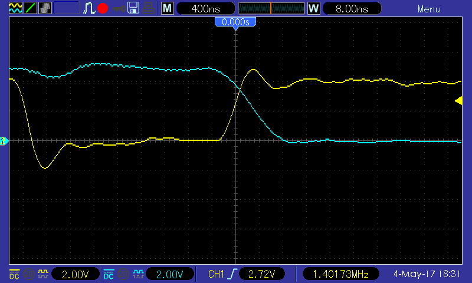
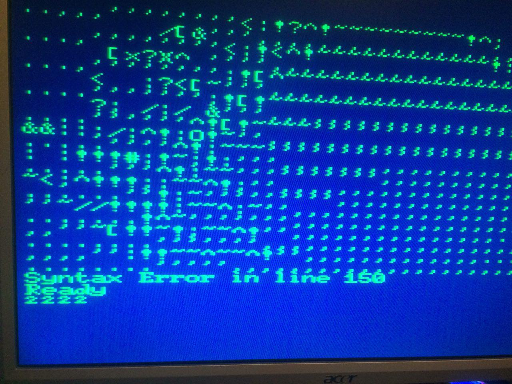
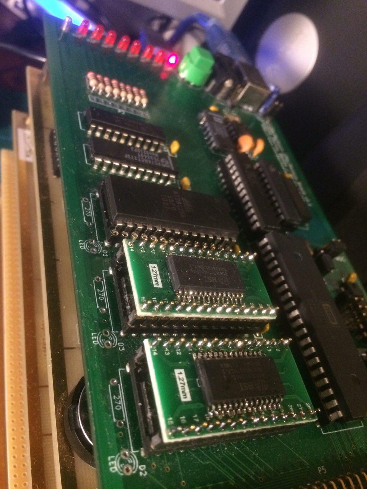

Inzwischen sind die 74F00 eingetroffen und der 74HCT00 durch einen ebensolchen ersetzt. Das Oszilloskopbild sieht gleich deutlich besser aus:

\[caption id="attachment\_870" align="alignnone" width="800"\] gelb: /WE, blau: A9\[/caption\]

Der Schreibvorgang wird also jetzt zumindest abgeschlossen, bevor sich die Adresse auf dem Adressbus ändert. Das ist schonmal viel sauberer.

Nur leider hat es das Problem nicht gelöst, das Steckschwein läuft mit den "richtigen" RAMs immer noch instabil, was sich insbesondere bei BASIC-Programmen bemerkbar macht:

Wäre auch zu einfach gewesen.

**\[UPDATE\]** Ein weiterer Test mit anderen 55ns-SRAMs, nämlich Bausteinen von BSI im TSOP28-Gehäuse auf DIP28-Adaptern, lief problemlos durch. Das BASIC-Programm, mit dem wir testen, lief 2 Tage problemlos durch. Dies ist insofern bemerkenswert, als dass das Steckschwein mit diesen Bausteinen vorher überhaupt nicht lief. Also doch ein Erfolg. Warum die 55ns-Chips von Alliance Memory Probleme machen, müssen wir noch untersuchen.

\[caption id="attachment\_881" align="alignnone" width="960"\] TSOP28-SRAMs auf DIP28 Adapter\[/caption\]
