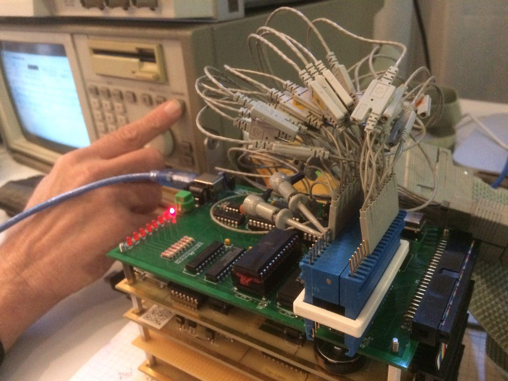
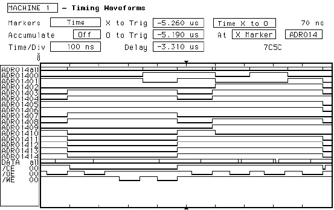
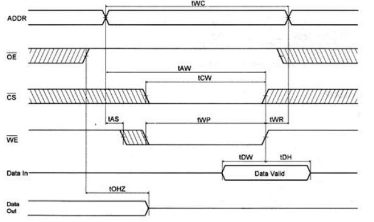
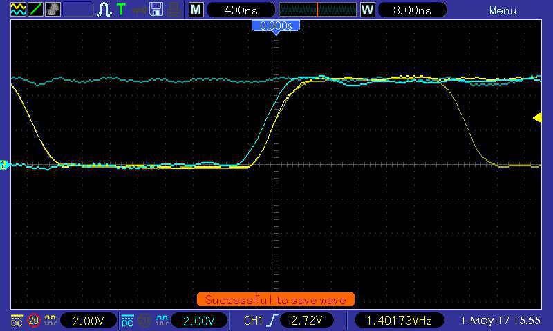

Auf dem VCFe 18.0 gab es Dank Nick Müller die Möglichkeit, das Steckschwein mal mit einem Logic Analyzer "für große Jungs" zu untersuchen. Unsere USB-Logic-Analyzer sind zwar für vieles gut, aber um komplett Adress- und Datenbus sowie einschlägiger Steuerleitungen abzuhorchen, fehlen einfach Kanäle, und selbst dann wären sie nicht schnell genug.

 Das Steckschwein am Logic Analyzer. im Hintergrund Nicks Finger.

Die Gelegenheit, ein solches Höllengerät (genauer: ein HP 1652B) und mit Nick auch noch jemanden greifbar zu haben, der selbiges beherrscht, gibt uns die Chance, ein merkwürdiges Problem zu untersuchen, welches schon länger Rätsel aufgibt: Die aktuell verwendeten Hyundai-SRAMs sind mit einer Zugriffszeit von 100ns eigentlich viel zu langsam für 8MHz, zumal der 6502 ja nur die 2. Takthälfte für Buszugriffe nutzt. Diese ist nur 62,5ns lang. Von dieser Zeit geht ausserdem noch die Durchlaufzeit der Adressdekodierung und weiterer Glue-Logik ab. Eigens angeschaffte neue SRAMs von Alliance Memory mit 55ns Zugriffszeit sollten also ganz knapp schnell genug sein. Trotzdem treten mit diesen immer wieder merkwürdig zufällige Abstürze auf, die 100ns-Chips laufen dagegen problemlos.

Also ran an die Maschine. Hierbei zeigte sich auch schon schnell etwas Merkwürdiges:

 Analyse von Adress- und Datenbus sowie Steuersignale

Es fiel etwas unangenehm auf, dass die steigende Flanke von /WE (Ende des Schreibzugriffs) direkt mit der Änderung des Adressbus zusammenfällt. Idealerweise sollte der Schreibzugriff beendet sein, bevor am Adressbus eine andere Adresse anliegt. Das Datenblatt nennt die Zeitspanne zwischen der steigenden Flanke von /WE und einer Änderung auf dem Adressbus tWR (Write Recovery Time):

Laut Diagramm soll also /WE high werden, **bevor** sich der Adressbus ändert. Im Datenblatt selbst ist die Write Recovery Time mit 0ns angegeben, und zwar bei beiden SRAMs, die 100ns-Typen sowie bei den 55ns-Bausteinen. Das würde bedeutet, dass die steigende Flanke von /WE mit einer Änderung der Adresse zeitlich zusammenfallen darf. Der verwendete Logicanalyzer hat eine Auflösung von 10ns, sodass man eigentlich nur sagen kann, dass sich /WE und der Adressbus im selben Zeitraum von 10ns ändern. Also schauen wir uns /WE und eine zufällige Adressleitung nochmal unterm Oszilloskop an.

 /WE und A9 unterm Oszilloskop. Gelb: /WE, Blau: A9

Offenbar ändert sich der Adressbus, **bevor** mit der steigenden Flanke von /WE der Schreibzugriff endet! Einen ausreichend schnellen Chip vorausgesetzt, könnte der anliegende Schreibzugriff womöglich in die neue Adresse hereingeschleppt werden. Wie dem auch sei, auf jeden Fall etwas, das so nicht sein darf! Wir halten die 0ns Write Recovery Time nicht ein, indem wir sie um ca. 4ns unterschreiten.

/OE und /WE für die RAMs wird bei uns durch 3 NAND-Gatter in einem 74HCT00 aus der r/W-Leitung und dem Systemtakt erzeugt. Ein 74HCT00 hat eine Durchlaufzeit von ca. 9ns. Als nächstes werden wir also stattdessen einen 74F00 verwenden, der uns mit 3.7ns Durchlaufzeit wieder in den Bereich tWR > 0ns bringen sollte. Sollte es das nicht bringen, werden wir uns etwas grundsätzlichere Gedanken machen müssen.
