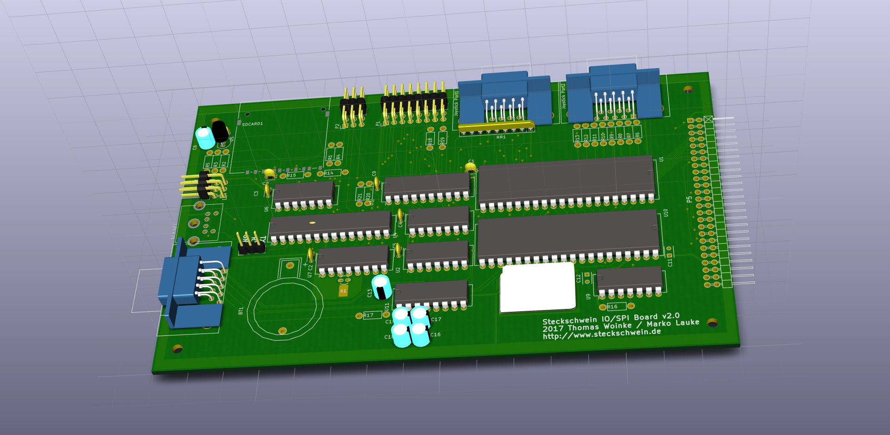

Die Zeit ist reif für ein Hardware-Update, und zwar für die IO-Platine 2.0. Vorgesehen war ja schon länger, den UART dort zu integrieren. Ausserdem war das Joystick--Interface noch unausgegoren, sodass auch hier etwas Neues entwickelt wurde.

Zum Schutz der VIA-Pins dienen nun keine Optokoppler, sondern simple Serienwiderstände sollen die Ports zumindest vor dem Fall schützen, dass man doch mal die Datenrichtung der Joystick-Pins auf Ausgang schaltet und dann die VIA grillt indem man den Joystick betätigt. Die Widerstände begrenzen den Strom auf 1mA. Das muss die VIA abkönnen. Zudem war im vorigen Design der Userport nicht wirklich nutzbar, weil immer noch die Joysticks daran hingen. Jetzt ist es so, dass jeder Joystick über Tri State Buffer an VIA Port A verbunden wird, und zwar grundsätzlich wahlweise. Ausserdem besteht die Möglichkeit, die Joyports komplett abzuschalten. Dies wird mit dem OUT1-Pin des UART bewerkstelligt. Somit läßt sich per Software konfigurieren, ob man Userport oder Joystick benutzen möchte.

Der User-Port hat ein neues, von [Neil Franklin](http://neil.franklin.ch/) vorgeschlagenes Pinout, in dem nun auch die /RESET und /IRQ-Leitungen vorhanden sind. Auch am Tastaturcontroller hat sich eine Kleinigkeit geändert, die Datenpins für den PS/2 Port sind nach PD6 bzw. PD7 gewandert. Somit sind die RX/TX-Pins des AVR USART wieder frei und bereit für neue Schandtaten. Deswegen haben sie auch eine kleine Pinleiste spendiert bekommen.

\[caption id="attachment\_973" align="alignnone" width="1918"\] 3D Rendering der neuen IO-Platine\[/caption\]
