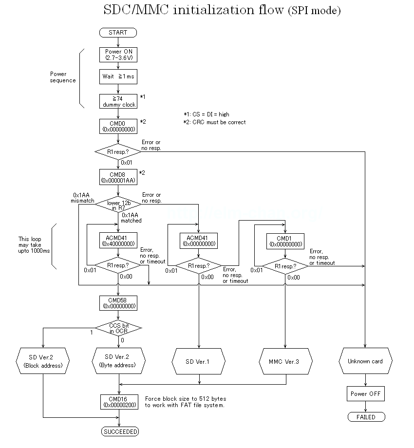

Unser "Standard"-Massenspeicher SD-Karte funktioniert zwar an und für sehr gut, Sorgenkind war aber immer die Initialisierungs-Routine. Bisher ließen sich damit nur günstige Class4-Karten initialisieren, bei "höherwertigen" Karten schlug die Initialisierung immer fehl, sodass nur etwa 3 von 5 Karten nutzbar waren.

<table style="margin-left:auto;margin-right:auto;text-align:center;" cellspacing="0" cellpadding="0" align="center"><tbody><tr><td style="text-align:center;"></td></tr><tr><td style="text-align:center;">Initialisierungs-Ablauf nach elm-chan.org</td></tr></tbody></table>

Das hat uns schon etwas gewurmt, denn irgendwie hatte dieser Stand ein Geschmäckle von "Funktioniert aus Versehen". Also mussten wir da nochmal ran. Der Initialisierungs-Flow entspricht im Wesentlichen dem, was auf der bekannten Seite [http://elm-chan.org/docs/mmc/mmc\_e.html](http://elm-chan.org/docs/mmc/mmc_e.html) dokumentiert ist. In den letzten Tagen haben wir diesen unter die Lupe genommen, und tatsächlich ist etwas aufgefallen. Vor dem Senden eines Kommandos muss sichergestellt werden, dass die Karte bereit ist. Hierzu sendet man solange $ff an die Karte, bis diese auch $ff zurücksendet. Dann ist die Karte bereit, ein Kommando zu empfangen. In unserer Initialisierungsroutine wurde dies zwischen CMD55 und ACMD41 (näheres bitte dem Link entnehmen) schlichtweg nicht gemacht. Plötzlich lassen sich fast alle vorhandenen Karten initialisieren. Dass dies mit den Class4-Karten trotzdem funktionierte, war also gewissermaßen tatsächlich aus Versehen.

Das nächste Problem war dann, dass von den jetzt nutzbaren Karten über die Shell zwar im Filesystem navigiert und Verzeichnisse aufgelistet werden konnten, das eigentliche Laden von Dateien bzw. Starten von Programmen funktionierte nicht. Die Blockleseroutinen liefen korrekt durch, die geladenen Daten jedoch waren fehlerhaft. Dass die Dateisystemoperationen funktioniert haben, und nur das Einlesen von Dateien Probleme machte, war verdächtig. [Noch im Mai verkündeten wir](http://wordpress.steckschwein.de/wordpress/index.php/2015/05/20/filesystem-und-shell/) u.a. stolz, dass wir zum Dateien lesen schnelle SD-Multiblock-Transfers verwenden. Diese haben den Vorteil, dass man der Karte nur die Adresse des ersten zu lesenden Blocks übermittelt, und dann einfach liest bis der Arzt kommt oder man der Karte sagt, dass man fertig ist. Vorteil ist, dass man die Blockadresse des nächsten Blocks nicht immer selber ausrechnen muss (immerhin eine 32bit-Addition) und auch nicht immer wieder an die Karte schicken muss.

Gut, also die fat\_read-Routine zurückgebaut, und schon ist das Steckschwein mit so ziemlich jeder handelsüblichen SD-Karte kompatibel.

**\[UPDATE:\]** Mittlerweile funktionieren auch wieder Multiblock-Transfers. Der Trick war, beim Lesen von der Karte die MOSI-Leitung nicht auf L, sondern auf H zu setzen, also nicht mehr $00 zu senden, sondern $ff. Die Idee kam, nachdem sämtliche Beispiele, die sich im Web finden lassen, $ff senden. Die Stelle in der SD-Karten-Spezifikation, in der das so spezifiziert ist, ist bis dato nicht gefunden worden.
