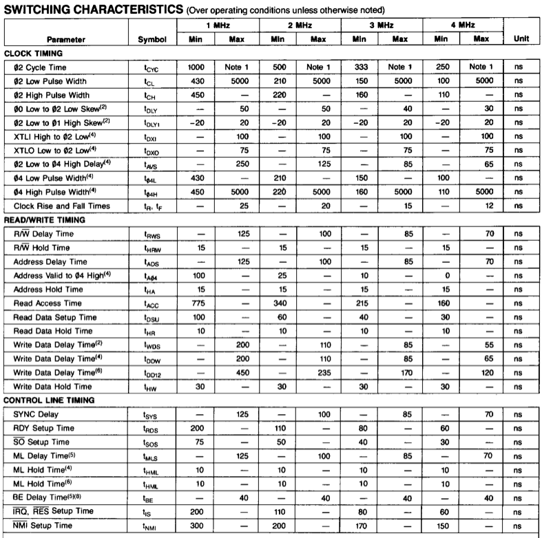
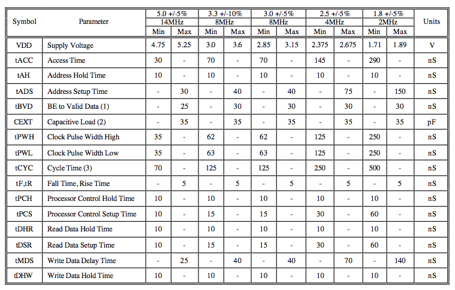
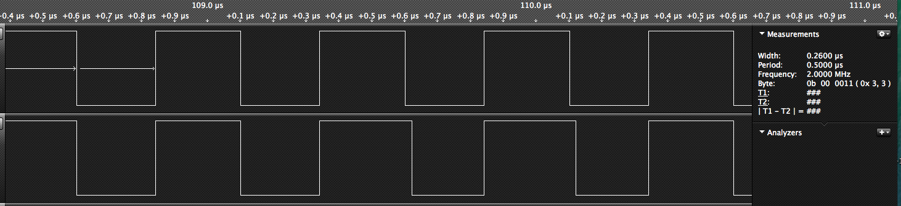
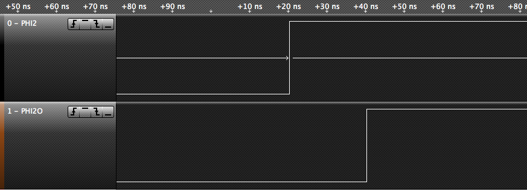

In den Posts [http://8bit-gefriemel.blogspot.de/2014/03/murphy.html](http://8bit-gefriemel.blogspot.de/2014/03/murphy.html) und [http://8bit-gefriemel.blogspot.de/2014/04/murphy-ii.html](http://8bit-gefriemel.blogspot.de/2014/04/murphy-ii.html) sind einige merkwürdige Phänomene und deren Lösungsversuche geschildert. Wie sich heute gezeigt hat, konnten wir gar nicht weiter daneben liegen.

Alles Quatsch. Die Fehlersuche nach dem "K"-Problem. Stack und so. Alles super. Klar, das mit dem Initialisieren des Stackpointers war natürlich richtig und wichtig, und dass die uart\_tx routine besser funktioniert wenn man auf Stack-Operationen verzichtet, hätte uns eigentlich eher stutzig machen sollen. Aber der Reihe nach.

Der alte Rockwell 65c02P4 wurde nämlich derweil durch einen funkelnagelneuen WDC 65c02S6TPG-14 ersetzt. Dieser brauchte zunächst einen Pullup-Widerstand für den BE-Pin, ohne den sich seine Bus-Leitungen im Tri-State-Zustand befunden hätten. Toll, wenn man den Prozessor vom Bus trennen muss, weil er ihn sich z.B. mit einem Grafikchip teilen muss. In unserem Fall aber ist der 65c02 immer der Chef. Also auf high mit dem Pin.

Relativ unvermittelt und mit keiner zu dem Zeitpunkt offensichtlichen Änderung an der Schaltung traten dann die oben beschriebenen Probleme auf. Die Fehlersuche brachte durchaus einiges zu Tage, wie beispielsweise die bislang nicht vorhandene Initialisierung des Stackpointers, jedoch führte nichts wirklich zu einer Lösung. Die Änderung der uart\_tx\_routine führte dazu, dass der Upload wieder funktioniert. Bis das Problem nach einem BIOS-Update mit kaum Code-Änderungen wieder auftrat. Diesmal mit einem nicht immer erfolgreich durchlaufenden Speichertest. Das K-Problem war zurück, und hat Verstärkung mitgebracht.

Es half nichts. Es blieb nur, zu rekapitulieren, welche Änderungen an der Schaltung vorgenommen wurden. In Chris Wards ursprünglichem Design waren die OE-Pins der 62256 SRAMS direkt mit den CS-Pins verbunden. Ein selektierter Chip hatte also automatisch auch seine Daten auf den Bus gelegt. Dies ist möglich, weil die WE-Leitung bei den verwendeten HY62256ALP-10-Bausteine ohnehin immer Vorrang hat. Aus irgendeinem Grund hat mir das nicht gefallen und ich habe die OE-Pins mit dem generierten OE-Signal verbunden, welches auch den OE-Pin des EEPROM steuert. Bislang hat dies auch immer problemlos funktioniert. Interessanterweise traten aber auch auf Markos Schaltung unerklärliche Phänomene auf, nachdem diese Modifikation dort vorgenommen wurde.

Dann der WDC-Prozessor. Hatte es diese Probleme auch mit dem Rockwell gegeben? Der WDC kann schließlich mit bis zu 14MHz getaktet werden, der Rockwell immerhin mit 4 MHz. Zeit, mal einen Blick ins Datenblatt zu werfen. Schnell fällt auf, dass der Rockwell z.B. eine Address hold time von 30ns hat, der WDC aber nur 10ns. Eigentlich klar, der Chip ist für weit höhere Frequenzen ausgelegt, also sind auch die Timings empfindlicher. Aber dann sollte uns noch eine Sache wie Schuppen von den Augen fallen...

<table style="float:left;margin-right:1em;text-align:left;" cellspacing="0" cellpadding="0" align="center"><tbody><tr><td style="text-align:center;"></td></tr><tr><td style="text-align:center;">Die Timings des 65c02P4 von Rockwell</td></tr></tbody></table>

<table style="float:left;margin-right:1em;text-align:left;" cellspacing="0" cellpadding="0" align="center"><tbody><tr><td style="text-align:center;"></td></tr><tr><td style="text-align:center;">Die Timing des&nbsp;WDC 65c02S6TPG-14</td></tr></tbody></table>

Eingehendere Lektüre des WDC-Datenblatts liess uns dann noch auf folgende Perle stoßen:

_An external oscillator is recommended for driving PHI2 and used for the main system clock. All production test timing is based on PHI2. **PHI2O and PHI1O were used in older systems for system timing** and internal oscillators when an external crystal was used._  Und weiter, als Fußnote zu den Timings:

1. PHI1O and PHI2O clock delay from PHI2 is no longer specified or tested and WDC recommends using an oscillator for system time base and PHI2 processor input clock. 

Jeder 6502 hat bisher das Systemtiming selbst generiert und am Pin PHI2O bereitgestellt. Von dort aus wurde alles mit Takt versorgt, was einen Takteingang hat. Damit hat WDC nun gebrochen und empfiehlt, den Systemtakt direkt am Oszillator abzugreifen. Das hatten wir beim Austausch Rockwell gegen WDC natürlich nicht berücksichtigt, wer denkt denn an sowas. Unser Rechner hat seinen Takt old-school-like vom PHI2O bezogen. Der Screenshot vom Logic Analyzer zeigt, dass PHI2O manchmal, aber nicht immer einen Versatz.

<table style="margin-left:auto;margin-right:auto;text-align:center;" cellspacing="0" cellpadding="0" align="center"><tbody><tr><td style="text-align:center;"></td></tr><tr><td style="text-align:center;">WDC 65c02 - Oben: PHI2, Unten: PHI2O
Genauer untersucht beträgt der Versatz ziemlich genau 20ns. Bei einer Hold Time von 10ns eine Ewigkeit.
</td></tr></tbody></table>

<table style="margin-left:auto;margin-right:auto;text-align:center;" cellspacing="0" cellpadding="0" align="center"><tbody><tr><td style="text-align:center;"></td></tr><tr><td style="text-align:center;">PHI2 (oben) und (PHI2O) sind manchmal, aber nicht immer, um 20ns zueinander versetzt.</td></tr></tbody></table>

Dementsprechend war die Lösung des Problems dann denkbar simpel: Die Taktleitungen für den Rest des Systems 2 Pins weiter nach rechts gesteckt.

Bleibt die Frage, was man denn macht, wenn man einen 65c02 aus einem alten System ersetzen möchte. Der WDC dürfte ohne Anpassungen nicht stabil laufen.
