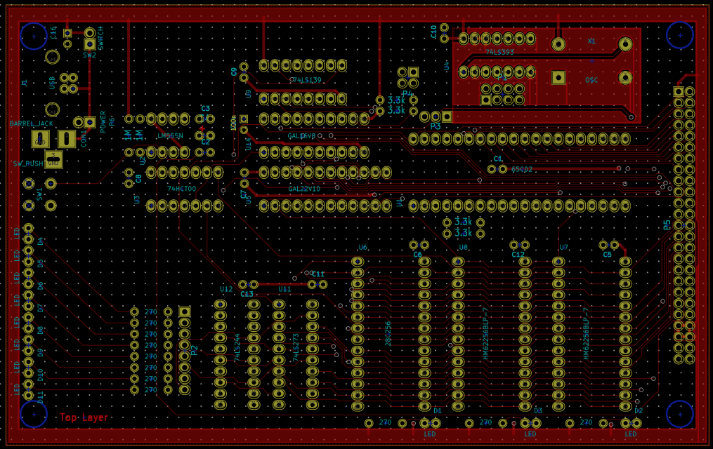
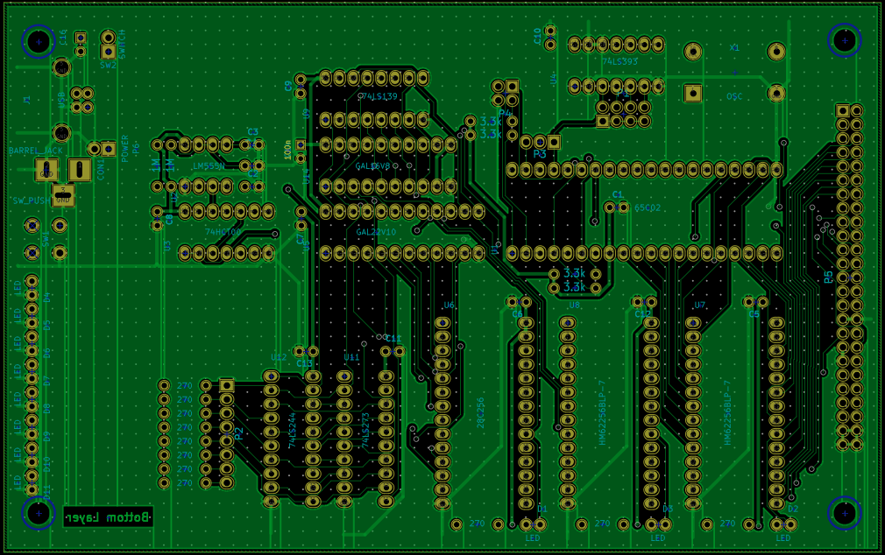

Wir haben vor, eine neue Revision der Steckschwein-Prototyp-Platinen herzustellen. Den Anfang macht ein neues CPU-Board mit einigen Bugfixes und den in [Chiptuning](http://www.steckschwein.de/index.php/2016/01/30/chiptuning/) beschriebenen zusätzlichen GAL als Waitstate-Generator, sowie einem geändertem Stromanschluss: In Zukunft wird es möglich sein, das Steckschwein mit nur 5V per USB, über einen Rundstecker oder wie gehabt über einen Pin-Header zu versorgen. Die Layouts sind schon fertig:

 Bestückungsseite

 Lötseite
