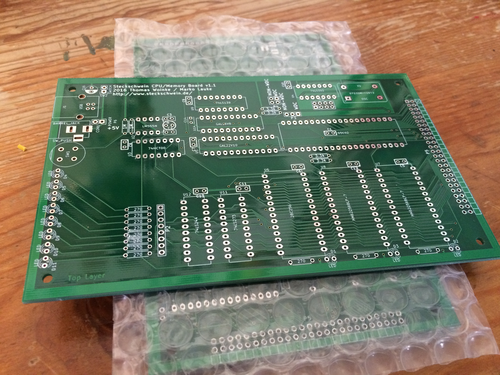

Wir arbeiten an neuen Revision unserer Prototyp-Platinen.

Den Anfang macht das CPU-Board. Zum einen sind ein paar Layoutfehler korrigiert worden, zum anderen ist der [kürzlich vorgestellte](/post/chiptuning/) Wait-State-Generator in das Board integriert worden.

Mit den neuen Boards wollen wir auch denen entgegenkommen, die sich selbst ein Steckschwein bauen wollen. Das sind nämlich mehr, als wir dachten. Dementsprechend lassen wir jeweils ein paar mehr Boards herstellen. Um die Inbetriebnahme des Steckschweins zukünftig zu vereinfachen, sind eine Hohlbuchse und eine USB-Buchse dazugekommen, um das Steckschwein später mit 5V aus einem handelsüblichen Netzteil oder per USB zu versorgen. Die 12V für das Video-Board werden nämlich in einer späteren Revision wegfallen.

