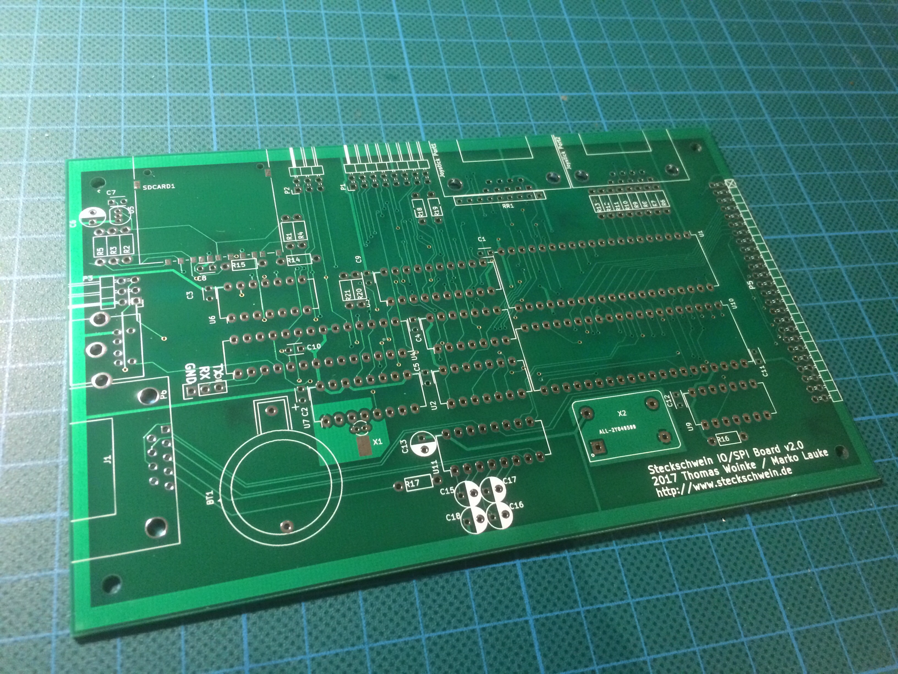
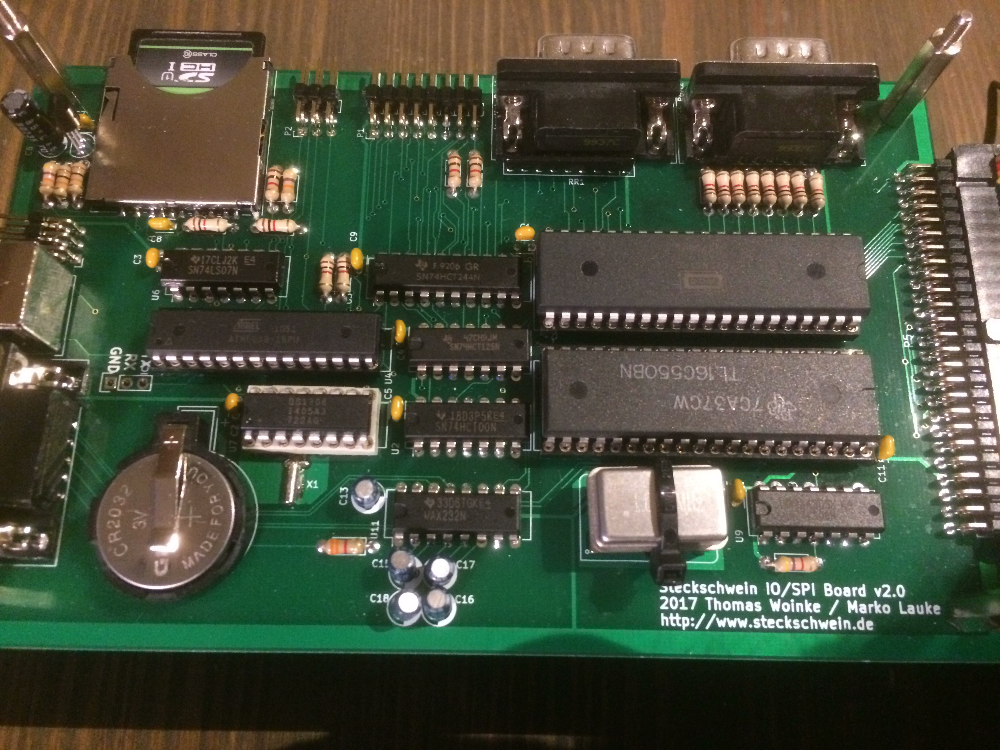
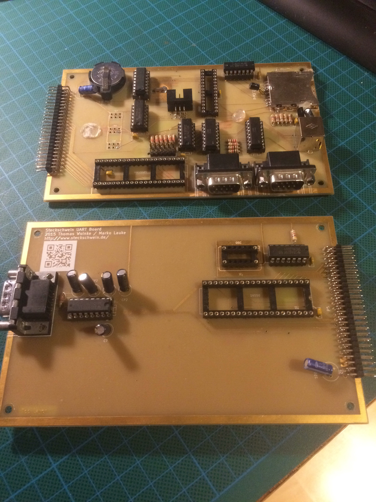

Die neuen IO-Platinen mit integriertem UART sind fertig und haben ihren Weg von China nach München gefunden.

Mit dem neuen Layout hat es nicht nur der UART mit aufs IO-Board geschafft, es sind auch etliche kleinere und größere Verbesserungen eingeflossen:

- Die Joystickports wurden komplett neu designed. Die Optokoppler sparen wir uns, stattdessen wählen wir über einen VIA Pin verschiedene Treiber an, die den gewünschten Joystickport mit VIA Port A verbindet. Die Ports lassen sich auch per Software komplett abschalten, damit der User-Port frei verfügbar ist. Als Schutz für die VIA werden Serienwiderstände verwendet.
- Der SD-Karten-Footprint und der verwendente Slot passen genau zusammen. Das war beim alten Board nicht der Fall. Jetzt sind die Karten- und die Schreibschutzerkennung endlich nutzbar.
- Die Datenpins für die PS/2 Schnittstelle am ATmega8 sind gewandert und liegen jetzt an PD6 und 7. Dadurch sind die RX und TX Pins des USART verfügbar geworden und können nun z.B. für das Debugging des Tastaturcontrollers verwendet werden.
- Zweckmäßigere Plazierung vom SPI-Anschluss des ATmega8 und des freien SPI Ports am Platinenrand. Updates der Tastaturcontrollerfirmware sind nun kein Krampf mehr.
- Der User-Port hat ein besseres Pinout.
- Die neue Platine sieht einfach besser aus.

\[caption id="attachment\_977" align="alignnone" width="3264"\] Frisch ausgepackte Platine\[/caption\]

\[caption id="attachment\_978" align="alignnone" width="3264"\] Fertig bestückte Platine\[/caption\]

\[caption id="attachment\_979" align="alignnone" width="2448"\] Die nun obsolet gewordenen Platinen.\[/caption\]
