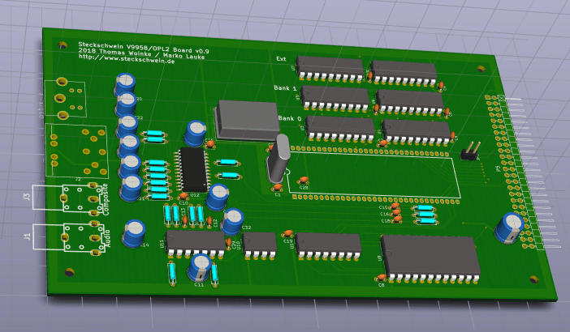

It's time for another hardware upgrade. Since we really want to get our single board Steckschwein done, we are going for higher integration of our multiboard prototype. After integrating the UART to the IO-Board, we integrate the OPL2 sound part onto the V9958 video board, so the current Steckschwein multi board incarnations are reduced to three boards. We did postpone our plan to upgrade sound to OPL3 because Daniel Illgen, which we met at VCFb, convinced us with some awesome OPL2 tunes that OPL2 is still cool. Also, we save the extra oscillator, since the OPL2 can be clocked using the CPUCLK-Pin from the V9958, which happens to provide 3.58MHz.

We did upgrade however the video ram. The first prototype had Bank 0 and Bank 1, maxing out vram at 128k. We decided to include the Extended memory bank, too, this time, giving the V9958 extra 64k, which can be accessed using the blitter command functions. Why not?

\[caption id="attachment\_1163" align="alignnone" width="702"\] KiCad 3D rendering of the new board\[/caption\]

Also, to make the connector side more compact, we decided to not use RCA jacks for RGB anymore, but an 8pin DIN jack, which also carries the audio signal. So hooking up a 1084 Monitor or TV will only require a single cable. We use the same DIN jack and [pinout as the NeoGeo](https://gamesx.com/avpinouts/neoav.htm) uses, so there are even [ready made cables available](https://www.retrogamingcables.co.uk/snk-neo-geo-aes-rgb-scart-cable-stereo-sound).
