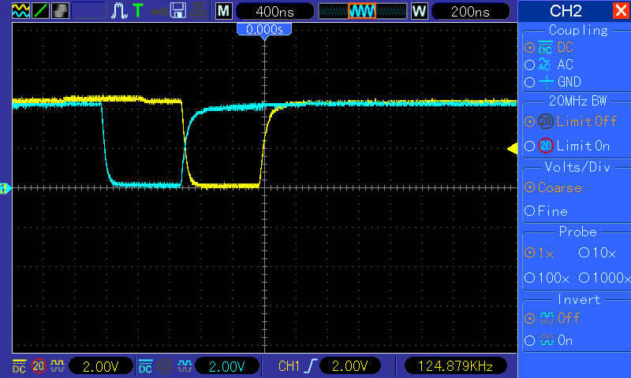
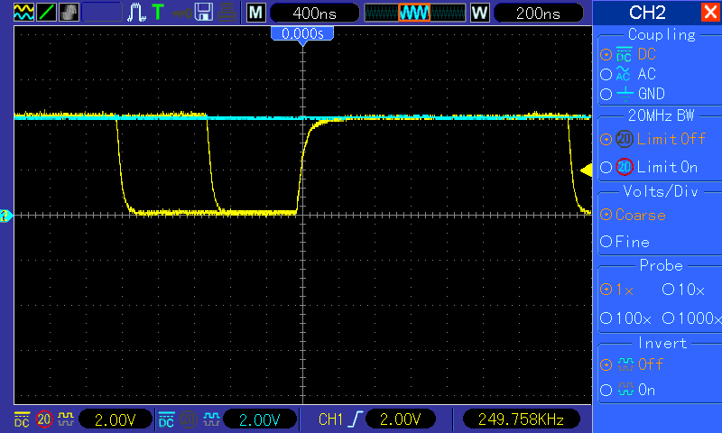

Wir sind jetzt also fast in der Lage, das RAM unter dem ROM zu nutzen. Hineinschreiben geht, lesen noch nicht. Da ist das ROM noch im Weg. Wir müssen also einen Weg finden, die GAL-Logik von außen zu beeinflussen. Unser GAL hat noch genügend Eingänge, sodass wir einen Pin zum ROM-Ein-/Ausschalter machen wollen. Lesezugriffe nach $e000-$ffff sollen also nur noch dann im ROM landen, wenn es "eingeschaltet" ist. Sonst wollen wir ins RAM. Die wiederum erweiterte Logik im GAL sieht jetzt so aus:

/CSHIRAM = G1\*/A2                                 + G1\*/A1\*/A0          + /RW\*G1\*A2\*A1 ; Writes to $e000-$ffff go to the RAM          + /ROMOFF\*RW\*G1\*A2\*A1 ; Reads  to $e000-$ffff go to the RAM, IF ROMOFF is Low /CSROM   = ROMOFF\*RW\*G1\*A2\*A1 ; Reads  to $e000-$ffff go to the ROM, IF ROMOFF is High ROMOFF haben wir Pin 13 des GAL zugeordnet. Und tatsächlich startet unser Steckschwein nur noch, wenn dieser PIN mittels eines PullUp-Widerstands nach High gezogen wird.  Lassen wir unser Testprogramm aus dem letzten Post nochmal laufen:

<table style="margin-left:auto;margin-right:auto;text-align:center;" cellspacing="0" cellpadding="0" align="center"><tbody><tr><td style="text-align:center;"></td></tr><tr><td style="text-align:center;">/CSHIRAM (gelb), /CSROM (blau)</td></tr></tbody></table>

Das gewohnte Bild, Lesezugriff geht ins ROM, Schreibzugriff ins RAM. Jetzt ziehen wir ROMOFF auf Masse und schalten damit das ROM aus:

<table style="margin-left:auto;margin-right:auto;text-align:center;" cellspacing="0" cellpadding="0" align="center"><tbody><tr><td style="text-align:center;"></td></tr><tr><td style="text-align:center;">/CSHIRAM (gelb), /CSROM (blau)</td></tr></tbody></table>

Volltreffer, das ROM wird nicht mehr selektiert, wir landen immer im RAM. ROMOFF müssen wir jetzt nur noch per Software steuerbar machen, und unser nutzbares RAM hat sich um 8k erweitert, sofern wir in Kauf nehmen, dass wir keine ROM-Routinen verwenden können, solange wir dort lesen. Aber das ist beim C64 ja auch nicht anders. Ein konkreter Verwendungszweck der neuen Dekoderlogik drängt sich bereits auch ohne Softwaresteuerung der ROMOFF-Leitung auf: Das Testen neuer Versionen des ROM-Code(BIOS) ohne jedesmal das EEPROM brennen zu müssen. Schon richtig modern. Als abschließendes Experiment verbinden wir ROMOFF mit dem Bit0 von Port A der VIA. Die VIA hat die angenehme Eigenschaft, dass ihre Ports im Urzustand immer als Eingänge geschaltet sind und die Pins durch interne Pullups auf H gezogen werden. Um jetzt aus dem RAM ab $e000 zu lesen, brauchen wir nur Bit 0 von Port A der VIA zu löschen. Folgendes Programm testet, ob das auch so klappt:  lda #000001         sta via1porta ; Pin 0 von Port A auf 1 setzen -> ROM ein         sta via1ddra  ; Pin 0 von Port A als Ausgang setzen  lda #$00         ldx #$42         stx $e000     ; $42 landet im RAM  dec via1porta ; Pin 0 von Port A ist jetzt 0 -> ROM  aus         lda $e000     ; $42 aus dem RAM lesen         inc via1porta ; -> ROM ein  jsr lcdhex 

... und auf dem LCD erscheint die $42. Freude.
