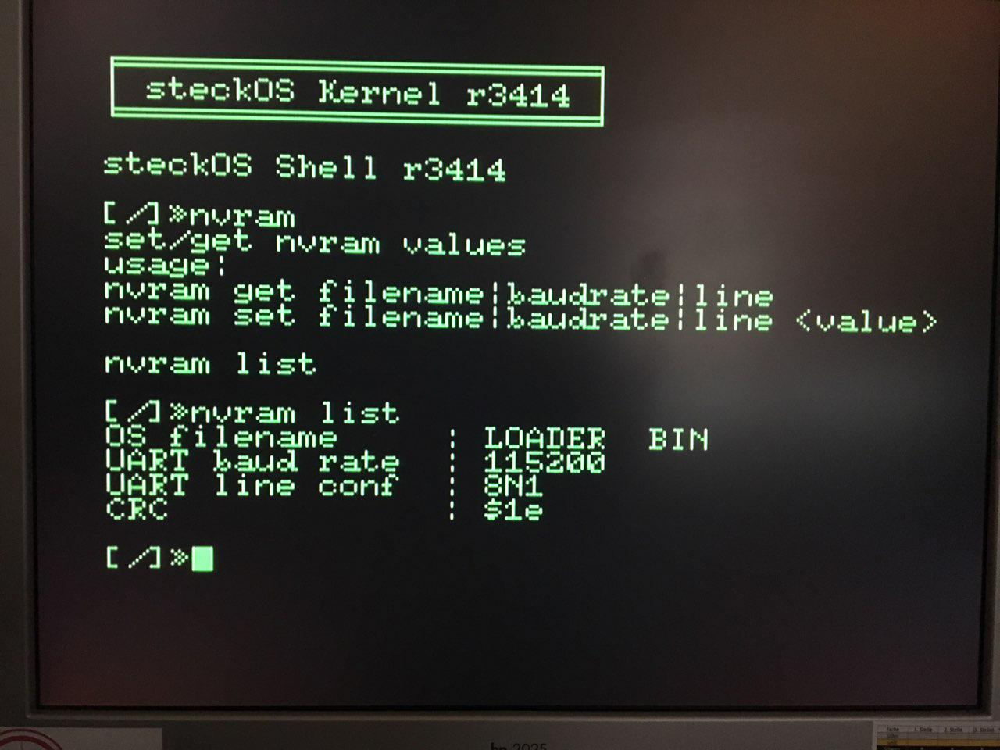

As real computer is not a real computer without a real time clock, the Steckschwein is no exception here. As [we know](http://steckschwein.de/hardware/via-65c22-as-spi-master/spi-devices/), we use the Maxim DS1306 RTC, which is a very common RTC which comes as DIP IC and has an SPI interface. And of course it supports battery backup in various configurations. And this is where things get interesting.

Apart from timekeeping, the DS1306 also has 96 bytes of battery buffered RAM. The ideal place to store system configuration parameters. As of now, the RTC NVRAM contains the name of the file to be read from sdcard at startup, the line parameters for the serial interface (baud rate, data bits, parity, stopbits), and also a version number and a crc7 checksum:

.struct nvram
    version       .byte
    filename      .byte 11
    uart\_baudrate .byte
    uart\_lsr      .byte
    crc7          .byte
.endstruct

version - The version byte will help tracking changes to the NVRAM data structure so we can maintain backwards compatibility. But for now, it's always $00. filename - The name of the file that will be read from sdcard at system bootup. uart\_baudrate - lower byte of the 16 bit divisor of the 16550's baud rate generator. The high byte will always be set to 0, since we do not need baud rates < 600 baud. uart\_lsr - contents of the 16550's Line Status Register, to setup the number of data bits, parity, and stop bits. crc7 - crc7 checksum of all the bytes except this last one. If at system startup the crc is not correct, an error message is displayed and fallback defaults are used.

To manipulate the contents of the NVRAM in a user friendly way, steckOS provides a tool written in C.

 nvram tool

 

As of now, we only use 15 bytes out of 96, so there are still 81 bytes left for whatever we might come up. Default text mode (40cols/80cols) comes to mind, also text/background colors...
