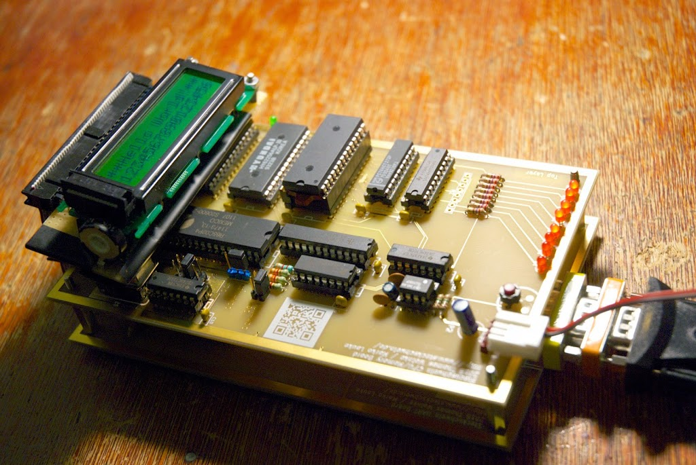

Damit man mal was sieht!

Die UART-Platine hat noch für einiges Kopfzerbrechen gesorgt, weil sich dann doch noch ein Fehler eingeschlichen hatte. Dieser ließ sich aber durch einen Klecks Lötzinn an der richtigen Stelle korrigieren. Pin25, /ADS hätte noch auf low gezogen werden müssen. Da das von uns in KiCad verwendete Symbol diesen Pin erst gar nicht hatte, war dies im Layout auch nicht drin. Pin war im Schaltplan als "nicht verbunden" markiert. Menschliches Versagen also. Toll.

Die CPU/Mem-Platine hingegen lief auf Anhieb.

<table style="margin-left:auto;margin-right:auto;text-align:center;" cellspacing="0" cellpadding="0" align="center"><tbody><tr><td style="text-align:center;"></td></tr><tr><td style="text-align:center;">CPU/Mem-Platine, darunter UART</td></tr></tbody></table>
