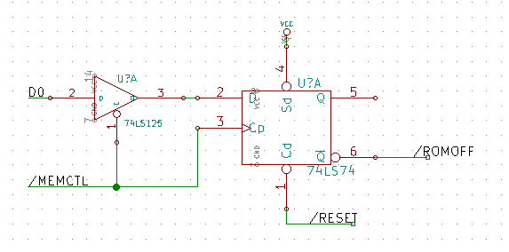

Nachdem wir also mit dem Adressdecoder durchaus zufrieden sind, müssen wir uns noch einen Weg überlegen, die /ROMOFF-Leitung per Software steuerbar zu machen. Wenn es schon beim BIOS-Update Test äußerst nützlich ist einfach nur eine Brücke umzustecken und damit das ROM zu deaktivieren, wie praktisch muss es erst sein, dies einfach durch Beschreiben einer Speicherstelle zu tun.

Was wir also brauchen, ist ein IO-Pin, der die /ROMOFF-Leitung steuert. Zusätzlich muss dieser Pin beim Einschalten des Systems einen definierten Zustand haben, damit sichergestellt ist, daß zu diesem Zeitpunkt das ROM eingeblendet ist. Passende Pins finden wir an der VIA und am UART. Die Portpins der VIA beispielsweise sind initial als Eingänge geschaltet und per internem Pullup high. Auch die OUT1 und OUT2-Pins des UART sind initial high. Gegen den UART-Ansatz spricht, dass sich diese Pins  nur über ein Write-Only-Register setzen lassen und es keine Möglichkeit gibt, den Zustand dieser Pins über irgendein UART-Register abzufragen.

Der VIA-Ansatz hat den Nachteil, dass die Pins zwar einen definierten Zustand haben, dies aber nur "zufällig", weil die VIA-Pins initial immer als Eingang definiert sind und damit nach "außen" Hi werden. Außerdem sind die Ports der VIA alle verplant. Port B ist vollständig für SPI vorgesehen, Port A stellt die Joystickports. Sicher wäre es möglich, von Port B einen SPI\_SS abzuknapsen, doch so richtig sauber wäre das nicht.

Besser für eine richtig saubere Lösung wäre also eine dedizierte Schaltung, die folgendes erfüllen soll: - Einen Pin mit definiertem Ausgangszustand - Dieser soll durch Schreiben in eine Speicherstelle verändert werden können - Der Zustand soll durch Lesen der Speicherstelle ermittelt werden können - Es soll kein vorhandener Chip (VIA, UART, ..) missbraucht werden

Kurz: Wir wollen einen dedizierten Ausgabeport in den Adressraum bzw. IO-Bereich einblenden. Der ideale Baustein hierfür wäre ein 8bit Tri-State Latch mit Reset. Einen Baustein, der all das kann, finden wir nicht. Die nächstbeste Möglichkeit wäre ein 74hct273, einem 8bit-Latch mit Reset, dem wir einen 74hct244-Buffer vorschalten, um ihn vom Bus zu nehmen, wenn er nicht selektiert ist. Leider befindet sich kein 74hct273 in der Bastelkiste, sodass erste Experimente mit einem Flipflop aus einem 74ls74 und einem Tri-State-Buffer im für das SD-Karten-Interface bereits verbauten 74hct125 stattfinden müssen. Sozusagen die kleine Variante mit nur einem Bit.

**Update:** Nach reiflicher Überlegung kann auf den Buffer auch verzichtet werden. Das Latch legt ja nur Eingänge auf den Bus, und tut nur etwas, wenn es per /CS eine CLK-Flanke bekommt. Also rationalisieren wir den Buffer weg und sparen einen Chip.

/MEMCTL haben wir den IO-Select-Pin des GAL genannt. Mit dieser Verdrahtung ist es nun möglich, das Flipflop durch Beschreiben einer Speicherstelle zu kippen. Was noch fehlt, ist die Möglichkeit, den Zustand des Ports auslesen zu können.

Ein Ansatz wäre, den Ausgang des Flipflop über einen weiteren Buffer wieder an den Datenbus zu koppeln und abhängig davon, ob gelesen oder geschrieben wird, den einen oder andere Buffer zu aktivieren. Dies würde aber zusätzliche Logik erfordern. Ein Ansatz mit geringerem Chipcount ist uns lieber. Wie wäre es, wenn wir für Schreibzugriffe an diesen Port nicht nur das Latch, sondern auch das darunterliegende RAM selektieren? Das geschriebene Byte würde somit im RAM gespiegelt. Dann müßte nur noch sichergestellt werden, dass das Latch nur noch bei Schreibzugriffen selektiert wird, sodass Lesezugriffe nur noch im RAM landen. Dies erfordert Anpassungen an der Dekoderlogik im GAL:

/MEMCTL = /A15\*/A14\*/A13\*/A12 \* /A11\*/A10\*A9\*/A8 \* A7\*A6\*A5\*A4 \* /RW ; $02f0

Wir legen unsere /MEMCTL-Leitung so weit wie möglich ans Ende des IO-Bereichs, und beziehen RW mit in den Term ein. Der Term für LORAM muss auch angepasst werden, damit $02f0 nicht mehr teil des reinen IO-Blocks ist. Hierzu nehmen wir A7 mit in den Term auf, was den IO-Bereich verkleinert (halbiert), sodass dieser an $027F endet. Mehr IO-Pins haben wir ohnehin nicht. Gleichzeitig haben wir noch Reserven im Adressraum, falls wir doch mal einen Block größer 16 Byte brauchen.

Vorher CSLORAM = /A14 \* /A13 \* /A12 \* /A11 \* /A10 \* A9 \* /A8 + A15

Nachher

CSLORAM = /A14 \* /A13 \* /A12 \* /A11 \* /A10 \* A9 \* /A8 \* /A7 + A15

Hiermit hat sich die Speicherbelegung wie folgt verändert.

| Bereich | Was |
| --- | --- |
| $0000 - $01ff | RAM (Zeropage und Stack) |
| $0200 - $027f | IO-Bereich |
| $0280 - $02ef | RAM (reserviert)\* |
| $02f0 - $02ff | MEMCTL-Register |
| $0300 - $dfff | RAM |
| $e000 - $ffff | ROM (ausblendbar) |

\* Das RAM an dieser Stelle ist im Grunde nutzbar, da wir aber Stand heute noch nicht wissen, ob dort später nicht doch noch IO-Adressen gemappt werden, deklarieren wir diesen Bereich als "reserviert".

Jetzt fehlen nur noch die "richtigen" Chips, um das Ganze 8bit breit umzusetzen.

Von den jetzt noch freien 7 Bit des so entstandenen "Memctl-Register" (nennen wir es ruhig so) verbinden wir Bit 1 und Bit 2 mit den Adressleitungen A13 und A14 des ROM, die vorher hart auf Masse lagen. Damit haben wir die Möglichkeit, die kompletten 32K des ROM zu nutzen, auch wenn wir aktuell noch nicht genau wissen, wofür :-). Aber so ist dann schonmal nichts verbaut.

Der kleine Schönheitsfehler dieser Lösung soll nicht verschwiegen werden: Der Inhalt des RAM ist beim Einschalten bekanntlich nicht definiert. Direkt nach dem Einschalten und bevor das erste Mal ins Register geschrieben wurde, lesen wir aus dem Register also alles, nur nicht den Zustand des Latch. Hier werden wir uns etwas Schlaues per Software überlegen müssen.
