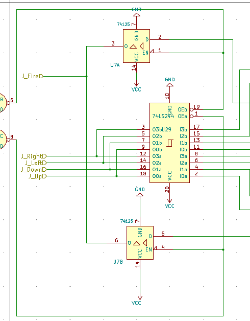
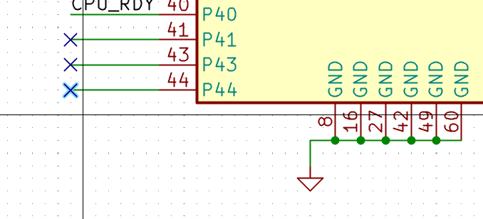
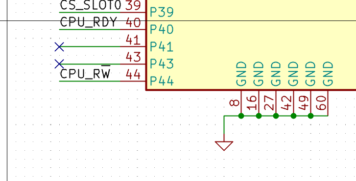

Our debugging journey at VCFe began right at powering up the board the first time, when something got real hot real fast. Fair enough, and easy to spot. There was a mixup of VCC and GND at U29, a 74HCT244. Embarassing, but not that critical, as U29 is only used to connect the joystick ports to Port A of the VIA. We can live without them for now. \
The mixup likely happened when I transferred the IO-board schematics from KiCad 6 to 7 while updating the symbols from the current library, which happened to be different than the old ones. I had to mirror the new symbols to fit the schematic. This meant that GND is at the top now, and VCC at the bottom. Which I happened to overlook.  While routing, I was briefly wondering why U29's bypass capacitor was at the opposite corner compared to all the other 74HCTnnn chips. I maybe should have become suspicious at that point.

 \
VCC/GND mixup fixed

The next error was not that easy to spot. We spent almost all the time at VCFe debugging and thinking what could be wrong. The only thing that made the board talk to us over serial was pulling the /OE line to low. \
Days later when I had some time I sat down and compared the schematics and the UCF definitions. That one hit hard.. I forgot to connect the CPU's r/w line to the CPLD. When I build the schematics, I went over the CPLD pinout in the UCF file and the schematics several times, and still managed to miss r/W.  Bodge-wire time!

 \
Pin 44 (CPU_r/W) unconnected

 \
Pin 44 correctly labeled

To be continued ...