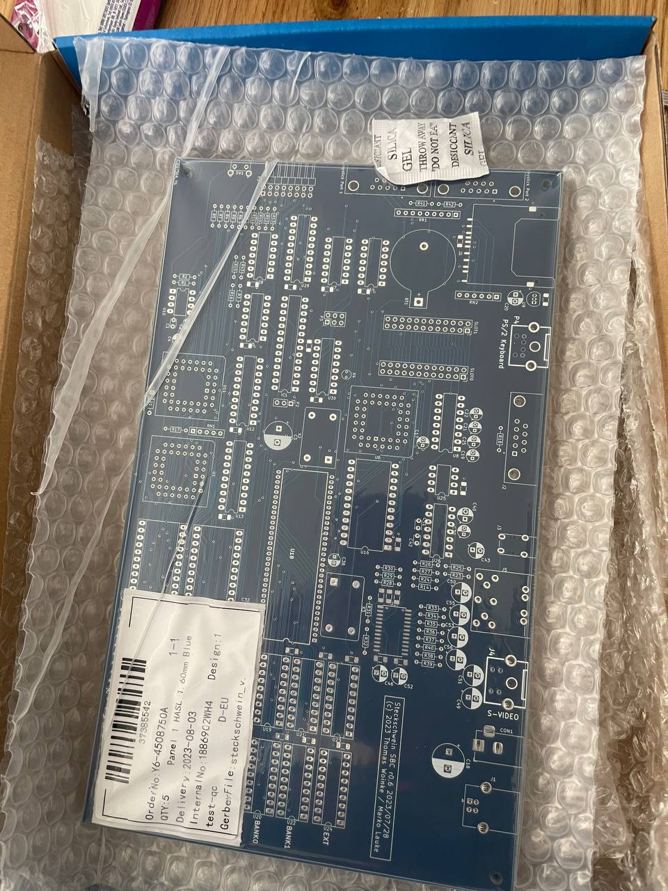

After some troubleshooting, we finally finished Revision 0.6 of our boards, and the new boards are finally there, ready to be assembled.
We managed to fix all the issues we found, and also did some cleaning up, used better footprints for the resistors and the mini DIN jacks.\
Soldering session coming up..

 \
Revision 0.6 boards are there

