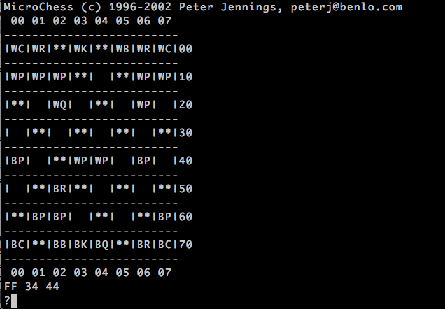
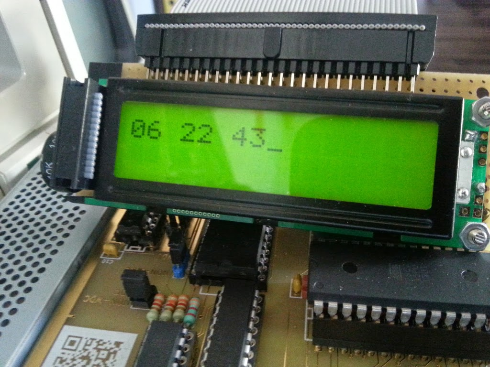

Nachdem das Grundsystem nun in Form von Platinen vorliegt und Marko dabei ist, das Videoboard zu layouten, ist die Gelegenheit günstig, schon einmal ein wenig vorhandene Software auf das Steckschwein zu portieren. Den Anfang macht [MicroChess](http://benlo.com/microchess/index.html), 1976 von Peter Jennings für den MOS KIM-1 entwickelt und von [Daryl Rictor modifiziert](http://www.6502.org/source/games/uchess/uchess.htm), um über ein serielles Terminal als Ein- /Ausgabestation spielbar zu sein, inklusive der coolen ASCII-Art-Darstellung des Schachbretts.

Dementsprechend einfach war es, es auf dem Steckschwein zum Laufen zu bekommen. Anstatt der vorhandenen Routinen zur Ein-/Ausgabe von Bytes über die 6551 ACIA verwenden wir einfach die UART-Routinen, die unser BIOS ohnehin bereitstellt, zur Ausgabe auf dem Terminal, während als Eingabe die ans Steckschwein angeschlossene PS/2-Tastatur dient.

Damit läuft auf dem Steckschwein erstmals ein Programm, welches kein Test-/Demoprogramm von uns ist. Weitere werden folgen.

Um ein wenig KIM-1-Feeling beizubehalten, geben wir die 3 Zahlen, die die Züge beschreiben auch auf dem LCD-Display aus. Damit ließe sich notfalls auch ohne Terminal spielen, sofern ein physikalisches Schachbrett zur Hand ist. Wie in der guten alten Zeit.

