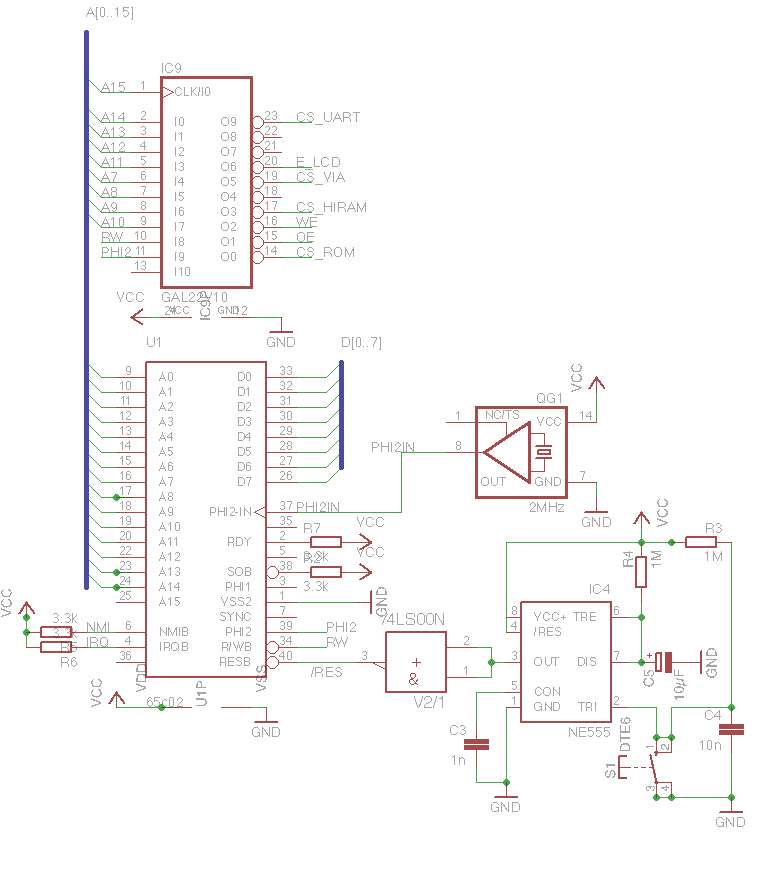
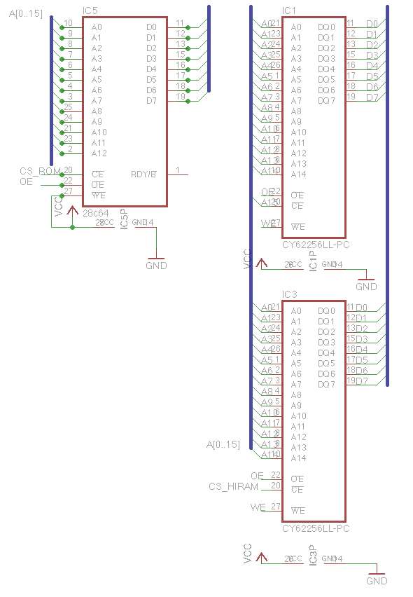
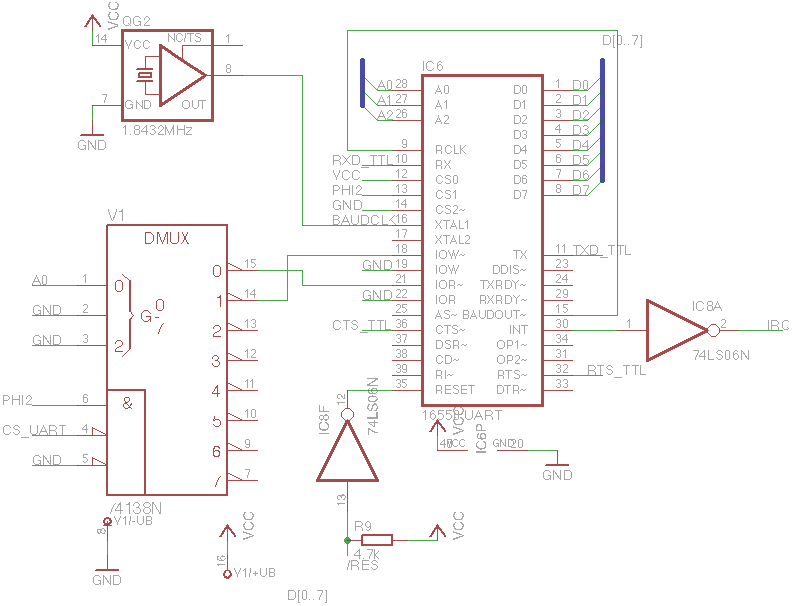
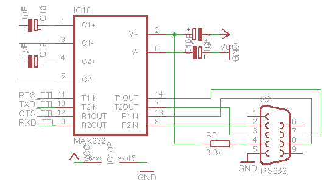
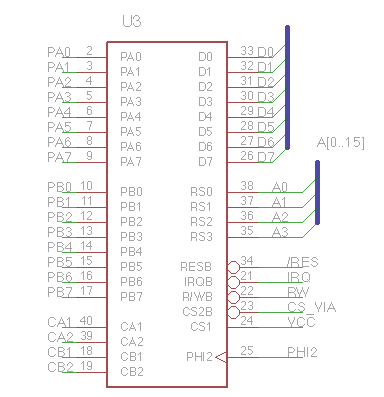

Damit Klarheit darüber herrscht, worum es überhaupt geht, haben wir den Schaltplan in die einzelnen Gruppen (Prozessor+ Freunde, Speicher, UART) zerlegt.

Die aktuelle Stückliste liest sich laut Eagle folgendermaßen:

Part     Value          Device                C1       100n           C5/3                  C3       1n             C-EU025-025X050       C4       10n            C-EU025-025X050       C5       10µF           CPOL-EUE2,5-6E      C6       100n           C5/3                 C7       100n           C5/3                 C8       100n           C5/3                    C12      1µF            CPOL-EUE2,5-6E        C13      100n           C5/3                C14      100n           C5/3                 C15      100n           C5/3                 C16      1µF            CPOL-EUE2,5-6E      C17      1µF            CPOL-EUE2,5-6E        C18      1µF            CPOL-EUE2,5-6E        C19      1µF            CPOL-EUE2,5-6E       IC1      CY62256LL-PC   CY62256LL-PC          IC3      CY62256LL-PC   CY62256LL-PC         IC4      NE555          NE555               IC5      28c64          2864                     IC6      16550 UART     XR-16C550P                IC8      74LS06N        74LS06N                    IC9      GAL22V10       22V10                IC10     MAX232         MAX232                QG1      2MHz           XO-14                QG2      1.8432MHz      XO-14                 R2       3.3k           R-EU\_0204/7          R3       1M             R-EU\_0204/7          R4       1M             R-EU\_0204/7          R5       3.3k           R-EU\_0204/7         R6       3.3k           R-EU\_0204/7          R7       3.3k           R-EU\_0204/7           R8       3.3k           R-EU\_0204/7          R9       4.7k           R-EU\_0204/7          S1       DTE6           DTE6                         U1       65c02          G65SC02P          U3       65c22          G65SC22P          V1       74138N         74138N            V2       74LS00N        74LS00N            X2       RS232          F09HP 

<table style="float:left;margin-right:1em;text-align:left;" cellspacing="0" cellpadding="0" align="center"><tbody><tr><td style="text-align:center;"></td></tr><tr><td style="text-align:center;">Der 65c02-Prozessor nebst Oszillator und RESET-Schaltung, welche aus dem Commodore-PET übernommen wurde und dem GAL, der zu Dekodierung des Adressbereichs von $8000 bis $ffff dient. Nicht zu sehen ist der Pull-Up-Widerstand für die BE (Bus Enable)-Leitung der WDC-Variante des 65x02, ohne den der Prozessor in einen Tri-State-Zustand geht und sich vom Bus abkoppelt.</td></tr></tbody></table>

 

<table style="margin-left:auto;margin-right:auto;text-align:center;" cellspacing="0" cellpadding="0" align="center"><tbody><tr><td style="text-align:center;"></td></tr><tr><td style="text-align:center;">Das EEPROM und die beiden 32k SRAM-Bausteine. Etwas schwer zu erkennen: die Adressleitung A15 des Prozessors dient den "unteren" 32k (IC1) als CS-Signal. Das CS_HIRAM-Signal hingegen erzeugt der GAL (siehe oben). Der Schaltplan unterschlägt, dass wir in Wirklichkeit ein 28c256-EEPROM verwendet haben, welches wir durch auf Masse legen von A14 und A13 auf 8k "kastriert" haben.</td></tr></tbody></table>

<table style="margin-left:auto;margin-right:auto;text-align:center;" cellspacing="0" cellpadding="0" align="center"><tbody><tr><td style="text-align:center;"></td></tr><tr><td style="text-align:center;">Der UART + Glue Logic, um dessen Bus-Interface an das des 65c02 anzupassen. Die Invertierung von RESET und INT(IRQ) übernimmt ein 74ls06. Beim RESET-Signal ist aufgrund dessen Open Collector-Treibers noch ein Pull-Up-Widerstand nötig.</td></tr></tbody></table>

<table style="margin-left:auto;margin-right:auto;text-align:center;" cellspacing="0" cellpadding="0" align="center"><tbody><tr><td style="text-align:center;"></td></tr><tr><td style="text-align:center;">Der Vollständigkeit halber.</td></tr></tbody></table>

 

<table style="margin-left:auto;margin-right:auto;text-align:center;" cellspacing="0" cellpadding="0" align="center"><tbody><tr><td style="text-align:center;"></td></tr><tr><td style="text-align:center;">Die Anbindung der 65x22 VIA gestaltet sich trivial und erweitert unseren kleinen Rechner um vielseitige IO-Möglichkeiten</td></tr></tbody></table>
