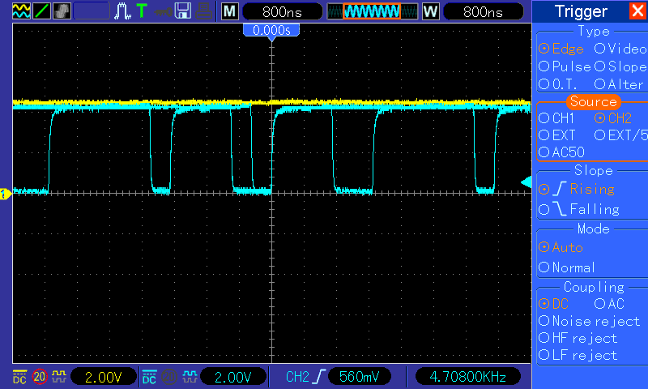
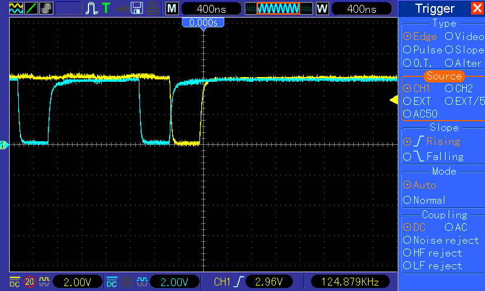

Im Rahmen unserer Reihe "Kleine Verbesserungen an der Architektur" ist heute der Adressdekoder dran. Dieser entscheidet bekanntlich anhand der am Adressbus anliegenden Adresse (oder genauergesagt deren höheren 8bit), welcher Baustein an der entsprechenden Adresse eingeblendet werden soll. Durch den Umstand, dass die oberen 8k dem ROM gehören, lassen sich die darunterliegenden 8k RAM nicht ohne weiteres nutzen. Die für die Selektierung des ROMs und der oberen 32k RAM sehen folgendermaßen aus:

/CSHIRAM = G1\*/A2                          + G1\*/A1\*/A0 /CSROM   = G1\*A2                  Wir machen also die CS-Signale statisch von der anliegen Adresse abhängig. Aber es sollte doch möglich sein, grundsätzlich auch zwischen Reads und Writes auf die entsprechenden Adressen zu unterscheiden, oder? Die /RW-Leitung des Prozessors liegt ohnehin am GAL an. Was spricht dagegen, Lesezugriffe nach $e000-$ffff aus dem ROM zu holen, Schreibzugriffe aber immer ins RAM zu leiten? Der C64 kann das schließlich auch. Schreiben wir ein kleines Testprogramm:

main ldx #$00 loop lda $e000,x sta $e000,x inx cpx #$ff bne loop jmp main

Wir lesen also aus dem ROM-Bereich und schreiben gleich wieder zurück. Das Oszilloskop zeigt uns /CSHIRAM (gelb) und /CSROM (blau):

<table style="margin-left:auto;margin-right:auto;text-align:center;" cellspacing="0" cellpadding="0" align="center"><tbody><tr><td style="text-align:center;"></td></tr><tr><td style="text-align:center;">/CSHIRAM (gelb) und /CSROM (blau)</td></tr></tbody></table>

Die Schreibzugriffe landen erwartungsgemäß nicht im RAM, dieses wird zu keiner Zeit selektiert.

Jetzt passen wir die Gleichungen für /CSHIRAM und /CSROM an, indem wir die Abhängigkeit von /RW berücksichtigen:

/CSHIRAM = G1\*/A2 

 + G1\*/A1\*/A0

 + /RW\*G1\*A2\*A1 ; Writes to $e000-$ffff go to the RAM

/CSROM   = RW\*G1\*A2\*A1 ; Reads  to $e000-$ffff go to the ROM

Und jetzt lassen wir unser Programm nochmal laufen:

<table style="margin-left:auto;margin-right:auto;text-align:center;" cellspacing="0" cellpadding="0" align="center"><tbody><tr><td style="text-align:center;"></td></tr><tr><td style="text-align:center;">/CSHIRAM (gelb) und /CSROM (blau)</td></tr></tbody></table>

Wir erkennen einen Lesezugriff (/CSROM, LDA $e000,x) und direkt darauf einen Schreibzugriff ins RAM (/CSHIRAM, STA $e000,x).

Hurra, schreiben wir jetzt "ins ROM", landen unsere Schreibzugriffe automatisch im darunterliegenden RAM. Allerdings nützt uns das noch nichts, denn noch können wir aus dem RAM nicht lesen.

Im nächsten Teil erweitern wir also die GAL-Logik um einen Steuerpin, mit dem wir das ROM vollständig ausblenden und das RAM entsprechend freilegen können.
