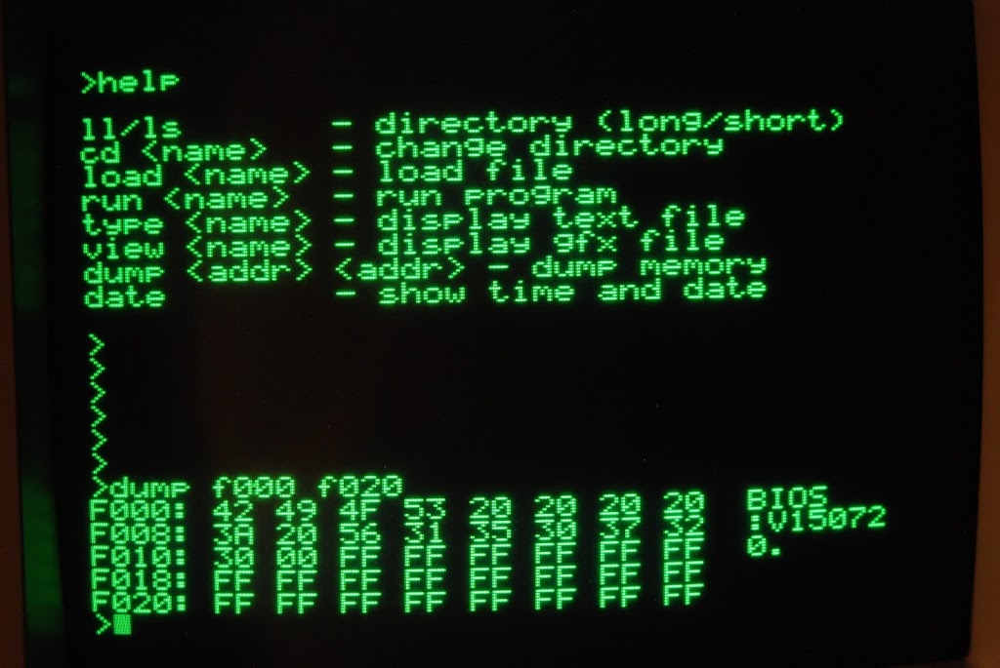

Als Abfallprodukt der letzten Debugging-Session bezüglich SD-Karten und dessen, was von ihnen gelesen wird, hat die Shell ein kleines Hexdump-Feature bekommen, mit dem sich Speicherinhalte ähnlich wie beim "M"-Kommando bei diversen Maschinensprachemonitoren ausgeben lassen.

Die Handhabung ist entsprechend bekannt: "dump ", abgebrochen werden kann mit Ctrl-C. Als Abfallprodukt hiervon gilt das jetzt auch für Directory-Listings.

Damit hat die SteckShell nunmehr die Versionsnummer 0.10.

