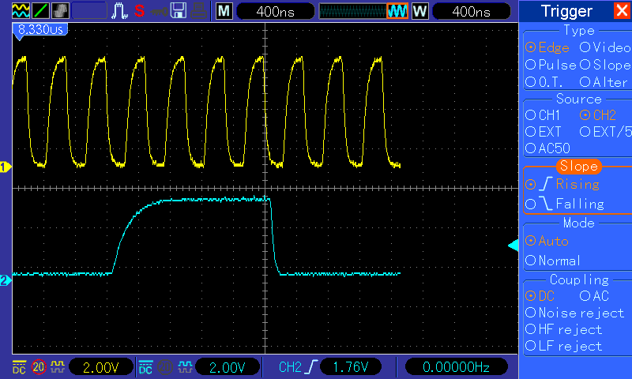

Es gibt verschiedene Ansätze, einem 6502-basierten System SPI beizubiegen. Daryl Rictor hat z.B. einen [CPLD-basierten SPI-Controller](http://sbc.rictor.org/65spi.html) mit passendem Businterface entwickelt. Meist jedoch wird eine 6522 VIA hergenommen und SPI per Bit Banging implementiert. Auch hier gibt es verschiedenen Ansätze, Andre Fachat hat es mit ein wenig externer Logik sogar geschafft, das Schieberegister der [VIA im für SD-Karten nötigen SPI Mode 0](http://www.6502.org/users/andre/csa/spi/index.html) zu betreiben. Normalerweise geht das ja nicht, das das Schieberegister der VIA die Daten nicht vor dem ersten Taktimpuls anlegen kann.

Unser Ansatz verwendet den VIA Port B zum Senden. An PB0 liegt der SPI Takt an, an PB7 das Datenbit (MOSI). Die Pins dazwischen dienen als Slave-Select-Leitungen. Der Empfang der Daten vom SPI-Slave (MISO) übernimmt das Schieberegister der VIA, welches extern betaktet werden soll.

Diese Betriebsart der VIA ist berühmt berüchtigt für einen [Bug](http://en.wikipedia.org/wiki/MOS_Technology_6522#Shift_register), der dafür sorgen kann, das das Schieberegister ein Bit "vergisst", nämlich dann, wenn die fallende Flanke des Systemtakts und die fallende Flanke des Schieberegister-Takts an CB1 zeitlich eng zusammenfallen. In diesem Fall wird die Flanke an CB1 ignoriert, was zum Verlust des entsprechenden Bit führt.

Mit dem Oszilloskop sehen wir, dass es zwischen den fallenden Flanken beider Takte ausreichend Versatz gibt, sodass wir uns keine Sorgen machen.

<table style="margin-left:auto;margin-right:auto;text-align:center;" cellspacing="0" cellpadding="0" align="center"><tbody><tr><td style="text-align:center;"></td></tr><tr><td style="text-align:center;">Versatz von PHI2 (gelb) und SPICLK (blau)</td></tr></tbody></table>

Jetzt brauchen wir nur noch die Routinen zum Bit-Banging des Ports:

Diese Routine überträgt das Byte im Akku per SPI. Das empfangene Byte wird anschließend aus dem Schieberegister in den Akku geladen.

spi\_rw\_byte

 phx

 phy

 sta tmp0        ; zu transferierendes byte im akku nach tmp0 retten

 ldx #$08

 lda via1portb   ; Port laden

 and #$fe        ; SPICLK loeschen

 asl             ; Nach links rotieren, damit das bit nachher an der richtigen stelle steht

 tay              ; bunkern

\-

 rol tmp0

 tya             ; portinhalt

 ror             ; datenbit reinschieben

 sta via1portb   ; ab in den port

 inc via1portb   ; takt an

 sta via1portb   ; takt aus

 dex

 bne -           ; schon acht mal?

 lda via1sr      ; Schieberegister auslesen

 ply

 plx

 rts

Da wir eher häufiger lesen als schreiben, gibt es dafür auch noch eine Routine, die nochmal wesentlich schneller arbeitet, da wir uns den Code für das Zerlegen des zu sendenden Bytes ja sparen können. Damit es richtig schnell geht, unrollen wir die Schleife für die Takterzeugung.

spi\_r\_byte

 phy

 lda via1portb   ; Port laden

 AND #$7e  ;    \* Daten und Takt ausschalten

 TAY             ; aufheben

 ORA #$01

 STA via1portb ; Takt An 1

 STY via1portb ; Takt aus

 STA via1portb ; Takt An 2

 STY via1portb ; Takt aus

 STA via1portb ; Takt An 3

 STY via1portb ; Takt aus

 STA via1portb ; Takt An 4

 STY via1portb ; Takt aus

 STA via1portb ; Takt An 5

 STY via1portb ; Takt aus

 STA via1portb ; Takt An 6

 STY via1portb ; Takt aus

 STA via1portb ; Takt An 7

 STY via1portb ; Takt aus

 STA via1portb ; Takt An 8

 STY via1portb ; Takt aus

 lda via1sr

 ply

 rts

An dieser Stelle vielen Dank an [Hans Franke](http://www.vcfe.org/), der uns auf die Idee mit SPI gebracht, die Idee mit dem Schieberegister hatte und mit uns die optimierten SPI-Routinen entwickelt hat.
