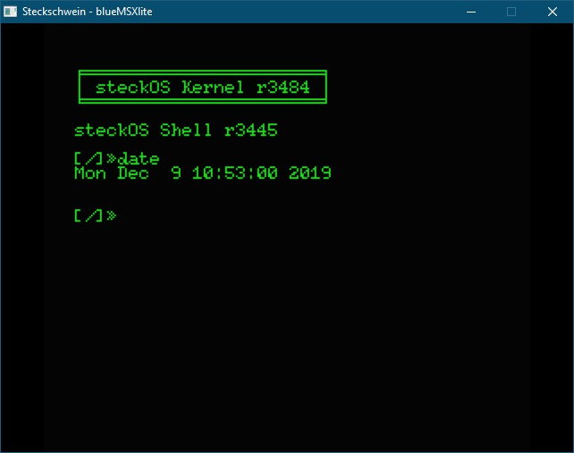

Back from the VCFB (Vintage Computer Festival Berlin) 2019 where we had good talks, met interesting people and got new ideas. Especially from [Michael Steil](https://www.pagetable.com/) who just asked the simple question **"How you can develop software for the Steckschwein without an emulator?"**

With the answer in my mind I felt a little annoyed and also "triggered" at the same time... However, Michael Steil was nice enough to strip down his Commander X16-Emulator into a barebone 65c02 computer emulator, so all we had to do was to implement our memory map (easy) and borrow a V9958 video chip implementation from blueMSX and implement it into the emulator (hard).

We'll guide you through the adaption of the emulator step by step. Let's start with the "easy" part, the...

### Memory Mapping

is done in a dedicated file [memory.c](https://github.com/twoinke/steckschwein-emulator/blob/master/memory.c) where we simply do the dispatching to a dedicated hardware emulation upon a given address. Luckily the Steckschwein i/o is located in a dedicated and continuous address range within $0200-$0280.

So if the CPU accesses these address range e.g. asking for a byte from such an address via

LDA $0220

the emulator dispatches the memory read to the corresponding i/o implementation. this  is done with a simple ordered "if-cascade" as follows

uint8\_t
real\_read6502(uint16\_t address, bool debugOn, uint8\_t bank)
{
	if (address < 0x0200)
	{ // RAM
		return RAM\[address\];
	}
	else if (address < 0x0280) { // I/O
		// TODO I/O map?
		if (address  < 0x210) // UART at $0200
		{
			return uart\_read(address & 0xf);
		}
		else if (address < 0x0220) // VIA at $0210
		{
			return via1\_read(address & 0xf);
		}
		else if (address < 0x0230) // VDP at $0220
		{
			return ioPortRead(NULL,address);
		}

The LDA shown above will end up in the line with

return ioPortRead(NULL,address);

and thus our VDP implementation is asked for a byte to read.

All other addresses are either RAM or ROM depending on the value within our memory control port $0230. For more details check out the [memory map](http://steckschwein.de/hardware/cpuramdecoder/).

### VIA and SDCard

The X16 and the Steckschwein share a few similar approaches, for example in terms of mass storage and/or peripheral communication. Both use the VIA to implement the SPI bus protocol via "bit banging" to communicate with various components, such as the SD card or the RTC. This part of the emulator almost completely derived from the X16 emulator, with only small modifications.

### Emulating the V9958

The video part was much more difficult, because Steckschwein uses the [V9958](http://steckschwein.de/hardware/v9958-video-board/). Emulating that kind of video chip is much much work todo and requires a very good understanding what's really going on within the chip at every µs when the screen is drawn.

Fortunately the MSX and MSX2 systems are very good documented and there are plenty of emulators with source available. As this sounds good the outcome of our investigation was quite sober. Only the fMSX and the blueMSX emulators gave us an idea how we can use or reuse the code of the VDP implementation.

Although the [blueMSX](http://www.bluemsx.com/) code is not maintained anymore we decided to give'em a try. This is because the blueMSX implementation is build more like a kind of emulator framework which can be used to build emulators for a wide range of hardware and not only for MSX systems.

For short, the following changes where made to get the emulator with the VDP work

1. strip out unnecessary code and extract the raw VDP V9558 implementation
2. create a blueMSX board implementation for Steckschwein
3. adapt the fake6502.c code to the blueMSX API with the appropriate cpu callbacks
4. glue code to dispatch the i/o access of addresses $220-$224 to the blueMSX VDP code
5. get cyclic exact timings required for video by using the blueMSX timer loop

And here we are... the emulator is able to boot our bios, which in turn mounts the sdcard and loads the kernel just like the real Steckschwein does.

On the screenshot you may have noticed the "date" tool, which actually gives the correct datetime. Hence the rtc emulation is also done already.

to be continued...

code: [https://github.com/twoinke/steckschwein-emulator](https://github.com/twoinke/steckschwein-emulator)
