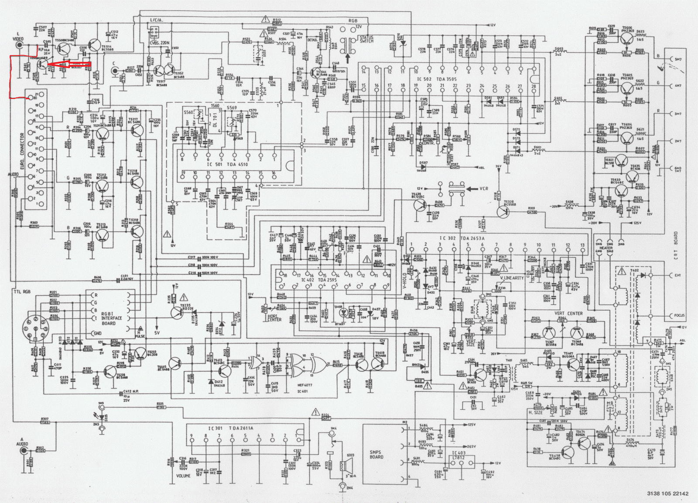
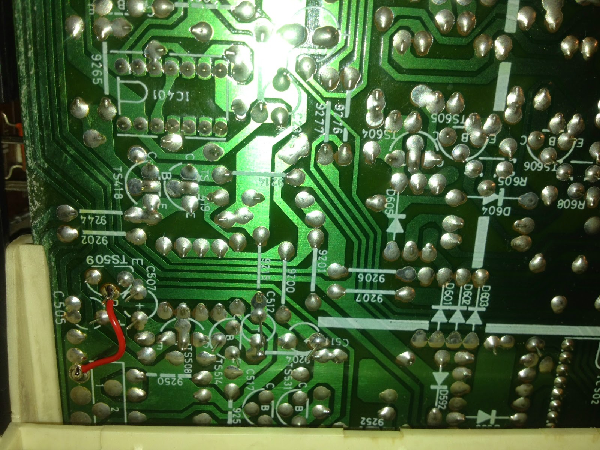
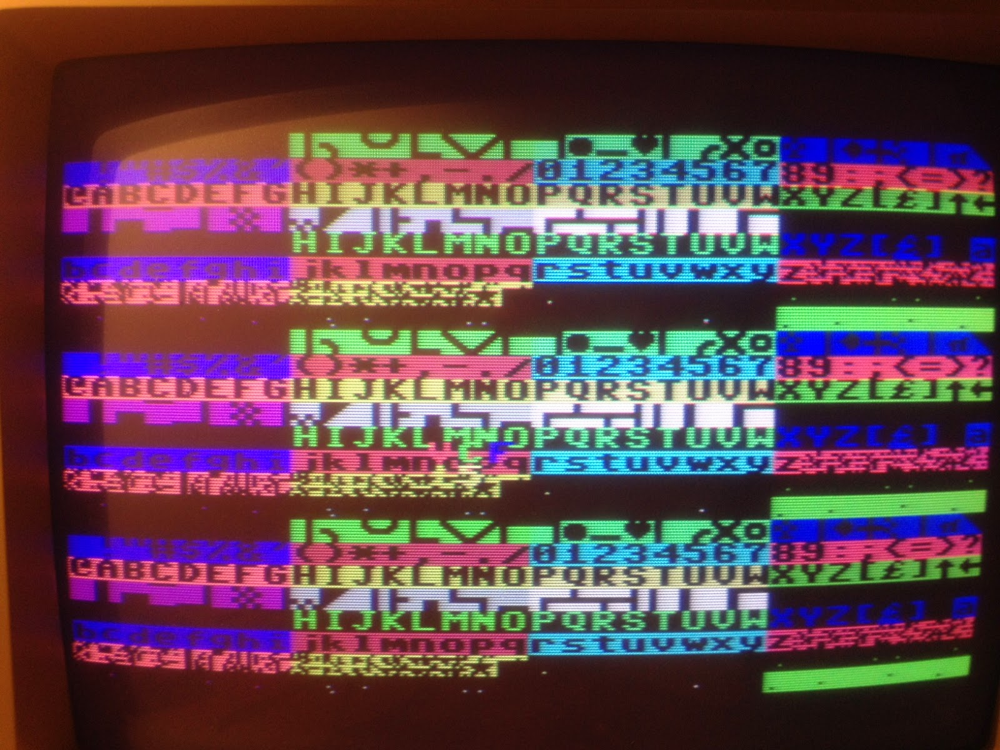

Damit Dommas nicht langweilig wird und auch in den Gfx-Genuss kommt muss natürlich eine Lösung her. Er hat momentan keine Möglichkeit das Steckschwein mit Grafik an seinem geliebten Commodore 1084-S Monitor zu betreiben. Was ist also zu tun?

Wir haben ja im Post ... beschrieben wie wir aus dem YRyBy des TMS9929 ein brauchbares RGB+Sync (BAS) Signal erzeugen können. Das funktioniert auch wunderbar an allen derzeit gängigen CRT-Fernsehern und auch an allen neuzeitlichen Flat-Screens wenn diese noch einen SCART-Anschluss oder ebend RGB+Sync (PAL-RGB) Eingänge besitzen. Am 1084-S geht aber nur RGB+H/V, d.h. das horizontale und vertikale Sync-Signal muss getrennt vorliegen. Wir haben aber nur ein Composite-Sync mit dem RGB+S vorliegen. Wir brauchen einen Sync-Separator. Genau das macht der LM1881 und kompatible.

 

<table style="float:left;margin-right:1em;text-align:left;" cellspacing="0" cellpadding="0"><tbody><tr><td style="text-align:center;"></td></tr><tr><td style="text-align:center;">RGB/Sync in RGB+H/V</td><td style="text-align:center;"></td><td style="text-align:center;"></td><td style="text-align:center;"></td></tr></tbody></table>

**Problem**: **Die Schaltung funktioniert nicht, zumindest nicht am Monitor 1084S**

Damit gehts also nicht, das erzeugte SYNC taugt dem 1084S nicht, wir bekommen kein Bild, sondern nur geflimmer.

Den 1084S nochmal genau angeschaut, um dann festzustellen, dass der ja eigentlich auch nur ein Fernseher ist. Mit dem Eingang CVBS/L und dem Umschalter am Front-Panel CVBS/RGB lässt sich der 1084S mit dem analogen RGB-Signal über die DIN-Buchse und zusätlzich dem SYNC-Signal am CVBS/L betreiben. Wir machen einen Test und es funktioniert, wir bekommen ein super Bild.

Da wir jetzt aber ein völlig unkonventionelles Kabel benutzen, wir aber als Ziel einen 1-Platinenrechner haben der kompatibel zum Rest der Welt sein soll, entschließen wir uns noch die fehlende SCART-Buchse am 1084S nazurüsten. Dazu muss lediglich eine entsprechende SCART-Buchse eingebaut werden und die RGB-Pins am [SCART](http://de.wikipedia.org/wiki/SCART) \- Pin 7 (blau), Pin 11 (grün), Pin 15 (rot) - mit dem bereits vorhandenen RGB-Anschlüssen der RGB DIN-Buchse des 1084S verbinden. Zum Glück ist dies nicht erforderlich, denn auch bei der 1084S Baureihe ohne SCART-Buchse ist dies bereits vorgesehen. Wir müssen uns lediglich Gedanken um das (F)BAS/Video-SYNC machen, was an Pin 20 der SCART-Buchse anliegt. Das SYNC muss im 1084S, wie oben bereits erwähnt, mit dem CVBS/L Cinch-Eingang verbunden werden.

Im folgenden Schaltplan eines 1084S Models mit SCART-Buchse kann man diesen Signalpfad deutlich erkennen.

<table style="float:left;margin-right:1em;text-align:left;" cellspacing="0" cellpadding="0"><tbody><tr><td style="text-align:center;"></td></tr><tr><td style="text-align:center;">Signalpfad Sync in Rot. Markierung Umschalt-Transistor</td></tr></tbody></table>

Wie auch immer, in unseren 1084S ohne SCART-Buchse ist dieser Pfad nicht verbunden. Dazu kommt das Problem, dass der Schalter CVBS/RGB im Front-Panel lediglich CVBS am Cinch-Eingang oder ebend RGB über die DIN-Buchse zulässt.

Schaltet man auf RGB wird über den Transistor TS509 der Video-Eingang über Cinch kurzgeschlossen, den es soll ja das H-/V-Sync der DIN-Buchse verwendet werden, was mit dem LM1881 und oben beschriebenen Ansatz nicht funktioniert hat.

<table style="float:left;text-align:left;" cellspacing="0" cellpadding="0"><tbody><tr><td style="text-align:center;"></td></tr><tr><td style="text-align:center;">TS509 kurzschließen</td></tr></tbody></table>

Also ziehen wir die Basis des TS509 kurzerhand auf Masse, so dass quasi der CVBS/RGB Schalter das Video-Signal nicht mehr kurzschließen kann und wir unser SYNC via Cinch oder ebend jetzt über SCART zusammen mit dem RGB am SCART in den 1084S speisen können.

Wir schrauben den 1084S wieder zusammen und sind zufrieden, immerhin haben wir jetzt ein Super Bild und einen SCART-Anschluss für den 1084S.

