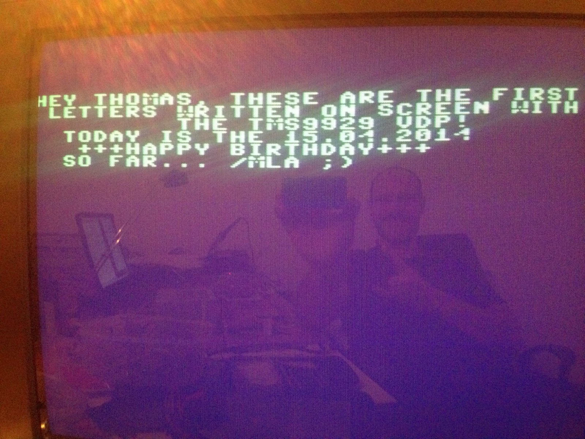

Nachdem das Timing vom Steckschwein grundsätzlich passt, sind auf einmal auch sämtliche Voodoo-Fehler verschwunden.

Jetzt lässt sich der VDP auch besser ansprechen, allerdings gibt es schon noch ein paar Probleme zu lösen, bspw. ist das DRAM sehr instabil irgendwie flackert ständig der Screen oder die Zeichen "Nullen" sich aus. Wir untersuchen das Steckbrett und die Spannungsversorgung. Wir beschließen, die Steckbrettkabel durch kurze blanke Drahtbrücken zu ersetzen und platzieren direkt am Vcc der einzelnen DRAMs die Abblock-Kondensatoren mit 100nF. Genauso die Spannungsversorgung des VDPs, hier auch nochmal kurze Drahtbrücken verwenden und einen Abblock-Kondensator direkt an Vcc vorsehen.

Wow, das Bild steht! Wie auf den Fernseher gemalt.Wir verbiegen den C64 Zeichensatz noch soweit, dass wir bequem ASCII-Zeichen als Text eingeben können ohne umständlich zu konvertieren.

Und so sieht's dann aus.

