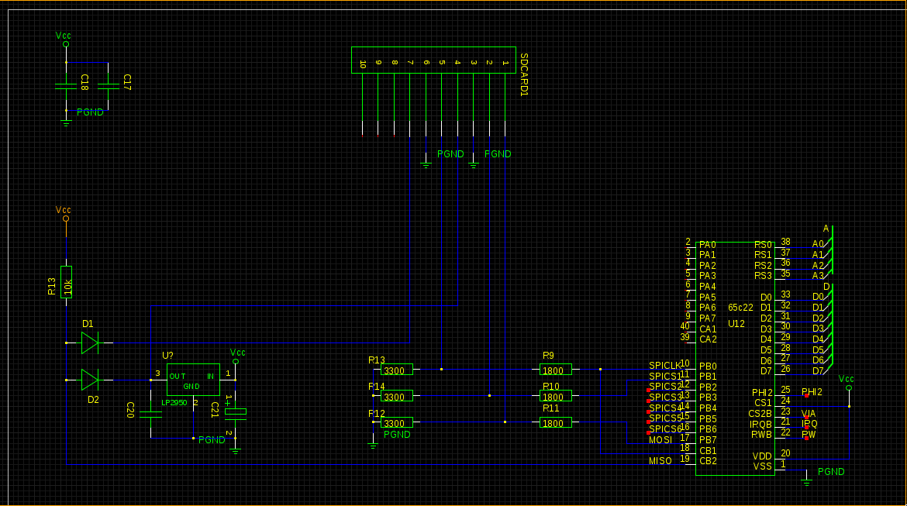

Um dem Ziel eines "richtigen" Computers näher zu kommen, brauchen wir nicht nur einen Videochip, wir brauchen auch Eingabegeräte und Massenspeicher.

Zwar soll unser Rechner so retro sein, dass es ihn damals, zur Hochzeit der 8bit-Heimcomputer, durchaus hätte geben können, realistischerweise wollen wir ihn jedoch mit durchaus modernen Schnittstellen ausstatten. Die 8bit-Rechner aus "unserer Zeit" haben IO-Chips wie den 6526 oder 6522 benutzt, um Tastatur (Matrix), Joysticks und Massenspeicher anzusteuern. Das haben wir auch vor. Nur etwas anders. Wir verwenden eine 65c22 VIA, und machen sie zu einem [SPI](http://de.wikipedia.org/wiki/Serial_Peripheral_Interface) "Master". Damit wollen wir einen wesentlichen Teil der Peripherie anbinden.

SD-Karten unterstützen SPI direkt, sodass unsere angepeilte Massenspeicherlösung quasi schon fertig ist. Damit ersparen wir es uns, einen irgendwie gearteten Laufwerkscontroller ansteuern zu müssen oder gar über einen Haufen TTL eine IDE-Schnittstelle für alte Platten oder CompactFlash-Karten bauen zu müssen. Der einzige Zusatzaufwand, den wir hardwaremäßig noch betreiben müssen, ist eine 3.3V-Spannungsversorgung und eine Anpassung der 5V-Pegel der VIA auf 3.3V für die SD-Karte, denn SD-Karten laufen mit 3.3V und ihre Eingänge sind nicht 5V-tolerant. Der Rest ist Software.

In Sachen Tastatur setzen wir auch auf eine Standardschnittstelle, nämlich PS/2. Das ist immer noch retro genug, und PS/2-Tastaturen sind immer noch einfacher zu beschaffen als Matrixtastaturen. Als kleiner Stilbruch bietet sich als Tastaturcontroller ein kleiner AVR-Microcontroller an, der die Scancodes der Tastatur in ASCII-Codes wandelt. Bequemerweise gibt es zahlreiche fertige Lösungen, die z.B. am anderen Ende rs232 sprechen. Wir wollen aber nur wegen einer Tastatur keinen zweiten UART verbauen. Fehlt also nur eine kleine Anpassung auf SPI. Aber zunächst mal die SD-Karte.

Mit SPI hätten wir darüberhinaus noch viel mehr Möglichkeiten, ohne allzu großen Aufwand weitere SPI-fähige Komponenten wie RTCs, EEPROMS oder vielleicht sogar USB-Hosts anzubinden.

Der Schaltplan zeigt, wie wir aktuell die VIA nutzen, um eine SD-Karte anzusprechen. Port B stellt die Steuerleitungen, wobei die beiden "äußeren" Bits 0 und 7 für SPICLK und MOSI verwendet werd, weil sie sich durch Inkrementieren, Dekrementieren bzw. Bit-Shifting schnell ansprechen lassen. Die 6 Bit dazwischen dienen als Slave-Select-Leitungen. MISO geht direkt in CB2, dem Eingang des Schieberegisters der VIA, welcher von PB0 an CB1 extern über unsere SPI-Clock getaktet wird. Damit läuft das Schieberegister exakt in dem Modus, der durch den berühmt berüchtigten VIA-Bug betroffen ist. Wir leben gerne gefährlich. Die Alternative wäre gewesen, ein externes Schieberegister zu benutzen, welches dann Port A belegt hätte. So bleibt dieser frei.

