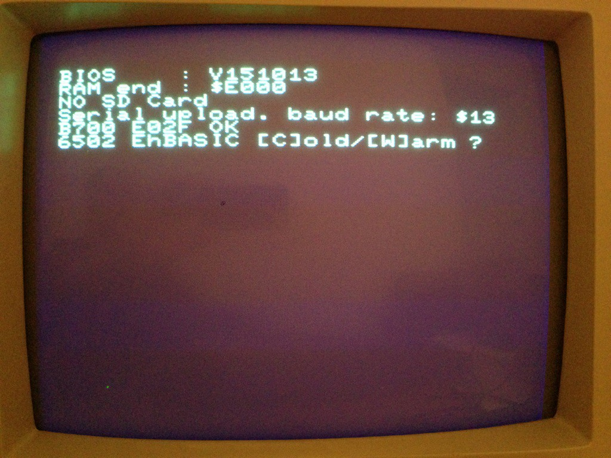
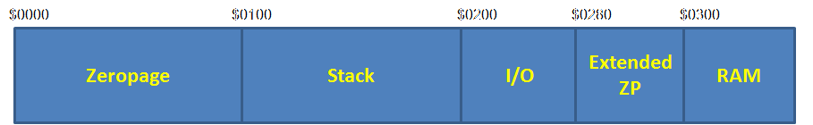
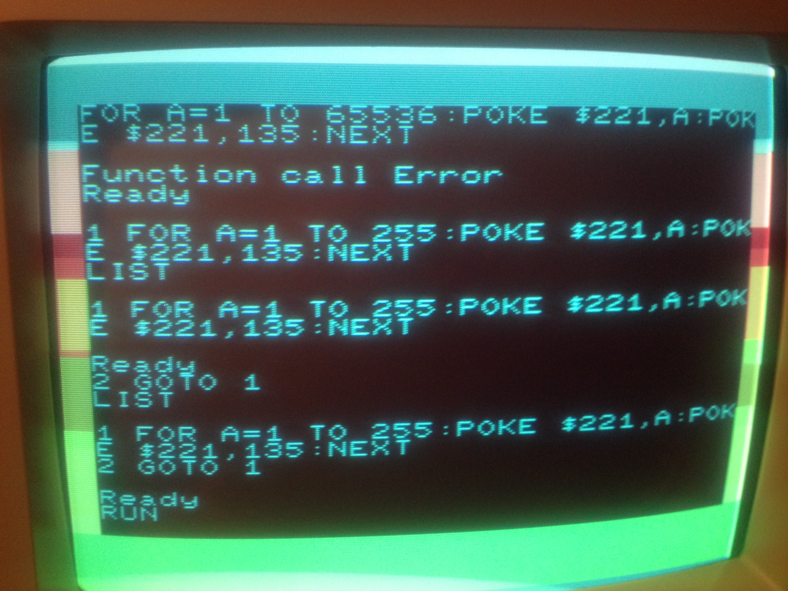

Es ist manchmal schon sehr mühselig bereits kleinere Probleme mit Assembler lösen zu müssen. Was uns für das Steckschwein fehlt ist eine einfache Sprache mit der man kleine Dinge erledigen und zeigen kann.

Also, warum nicht ein einfaches Basic für das Steckschwein portieren? Die Auswahl an guten Basic-Implementierungen ist überschaubar und unsere Wahl fiel in dem Fall auf EhBasic von LeeDavison. Warum? Nun, es hat sich gezeigt, dass EhBasic von vielen Homebrew-Projekten verwendet wird, die eine 6502-CPU-Basis benutzen. Darüber hinaus scheint EhBasic sogar eine sehr gute Implementierung zu sein, weil die Performance und Erweiterbarkeit gegenüber anderen Basics für diese Zielplattform herausragend ist.

Dann sollte das doch für uns und das Steckschwein auch kein Problem sein, oder?

Nun, schaut man sich an was zu tun ist, so sind im wesentlichen folgende Dinge zu tun

- EhBasic Assembler-Sourcen nach Acme-Assembler übersetzen
- VEC\_IN - Pointer und Code für eine Tastatur-Eingabe Routine bereitstellen
- VEC\_OUT - Pointer und Code für eine Ausgabe-Routine (Display) bereitstellen
- VEC\_LD - Pointer und Code für eine Basic-Datei Lade-Routine bereitstellen
- VEC\_SV - Pointer auf und Code für eine Basic-Datei Speicher-Routine bereitstellen
- Adressen anpassen und konfigurieren
- Spass haben mit EhBasic

Nach aktuellem Stand der Entwicklung haben wir bereits die Möglichkeit VEC\_IN und VEC\_OUT problemlos bereitzustellen. Für LOAD und SAVE wird das schon etwas kniffeliger, aber wir können ja erstmal ohne Laden und Speichern auskommen.

Wir nehmen also die Sourcen des min\_mon.a portieren auch die nach Acme-Assembler und setzen in der Sprungtabelle einfach unsere Routinen für Input/Output ein.

LAB\_vec
   !word .getkey ; byte in
   !word .chrout ; byte out
   !word LOAD ; load vector for EhBASIC
   !word SAVE ; save vector for EhBASIC

Wir benötigen noch eine .getkey und .chrout Implementierung, da derartige Routinen mittlerweile in den Steckschwein-Kernel verlagert wurden. Wir setzen mit EhBasic also direkt auf das Steckschwein-Bios auf und müssen daher die Ein- und Ausgabe nochmal selber stricken.

Die Zeichenausgabe ist einfach, lediglich X-Register und Akku retten, da die Bios-Methode dies nicht tut.

.chrout
 pha
 phx
 jsr chrout
 plx
 pla
 rts

Die Zeicheneingabe ist ein Aufruf an die Tastatur per SPI über die VIA. Die Basis-Methoden liegen im Bios vor.

.getkey
 phx
 lda #%01111010
 sta via1portb
 jsr spi\_r\_byte
 ldx #%11111110
 stx via1portb
 plx
 cmp #$00; restore zero flag
 rts

Aufpassen muss man hier, dass das Zero-Flag entsprechend gelöscht/gesetzt ist. Dies wird von EhBasic so erwaret. Nach dem plx ist dies aber "zerstärt" und wir machen daher den Vergleich auf 0-Byte - keine Taste gedrückt - explizit bevor wir die Funktion verlassen.

Das ist auch schon alles, wir Laden das Basic und siehe da... es erscheint die Einschaltmeldung des EhBasic.

**Aber, weiter geht es leider nicht**, irgendwas passt noch nicht. Aber was?!? Ok, wir schauen uns das Basic nun genauer an. Wir stellen schnell fest das die gesamte Zeropage (ZP) durch das Basic benötigt wird und gleichzeitig im Konflikt mit der ZP-Belegung vom Steckschwein-Bios steht. Das geht so natürlich nicht! Hier liegen beispielsweise die Pointer für die Ein-/Ausgabe Sprungvektoren oder die Speicheradressen für die Cursor-Position. Genau da, wo sich das EhBasic sich austobt.

Mit dieser Erkenntnis und der Tatsache das bereits das Steckschwein-Bios große Bereiche der Zeropage beansprucht lehnen wir uns zurück und überlegen wie wir das Schweine-Bios schlanker machen können. Puh.... jetzt artet das ja doch in Arbeitet aus :/

Ich berate mich also mit Thomas und wir können einige Vektoren aus der ZP entfernen, da für Sprungvektoren - via JMP ($xxyy) - ja nicht zwangsweise die ZP verschwendet werden muss.

Wir überlegen wo wir diese Sprung-Vektoren ablegen, bestenfalls speichermäßig in die Nähe der ZP. Nach der ZP kommt der Stack danach der I/O-Bereich. Also bleibt nur Bereich ab $0300. Aber warum denn erst dort?

Irgendwie sind wir wohl bei unserem Adress-Decoder im GAL auf halben Wege abgestorben. Warum haben wir hier eine ganze Page für I/O vorgesehen? Wir wissen es nicht mehr und beschließen den Decoder nochmal auf "links" zu drehen. Wir "defragmentieren" den I/O-Bereich, so dass wir einen zusammenhängenden I/O-Bereich von $0200 - $027f erhalten. Ab $0280 bis $02ff wird frei adressierbarer RAM frei, also insgesamt 128 Byte. Genug, um unsere Vektoren hier abzulegen. Der Bereich ist quasi eine "Extended Zeropage" und wir sind glücklich damit. Sieht jetzt so aus...

Mit dieser neuen Speicheraufteilung können wir die Konflikte zwischen EhBasic und Steckschwein-Bios in der ZP problemlos lösen. Ab $0300 liegen einige Vektoren für das Basic selbst gefolgt vom Eingabepuffer. Wir passen die Start- und Endadresse für den Basic Programm-Speicher auf $0400 bis $b700 an und erhalten somit $b300 Bytes freien Basic-Speicher. Das EhBasic selbst wird nach b700 geladen, also direkt vor das ROM.

Wir laden das Basic erneut, es erscheint die Cold-Start Meldung. Wir drücken 'c' und geben den verfügbaren Speicher mit $b300 an. Das Basic initialisiert und wir können endlich loslegen...

Bei dem hier gezeigten Bild manipulieren wir die Rahmenfarbe des Video-Chips mittels einer einfachen Schleife und Basic-POKE. Das funktioniert sogar, obwohl der VDP ja diese eigenartige Adressierung der Register und der Daten hat. In dem Fall geht das gerade, weil Zwischendurch keine Zeichenausgabe erfolgt. Glück gehabt...
